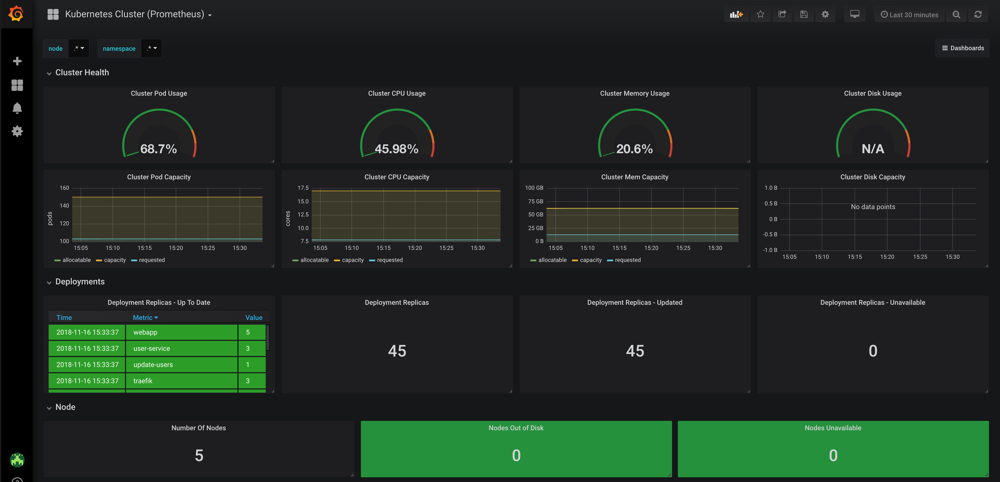

# bedrock

The cloud native ecosystem is in a virtual cambrian explosion of platforms and projects that individually promise to greatly improve our lives as developers. At the same time, even as an experienced developer in this space, it is difficult to start from stratch and stitch all of these projects together into a coherent whole without having to do a substantial amount of research and work.

This project is our humble attempt to combine the collective wisdom of our cloud native community for building best practice cloud native Kubernetes clusters. It is based on the real world experience that we have of deploying cloud native applications with our largest customers.

## What's in the box?

Bedrock is a set of devops scripts for automated deployment of the common elements of a production-ready cloud native Kubernetes cluster. It includes:

Cluster Management

-   [Kured](https://github.com/weaveworks/kured) (automatic cordon/drain/reboot after node level patches are applied)

Monitoring

-   [Prometheus](https://prometheus.io/) metrics monitoring and aggregation
-   [Grafana](https://grafana.com/) metrics visualization with Kubernetes monitoring dashboards preconfigured

Log Management

-   [Fluentd](https://www.fluentd.org/) collection and forwarding
-   [Elasticsearch](https://www.elastic.co/) aggregation
-   [Kibana](https://www.elastic.co/products/kibana) querying and visualization

Ingress and Service Mesh

-   [Istio](https://istio.io/) ingress gateway and service mesh

Distributed Tracing

-   [Jaeger](https://www.jaegertracing.io/) end to end distributed request tracing.

## Quick Start

### Deploy a Cluster

If you already have a Kubernetes cluster running and its context is the default, you can skip ahead to the "Deploying Infrastructure" section.

We've included Terraform scripts for building a Kubernetes cluster with Azure AKS or ACS Engine, but would welcome pull requests for other cloud providers.

To deploy a cluster,

1. Ensure you have the [az cli](https://docs.microsoft.com/en-us/cli/azure/install-azure-cli?view=azure-cli-latest) installed, in your path, and logged in to your subscription.
2. Edit cluster/environments/azure-aks/main.tf and adjust the name of the cluster and, if desired, any of the sizing or network parameters.

3. Deploy the cluster using:

```
$ cd cluster/environments/azure-aks
$ ./init
$ ./apply
```

### Deploy Infrastructure

1. Install docker locally and confirm that it is in your path. We've encapsulated the rest of the dependencies in a Docker image, but you can also run these tools locally by installing the following set of tools locally as well:

-   [docker](https://docs.docker.com/docker-for-mac/install/)
-   [helm](https://helm.sh/)
-   [kubectl](https://kubernetes.io/docs/tasks/tools/install-kubectl/)
-   [terraform](https://www.terraform.io/intro/getting-started/install.html)

2. If you haven't, create a new Kubernetes cluster with RBAC enabled and switch to it such that it is the default context `kubectl` is using.

3. Clone this project locally:

```
$ git clone https://github.com/Microsoft/bedrock
```

4. Choose a password for your grafana deployment and set an environmental variable with it.

```
$ export TF_VAR_grafana_admin_password="SECRETpass"
```

5. Deploy the dev configuration:

```
bash-4.4# cd infra/environments/dev
bash-4.4# ./init
bash-4.4# ./apply
bash-4.4# cd ../../..
```

6. Take it for a test spin!

```
bash-4.4# tools/grafana

NOTE: By default the credentials for grafana are 'ops' and the password you chose above.
```

Grafana provides a visualization of the metrics being collected by our cluster's Prometheus service -- and we've included a couple of Kubernetes related dashboards out of the box.



```
bash-4.4# tools/kibana
```

Fluentd, Elasticsearch, and Kibana are installed and integrated with each other and your cluster -- ready for you to start querying and visualizing text logs immediately.


```
bash-4.4# tools/traefik
```

Ingress traffic to the cluster is managed by Traefik, which includes a management console for monitoring the health and performance of your externally exposed services.


```
bash-4.4# tools/jaeger
```

Jaeger provides distributed tracing of requests through your system so you can discover and optimize performance hotspots.


#### Using the Docker image

If you'd like to avoid installing the tool dependencies, you can use our Docker container with these dependencies already installed:

1. Build the image locally:

```
$ docker build -t bedrock:latest .
```

2. Choose a password for your grafana deployment and then start the container with your grafana password as an environmental variable and the kube config as a volume mount (the typical path for your kube config is ~/.kube/config below):

```
$ docker run --rm -it -v <path-to-your-kube-config>/config:/.kube/config -e TF_VAR_grafana_admin_password="SECRETpass" bedrock:latest /bin/bash

bash-4.4#
```

From here, rejoin the quick start steps above.

### Deploy a Service

We have also included terraform devops scripts for a [simple node.js service](https://github.com/timfpark/simple-service), giving you both a starting point for your own services, but also enabling you to see how all of the parts of the system fit together with a real service.

Deploying it is as simple as:

```
$ set TF_VAR_container_repo=docker.io/timfpark  <-- adjust this to your container repo
$ cd services/environments/dev
$ ./init && ./apply
```

You can then access the service externally by noting the public IP address of the Traefik service:

```
$ kubectl get services -n kube-system
NAME                     TYPE           CLUSTER-IP     EXTERNAL-IP     PORT(S)...
...
istio-ingressgateway     LoadBalancer   10.0.184.127   40.123.43.171   80:31380/TCP,443:31390/TCP,31400:31400/TCP,15011:32347/TCP,8060:30113/TCP,853:31090/TCP,15030:32107/TCP,15031:30020/TCP   1h
...
```

and then using `curl` to inject the Host header for your request so Istio knows how to route it:

```
$ curl -HHost:simple.bedrock.tools http://40.123.43.171:80
Your lucky number is 58 (instance id 65300 at Wed Nov 28 2018 21:46:46 GMT+0000 (UTC))
```

## Contributing

We do not claim to have all the answers and would greatly appreciate your ideas and pull requests.

This project welcomes contributions and suggestions. Most contributions require you to agree to a
Contributor License Agreement (CLA) declaring that you have the right to, and actually do, grant us
the rights to use your contribution. For details, visit https://cla.microsoft.com.

When you submit a pull request, a CLA-bot will automatically determine whether you need to provide
a CLA and decorate the PR appropriately (e.g., label, comment). Simply follow the instructions
provided by the bot. You will only need to do this once across all repos using our CLA.

This project has adopted the [Microsoft Open Source Code of Conduct](https://opensource.microsoft.com/codeofconduct/).
For more information see the [Code of Conduct FAQ](https://opensource.microsoft.com/codeofconduct/faq/) or
contact [opencode@microsoft.com](mailto:opencode@microsoft.com) with any additional questions or comments.

For project related questions or comments, please contact (Tim Park)[https://github.com/timfpark].

```

```
