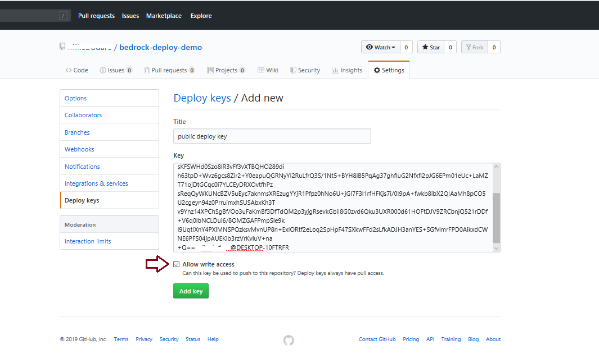
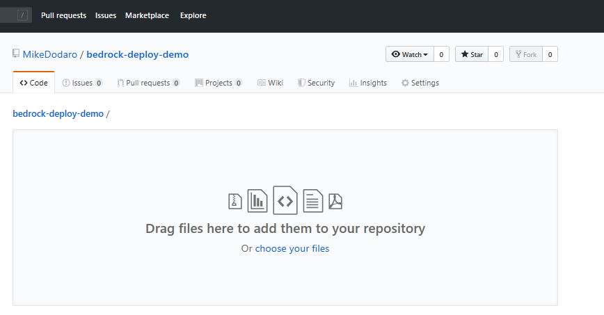
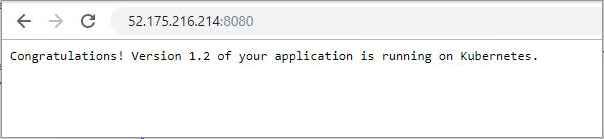

# A Walkthrough Deploying a Bedrock Environment

This document walks through a Bedrock deployment.  It does not include everything available using the [gitops](../../gitops/README.md) workflow. We deploy a Kubernetes cluster and create an empty repo for Flux updates.  After the cluster is running we add a manifest file to the repo to demonstrate Flux automation.

This walkthrough consists of the following steps:

- [Prerequisites](#prerequisites)
  - [Install the required tooling](#install-the-required-tooling)
  - [Install the Azure CLI](#install-the-azure-cli)
- [Set Up Flux Manifest Repository](#set-up-flux-manifest-repository)
  - [Generate an RSA key pair to use as the manifest repository deploy key](#generate-an-rsa-key-pair-to-use-as-the-manifest-repository-deploy-key)
  - [Grant deploy key access to the manifest repository](#grant-deploy-key-access-to-the-manifest-repository)
- [Create an RSA Key Pair to use as node key](#create-an-rsa-key-pair--to-use-as-node-key)
- [Create an Azure Service Principal](#create-an-azure-service-principal)
  - [Configure Terraform For Azure Access](#configure-terraform-for-azure-access)
- [Clone the Bedrock Repository](#clone-the-bedrock-repository)
  - [Set Up Terraform Deployment Variables](#set-up-terraform-deployment-variables)
  - [Deploy the Template](#deploy-the-template)
    - [Terraform Init](#terraform-init)
    - [Terraform Plan](#terraform-plan)
    - [Terraform Apply](#terraform-apply)
    - [Terraform State](#terraform-state)
- [Interact with the Deployed Cluster](#interact-with-the-deployed-cluster)
  - [Deploy an update using Kubernetes manifest](#deploy-an-update-using-kubernetes-manifest)

# Prerequisites

Before starting the deployment, there are several required steps:

- Install the required common tools (kubectl, helm, and terraform).  See also [Required Tools](https://github.com/microsoft/bedrock/tree/master/cluster). Note: this tutorial currently uses [Terraform 0.12.6](https://releases.hashicorp.com/terraform/0.12.6/).
- Enroll as an Azure subscriber.  The free trial subscription does not support enough cores to run this tutorial.
- Install the [Azure CLI](https://docs.microsoft.com/en-us/cli/azure/install-azure-cli?view=azure-cli-latest).

The following procedures complete the prerequisites and walk through the process of configuring Terraform and Bedrock scripts, deploying the cluster, and checking the deployed cluster's health. Then we add a new manifest file to demonstrate Flux update.

## Install the required tooling

This document assumes one is running a current version of Ubuntu.  Windows users can install the [Ubuntu Terminal](https://www.microsoft.com/store/productId/9NBLGGH4MSV6) from the Microsoft Store.  The Ubuntu Terminal enables Linux command-line utilities, including bash, ssh, and git that will be useful for the following deployment.  *Note: You will need the Windows Subsystem for Linux installed to use the Ubuntu Terminal on Windows*.

Ensure that the [required tools](https://github.com/microsoft/bedrock/tree/master/cluster#required-tools), are installed in your environment. Alternatively, there are [scripts](https://github.com/jmspring/bedrock-dev-env/tree/master/scripts) that will install `helm`, `terraform` and `kubectl`.  In this case, use `setup_kubernetes_tools.sh` and `setup_terraform.sh`.  The scripts install the tools into `/usr/local/bin`.

## Install the Azure CLI

For information specific to your operating system, see the [Azure CLI install guide](https://docs.microsoft.com/en-us/cli/azure/install-azure-cli?view=azure-cli-latest).  You can also use [this script](https://github.com/jmspring/bedrock-dev-env/blob/master/scripts/setup_azure_cli.sh) if running on a Unix based machine.

# Set Up Flux Manifest Repository

 We will deploy the Bedrock environment using the empty repo and then add a Kubernetes manifest that defines a simple Web application.  The change to the repo will automatically update the deployment.

To prepare the Flux manifest repository, we must:

1. [Create the Flux Manifest Repository](#create-the-flux-manifest-repository)
2. [Generate an RSA Key Pair to use as the Manifest Repository Deploy Key](#generate-an-rsa-key-pair-to-use-as-the-manifest-repository-deploy-key)
3. [Grant Deploy Key access to the Manifest Repository](#grant-deploy-key-access-to-the-manifest-repository)

## Create the Flux Manifest Repository
[Create an empty git repository](https://github.com/new/) with a name that clearly signals that the repo is used for the Flux manifests. For example `sample_app_manifests`.

Flux requires that the git respository have at least one commit.  Initialize the repo with an empty commit.
```bash
git commit --allow-empty -m "Initializing the Flux Manifest Repository"
```

More edocumentation around Service Principals are available in the [Bedrock documentation].
## Generate an RSA Key Pair to use as the Manifest Repository Deploy Key

Generate the [deploy key](https://developer.github.com/v3/guides/managing-deploy-keys/#deploy-keys) using `ssh-keygen`.  The public portion of the key pair will be uploaded to GitHub as a deploy key.

Run: `ssh-keygen -b 4096 -t rsa -f ~/.ssh/gitops-ssh-key`.

```bash
$ ssh-keygen -b 4096 -t rsa -f ~/.ssh/gitops-ssh-key
Generating public/private rsa key pair.
Enter passphrase (empty for no passphrase):
Enter same passphrase again:
Your identification has been saved in /Users/jmspring/.ssh/gitops-ssh-key.
Your public key has been saved in /Users/jmspring/.ssh/gitops-ssh-key.pub.
The key fingerprint is:
SHA256:jago9v63j05u9WoiNExnPM2KAWBk1eTHT2AmhIWPIXM jmspring@kudzu.local
The key's randomart image is:
+---[RSA 4096]----+
|.=o.B= +         |
|oo E..= .        |
|  + =..oo.       |
|   . +.*o=       |
|    o * S..      |
|   . * . .       |
|... o ... .      |
|...  .o+.. .     |
|  .o..===o.      |
+----[SHA256]-----+
kudzu:azure-simple jmspring$
```

This will create public and private keys for the Flux repository. We will assign the public key under the following heading: [Adding the Repository Key](#adding-the-repository-key).  The private key is stored on the machine originating the deployment.

## Grant Deploy Key Access to the Manifest Repository

The public key of the [RSA key pair](#create-an-rsa-key-pair-for-a-deploy-key-for-the-flux-repository) previously created needs to be added as a deploy key.  Note: *If you do not own the repository, you will have to fork it before proceeding*.

First, display the contents of the public key: `more ~/.ssh/gitops-ssh-key.pub`.

```bash
$ more ~/.ssh/gitops-ssh-key.pub
ssh-rsa AAAAB3NzaC1yc2EAAAADAQABAAACAQDTNdGpnmztWRa8RofHl8dIGyNkEayNR6d7p2JtJ7+zMj0HRUJRc+DWvBML4DvT29AumVEuz1bsVyVS2f611NBmXHHKkbzAZZzv9gt2uB5sjnmm7LAORJyoBEodR/T07hWr8MDzYrGo5fdTDVagpoHcEke6JT04AL21vysBgqfLrkrtcEyE+uci4hRVj+FGL9twh3Mb6+0uak/UsTFgfDi/oTXdXOFIitQgaXsw8e3rkfbqGLbhb6o1muGd1o40Eip6P4xejEOuIye0cg7rfX461NmOP7HIEsUa+BwMExiXXsbxj6Z0TXG0qZaQXWjvZF+MfHx/J0Alb9kdO3pYx3rJbzmdNFwbWM4I/zN+ng4TFiHBWRxRFmqJmKZX6ggJvX/d3z0zvJnvSmOQz9TLOT4lqZ/M1sARtABPGwFLAvPHAkXYnex0v93HUrEi7g9EnM+4dsGU8/6gx0XZUdH17WZ1dbEP7VQwDPnWCaZ/aaG7BsoJj3VnDlFP0QytgVweWr0J1ToTRQQZDfWdeSBvoqq/t33yYhjNA82fs+bR/1MukN0dCWMi7MqIs2t3TKYW635E7VHp++G1DR6w6LoTu1alpAlB7d9qiq7o1c4N+gakXSUkkHL8OQbQBeLeTG1XtYa//A5gnAxLSzxAgBpVW15QywFgJlPk0HEVkOlVd4GzUw== sl;jlkjgl@kudzu.local
```

Next, on the repository, select `Settings` -> `Deploy Keys` -> `Add deploy key`.  Give your key a title and paste in the contents of your public key.  Important: allow the key to have `Write Access`.



Click "Add key", and you should see:


## Create Azure Resource Group
Note: You need to create a resource group in your subscription first before you apply terraform. Use the following command to create a resource group

```bash
az group create -l westus2 -n testazuresimplerg
```

## Create an Azure Service Principal

We use a single [Azure Service Principal](https://docs.microsoft.com/en-us/azure/active-directory/develop/app-objects-and-service-principals) for configuring Terraform and for the [Azure Kubernetes Service (AKS)](https://azure.microsoft.com/en-us/services/kubernetes-service/) cluster being deployed.  In Bedrock, see the [Service Principal documention](https://github.com/microsoft/bedrock/tree/master/cluster/azure#create-an-azure-service-principal).

[Login to the Azure CLI](https://docs.microsoft.com/en-us/cli/azure/authenticate-azure-cli) using the `az login` command.

Get the Id of the subscription by running `az account show`.

Then, create the Service Principal using `az ad sp create-for-rbac --role contributor --scopes "/subscriptions/7060bca0-1234-5-b54c-ab145dfaccef"` as follows:

```bash
~$ az account show
{
  "environmentName": "AzureCloud",
  "id": "7060bca0-1234-5-b54c-ab145dfaccef",
  "isDefault": true,
  "name": "jmspring trial account",
  "state": "Enabled",
  "tenantId": "72f984ed-86f1-41af-91ab-87acd01ed3ac",
  "user": {
    "name": "jmspring@kudzu.local",
    "type": "user"
  }
}
~$ az ad sp create-for-rbac --role contributor --scopes "/subscriptions/7060bca0-1234-5-b54c-ab145dfaccef"
{
  "appId": "7b6ab9ae-dead-abcd-8b52-0a8ecb5beef7",
  "displayName": "azure-cli-2019-06-13-04-47-36",
  "name": "http://azure-cli-2019-06-13-04-47-36",
  "password": "35591cab-13c9-4b42-8a83-59c8867bbdc2",
  "tenant": "72f988bf-86f1-41af-91ab-2d7cd011db47"
}
```

Take note of the following values.  They will be needed for configuring Terraform as well as the deployment as described under the heading [Configure Terraform for Azure Access](#3.-configure-terraform-for-azure-access):

- Subscription Id (`id` from account): `7060bca0-1234-5-b54c-ab145dfaccef`
- Tenant Id: `72f984ed-86f1-41af-91ab-87acd01ed3ac`
- Client Id (appId): `7b6ab9ae-dead-abcd-8b52-0a8ecb5beef7`
- Client Secret (password): `35591cab-13c9-4b42-8a83-59c8867bbdc2`

## Create an RSA Key Pair to use as Node Key

The Terraform scripts use this node key to setup log-in credentials on the nodes in the AKS cluster. We will use this key when setting up the Terraform deployment variables.  To generate the node key, run `ssh-keygen -b 4096 -t rsa -f ~/.ssh/node-ssh-key`:

```bash
$ ssh-keygen -b 4096 -t rsa -f ~/.ssh/node-ssh-key
Generating public/private rsa key pair.
Enter passphrase (empty for no passphrase):
Enter same passphrase again:
Your identification has been saved in /home/jims/.ssh/node-ssh-key.
Your public key has been saved in /home/jims/.ssh/node-ssh-key.pub.
The key fingerprint is:
SHA256:+8pQ4MuQcf0oKT6LQkyoN6uswApLZQm1xXc+pp4ewvs jims@fubu
The key's randomart image is:
+---[RSA 4096]----+
|   ...           |
|  . o. o .       |
|.. .. + +        |
|... .= o *       |
|+  ++ + S o      |
|oo=..+ = .       |
|++ ooo=.o        |
|B... oo=..       |
|*+. ..oEo..      |
+----[SHA256]-----+
```

## Configure Terraform For Azure Access

Terraform supports a number of methods for authenticating with Azure.  Bedrock uses [authenticating with a Service Principal and client secret](https://www.terraform.io/docs/providers/azurerm/auth/service_principal_client_secret.html).  This is done by setting a few environment variables via the Bash `export` command.

To set the variables, use the key created under the previous heading [Create an Azure Service Principal](#create-an-azure-service-principal).  (The ARM_CLIENT_ID is `app_id` from the previous procedure.  The ARM_SUBSCRIPTION_ID is account `id`.)

Set the variables as follows:

```bash
$ export ARM_SUBSCRIPTION_ID=7060bca0-1234-5-b54c-ab145dfaccef
$ export ARM_TENANT_ID=72f984ed-86f1-41af-91ab-87acd01ed3ac
$ export ARM_CLIENT_SECRET=35591cab-13c9-4b42-8a83-59c8867bbdc2
$ export ARM_CLIENT_ID=7b6ab9ae-dead-abcd-8b52-0a8ecb5beef7
```

If you execute `env | grep ARM` you should see:

```bash
$ env | grep ARM
ARM_SUBSCRIPTION_ID=7060bca0-1234-5-b54c-ab145dfaccef
ARM_TENANT_ID=72f984ed-86f1-41af-91ab-87acd01ed3ac
ARM_CLIENT_SECRET=35591cab-13c9-4b42-8a83-59c8867bbdc2
ARM_CLIENT_ID=7b6ab9ae-dead-abcd-8b52-0a8ecb5beef7
```

## Clone the Bedrock Repository

Clone the [Bedrock repository](https://github.com/microsoft/bedrock) with the command: `git clone https://github.com/microsoft/bedrock.git`

```bash
$ git clone https://github.com/microsoft/bedrock.git
Cloning into 'bedrock'...
remote: Enumerating objects: 37, done.
remote: Counting objects: 100% (37/37), done.
remote: Compressing objects: 100% (32/32), done.
remote: Total 2154 (delta 11), reused 11 (delta 5), pack-reused 2117
Receiving objects: 100% (2154/2154), 29.33 MiB | 6.15 MiB/s, done.
Resolving deltas: 100% (1022/1022), done.
```

To verify, navigate to the `bedrock/cluster/environments` directory and do an `ls` command:

```bash
$ ls -l
total 0
drwxr-xr-x   8 jmspring  staff  256 Jun 12 09:11 azure-common-infra
drwxr-xr-x  15 jmspring  staff  480 Jun 12 09:11 azure-multiple-clusters
drwxr-xr-x   6 jmspring  staff  192 Jun 12 09:11 azure-simple
drwxr-xr-x   7 jmspring  staff  224 Jun 12 09:11 azure-single-keyvault
drwxr-xr-x   7 jmspring  staff  224 Jun 12 09:11 azure-velero-restore
drwxr-xr-x   3 jmspring  staff   96 Jun 12 09:11 minikube
```

Each of the directories represent a common pattern supported within Bedrock.  For more information see the [Bedrock github repo](https://github.com/microsoft/bedrock/tree/master/cluster/azure).

## Set Up Terraform Deployment Variables

As mentioned, we will be using `azure-simple`. Changing to that directory and doing an `ls -l` command reveals:

```bash
$ cd azure-simple
$ ls -l
total 32
-rw-r--r--  1 jmspring  staff   460 Jun 12 09:11 README.md
-rw-r--r--  1 jmspring  staff  1992 Jun 12 09:11 main.tf
-rw-r--r--  1 jmspring  staff   703 Jun 12 09:11 terraform.tfvars
-rw-r--r--  1 jmspring  staff  2465 Jun 12 09:11 variables.tf
```

The inputs for a Terraform deployment are specified in a `.tfvars` file.  In the `azure-simple` repository, a skeleton exists in the form of `terraform.tfvars` with the following fields.  To get the ssh_public_key, run: `more ~/.ssh/node-ssh-key.pub`.  The path to the private key is `"/home/<user>/.ssh/gitops-ssh-key"`.

```bash
$ cat terraform.tfvars
resource_group_name="<resource-group-name>"
cluster_name="<cluster-name>"
agent_vm_count = "3"
dns_prefix="<dns-prefix>"
service_principal_id = "<client-id>"
service_principal_secret = "<client-secret>"
ssh_public_key = "ssh-rsa ..." # from node-ssh-key.pub
gitops_ssh_url = "git@github.com:<github-user>/<repo>.git" # ssh url to manifest repo
gitops_ssh_key = "/home/<user>/.ssh/gitops-ssh-key" # path to private gitops repo key
vnet_name = "<vnet name>"

#--------------------------------------------------------------
# Optional variables - Uncomment to use
#--------------------------------------------------------------
# gitops_url_branch = "release-123"
# gitops_poll_interval = "30s"
# gitops_path = "prod"
# network_policy = "calico"
# network_plugin = "azure"
```

From previous procedures, we have values for `service_principal_id`, `service_principal_secret`, `ssh_public_key`, `gitops_ssh_key`.  For purposes of this walkthrough use `agent_vm_count=3` as default

To get the gitopp_ssh_url, go back to the empty repository that was created in [Set Up Flux Manifest Repository](#set-up-flux-manifest-repository).  This example uses SSH: `git@github.com:<user>/bedrock-deploy-demo.git`.

Define the remainding fields:

- `resource_group_name`: `testazuresimplerg`
- `cluster_name`: `testazuresimplecluster`
- `dns_prefix`: `testazuresimple`
- `vnet_name`: `testazuresimplevnet`

Note: You need to create a resource group in your subscription first before you apply terraform. Use the following command to create a resource group

```bash
az group create -l westus2 -n testazuresimplerg
```

The, `gitops_ssh_key` is a *path* to the RSA private key we created under [Set Up Flux Manifest Repository](#set-up-flux-manifest-repository)
The `ssh_public_key` is the RSA public key that was created for [AKS node access](#create-an-rsa-key-for-logging-into-aks-nodes).

Make a copy of the `terraform.tfvars` file and name it `testazuresimple.tfvars` for a working copy.  Next, using the values just defined, fill in the other values that were generated.  Then, remove the old terraform.tfvars file.

When complete `testazuresimple.tfvars` should resemble:

```bash
$ cat testazuresimple.tfvars
resource_group_name="testazuresimplerg"
cluster_name="testazuresimplecluster"
agent_vm_count = "3"
dns_prefix="testazuresimple"
service_principal_id = "7b6ab9ae-dead-abcd-8b52-0a8ecb5beef7"
service_principal_secret = "35591cab-13c9-4b42-8a83-59c8867bbdc2"
ssh_public_key = "ssh-rsa AAAAB3NzaC1yc2EAAAADAQABAAACAQCo5cFB/HiJB3P5s5kL3O24761oh8dVArCs9oMqdR09+hC5lD15H6neii4azByiMB1AnWQvVbk+i0uwBTl5riPgssj6vWY5sUS0HQsEAIRkzphik0ndS0+U8QI714mb3O0+qA4UYQrDQ3rq/Ak+mkfK0NQYL08Vo0vuE4PnmyDbcR8Pmo6xncj/nlWG8UzwjazpPCsP20p/egLldcvU59ikvY9+ZIsBdAGGZS29r39eoXzA4MKZZqXU/znttqa0Eed8a3pFWuE2UrntLPLrgg5hvliOmEfkUw0LQ3wid1+4H/ziCgPY6bhYJlMlf7WSCnBpgTq3tlgaaEHoE8gTjadKBk6bcrTaDZ5YANTEFAuuIooJgT+qlLrVql+QT2Qtln9CdMv98rP7yBiVVtQGcOJyQyG5D7z3lysKqCMjkMXOCH2UMJBrurBqxr6UDV3btQmlPOGI8PkgjP620dq35ZmDqBDfTLpsAW4s8o9zlT2jvCF7C1qhg81GuZ37Vop/TZDNShYIQF7ekc8IlhqBpbdhxWV6ap16paqNxsF+X4dPLW6AFVogkgNLJXiW+hcfG/lstKAPzXAVTy2vKh+29OsErIiL3SDqrXrNSmGmXwtFYGYg3XZLiEjleEzK54vYAbdEPElbNvOzvRCNdGkorw0611tpCntbpC79Q/+Ij6eyfQ== user"
gitops_ssh_url = "git@github.com:<user>/bedrock-deploy-demo.git"
gitops_ssh_key = "/home/<user>/.ssh/gitops-ssh-key"
vnet_name = "testazuresimplevnet"

#--------------------------------------------------------------
# Optional variables - Uncomment to use
#--------------------------------------------------------------
# gitops_url_branch = "release-123"
# gitops_poll_interval = "30s"
# gitops_path = "prod"
# network_policy = "calico"
# network_plugin = "azure"
```

## Deploy the Template

With the Terraform variables file, [testazuresimple.tfvars](#set-up-terraform-deployment-variables), it is time to do the Terraform deployment.  There are three steps to this process:

- `terraform init` which initializes the local directory with metadata and other necessities Terraform needs.
- `terraform plan` which sanity checks your variables against the deployment
- `terraform apply` which actually deploys the infrastructure defined

Make sure you are in the `bedrock/cluster/environments/azure-simple` directory and that you know the path to `testazuresimple.tfvars` (it is assumed that is in the same directory as the `azure-simple` environment).

### Terraform Init
First execute `terraform init`:

```bash
$ terraform init
Initializing modules...
- module.provider
  Getting source "github.com/Microsoft/bedrock/cluster/azure/provider"
- module.vnet
  Getting source "github.com/Microsoft/bedrock/cluster/azure/vnet"
- module.aks-gitops
  Getting source "github.com/Microsoft/bedrock/cluster/azure/aks-gitops"
- module.provider.common-provider
  Getting source "../../common/provider"
- module.aks-gitops.aks
  Getting source "../../azure/aks"
- module.aks-gitops.flux
  Getting source "../../common/flux"
- module.aks-gitops.kubediff
  Getting source "../../common/kubediff"
- module.aks-gitops.aks.azure-provider
  Getting source "../provider"
- module.aks-gitops.aks.azure-provider.common-provider
  Getting source "../../common/provider"
- module.aks-gitops.flux.common-provider
  Getting source "../provider"
- module.aks-gitops.kubediff.common-provider
  Getting source "../provider"

Initializing provider plugins...
- Checking for available provider plugins on https://releases.hashicorp.com...
- Downloading plugin for provider "null" (2.1.2)...
- Downloading plugin for provider "azurerm" (1.29.0)...
- Downloading plugin for provider "azuread" (0.3.1)...

Terraform has been successfully initialized!

You may now begin working with Terraform. All Terraform commands
should work. Try running "terraform plan" to see
any changes that are required for your infrastructure.

If you ever set or change modules or backend configuration for Terraform,
rerun this command to reinitialize your working directory. If you forget, other
commands will detect it and remind you to do so if necessary.
```
### Terraform Plan
Next, execute `terraform plan` and specify the location of our variables file: `$ terraform plan -var-file=testazuresimple.tfvars`

```bash
$ terraform plan -var-file=testazuresimple.tfvars
Refreshing Terraform state in-memory prior to plan...
The refreshed state will be used to calculate this plan, but will not be
persisted to local or remote state storage.


------------------------------------------------------------------------

An execution plan has been generated and is shown below.
Resource actions are indicated with the following symbols:
  + create

Terraform will perform the following actions:

  + azurerm_resource_group.cluster_rg
      id:                                         <computed>
      location:                                   "westus2"
      name:                                       "testazuresimplerg"
      tags.%:                                     <computed>

  + module.vnet.azurerm_resource_group.vnet
      id:                                         <computed>
      location:                                   "westus2"
      name:                                       "testazuresimplerg"
      tags.%:                                     <computed>

  + module.vnet.azurerm_subnet.subnet
      id:                                         <computed>
      address_prefix:                             "10.10.1.0/24"
      ip_configurations.#:                        <computed>
      name:                                       "testazuresimplecluster-aks-subnet"
      resource_group_name:                        "testazuresimplerg"
      service_endpoints.#:                        "1"
      virtual_network_name:                       "testazuresimplevnet"

  + module.vnet.azurerm_virtual_network.vnet
      id:                                         <computed>
      address_space.#:                            "1"
      address_space.0:                            "10.10.0.0/16"
      location:                                   "westus2"
      name:                                       "testazuresimplevnet"
      resource_group_name:                        "testazuresimplerg"
      subnet.#:                                   <computed>
      tags.%:                                     "1"
      tags.environment:                           "azure-simple"

  + module.aks-gitops.module.aks.azurerm_kubernetes_cluster.cluster
      id:                                         <computed>
      addon_profile.#:                            <computed>
      agent_pool_profile.#:                       "1"
      agent_pool_profile.0.count:                 "3"
      agent_pool_profile.0.dns_prefix:            <computed>
      agent_pool_profile.0.fqdn:                  <computed>
      agent_pool_profile.0.max_pods:              <computed>
      agent_pool_profile.0.name:                  "default"
      agent_pool_profile.0.os_disk_size_gb:       "30"
      agent_pool_profile.0.os_type:               "Linux"
      agent_pool_profile.0.type:                  "AvailabilitySet"
      agent_pool_profile.0.vm_size:               "Standard_D2s_v3"
      agent_pool_profile.0.vnet_subnet_id:        "${var.vnet_subnet_id}"
      dns_prefix:                                 "testazuresimple"
      fqdn:                                       <computed>
      kube_admin_config.#:                        <computed>
      kube_admin_config_raw:                      <computed>
      kube_config.#:                              <computed>
      kube_config_raw:                            <computed>
      kubernetes_version:                         "1.13.5"
      linux_profile.#:                            "1"
      linux_profile.0.admin_username:             "k8sadmin"
      linux_profile.0.ssh_key.#:                  "1"
      linux_profile.0.ssh_key.0.key_data:         "ssh-rsa AAAAB3NzaC1yc2EAAAADAQABAAACAQCo5cFB/HiJB3P5s5kL3O24761oh8dVArCs9oMqdR09+hC5lD15H6neii4azByiMB1AnWQvVbk+i0uwBTl5riPgssj6vWY5sUS0HQsEAIRkzphik0ndS0+U8QI714mb3O0+qA4UYQrDQ3rq/Ak+mkfK0NQYL08Vo0vuE4PnmyDbcR8Pmo6xncj/nlWG8UzwjazpPCsP20p/egLldcvU59ikvY9+ZIsBdAGGZS29r39eoXzA4MKZZqXU/znttqa0Eed8a3pFWuE2UrntLPLrgg5hvliOmEfkUw0LQ3wid1+4H/ziCgPY6bhYJlMlf7WSCnBpgTq3tlgaaEHoE8gTjadKBk6bcrTaDZ5YANTEFAuuIooJgT+qlLrVql+QT2Qtln9CdMv98rP7yBiVVtQGcOJyQyG5D7z3lysKqCMjkMXOCH2UMJBrurBqxr6UDV3btQmlPOGI8PkgjP620dq35ZmDqBDfTLpsAW4s8o9zlT2jvCF7C1qhg81GuZ37Vop/TZDNShYIQF7ekc8IlhqBpbdhxWV6ap16paqNxsF+X4dPLW6AFVogkgNLJXiW+hcfG/lstKAPzXAVTy2vKh+29OsErIiL3SDqrXrNSmGmXwtFYGYg3XZLiEjleEzK54vYAbdEPElbNvOzvRCNdGkorw0611tpCntbpC79Q/+Ij6eyfQ== jims@fubu"
      location:                                   "westus2"
      name:                                       "testazuresimplecluster"
      network_profile.#:                          "1"
      network_profile.0.dns_service_ip:           "10.0.0.10"
      network_profile.0.docker_bridge_cidr:       "172.17.0.1/16"
      network_profile.0.network_plugin:           "azure"
      network_profile.0.network_policy:           "azure"
      network_profile.0.pod_cidr:                 <computed>
      network_profile.0.service_cidr:             "10.0.0.0/16"
      node_resource_group:                        <computed>
      resource_group_name:                        "testazuresimplerg"
      role_based_access_control.#:                "1"
      role_based_access_control.0.enabled:        "true"
      service_principal.#:                        "1"
      service_principal.3262013094.client_id:     "7b6ab9ae-7de4-4394-8b52-0a8ecb5d2bf7"
      service_principal.3262013094.client_secret: <sensitive>
      tags.%:                                     <computed>

  + module.aks-gitops.module.aks.azurerm_resource_group.cluster
      id:                                         <computed>
      location:                                   "westus2"
      name:                                       "testazuresimplerg"
      tags.%:                                     <computed>

  + module.aks-gitops.module.aks.null_resource.cluster_credentials
      id:                                         <computed>
      triggers.%:                                 "2"
      triggers.kubeconfig_recreate:               ""
      triggers.kubeconfig_to_disk:                "true"

  + module.aks-gitops.module.flux.null_resource.deploy_flux
      id:                                         <computed>
      triggers.%:                                 "2"
      triggers.enable_flux:                       "true"
      triggers.flux_recreate:                     ""


Plan: 8 to add, 0 to change, 0 to destroy.

------------------------------------------------------------------------

Note: You didn't specify an "-out" parameter to save this plan, so Terraform
can't guarantee that exactly these actions will be performed if
"terraform apply" is subsequently run.
```

As seen from the output, a number of objects have been defined for creation.

### Terraform Apply
The final step is to issue `terraform apply -var-file=testazuresimple.tfvars` which uses the file containing the variables we defined above (if you run `terraform apply` without `-var-file=` it will take any `*.tfvars` file in the folder, for example, the sample *terraform.tfvars* file, if you didn't remove it, and start asking for the unspecified fields).

The output for `terraform apply` is quite long, so the snippet below contains only the beginning and the end (sensitive output has been removed).  The full output can be found in [./extras/terraform_apply_log.txt](./extras/terraform_apply_log.txt).  Note the beginning looks similar to `terraform plan` and the output contains the status of deploying each component.  Based on dependencies, Terraform deploys components in the proper order derived from a dependency graph.

```bash
$ terraform apply -var-file=testazuresimple.tfvars

An execution plan has been generated and is shown below.
Resource actions are indicated with the following symbols:
  + create

Terraform will perform the following actions:

  + azurerm_resource_group.cluster_rg
      id:                                         <computed>
      location:                                   "westus2"
      name:                                       "testazuresimplerg"
      tags.%:                                     <computed>

  + module.vnet.azurerm_resource_group.vnet
      id:                                         <computed>
      location:                                   "westus2"
      name:                                       "testazuresimplerg"
      tags.%:                                     <computed>

  + module.vnet.azurerm_subnet.subnet
      id:                                         <computed>
      address_prefix:                             "10.10.1.0/24"
      ip_configurations.#:                        <computed>
      name:                                       "testazuresimplecluster-aks-subnet"
      resource_group_name:                        "testazuresimplerg"
      service_endpoints.#:                        "1"
      virtual_network_name:                       "testazuresimplevnet"

  + module.vnet.azurerm_virtual_network.vnet
      id:                                         <computed>
      address_space.#:                            "1"
      address_space.0:                            "10.10.0.0/16"
      location:                                   "westus2"
      name:                                       "testazuresimplevnet"
      resource_group_name:                        "testazuresimplerg"
      subnet.#:                                   <computed>
      tags.%:                                     "1"
      tags.environment:                           "azure-simple"

  + module.aks-gitops.module.aks.azurerm_kubernetes_cluster.cluster
      id:                                         <computed>
      addon_profile.#:                            <computed>
      agent_pool_profile.#:                       "1"
      agent_pool_profile.0.count:                 "3"
      agent_pool_profile.0.dns_prefix:            <computed>
      agent_pool_profile.0.fqdn:                  <computed>
      agent_pool_profile.0.max_pods:              <computed>
      agent_pool_profile.0.name:                  "default"
      agent_pool_profile.0.os_disk_size_gb:       "30"
      agent_pool_profile.0.os_type:               "Linux"
      agent_pool_profile.0.type:                  "AvailabilitySet"
      agent_pool_profile.0.vm_size:               "Standard_D2s_v3"
      agent_pool_profile.0.vnet_subnet_id:        "${var.vnet_subnet_id}"
      dns_prefix:                                 "testazuresimple"
      fqdn:                                       <computed>
      kube_admin_config.#:                        <computed>
      kube_admin_config_raw:                      <computed>
      kube_config.#:                              <computed>
      kube_config_raw:                            <computed>
      kubernetes_version:                         "1.13.5"
      linux_profile.#:                            "1"
      linux_profile.0.admin_username:             "k8sadmin"
      linux_profile.0.ssh_key.#:                  "1"
      linux_profile.0.ssh_key.0.key_data:         "ssh-rsa AAAAB3NzaC1yc2EAAAADAQABAAACAQCo5cFB/HiJB3P5s5kL3O24761oh8dVArCs9oMqdR09+hC5lD15H6neii4azByiMB1AnWQvVbk+i0uwBTl5riPgssj6vWY5sUS0HQsEAIRkzphik0ndS0+U8QI714mb3O0+qA4UYQrDQ3rq/Ak+mkfK0NQYL08Vo0vuE4PnmyDbcR8Pmo6xncj/nlWG8UzwjazpPCsP20p/egLldcvU59ikvY9+ZIsBdAGGZS29r39eoXzA4MKZZqXU/znttqa0Eed8a3pFWuE2UrntLPLrgg5hvliOmEfkUw0LQ3wid1+4H/ziCgPY6bhYJlMlf7WSCnBpgTq3tlgaaEHoE8gTjadKBk6bcrTaDZ5YANTEFAuuIooJgT+qlLrVql+QT2Qtln9CdMv98rP7yBiVVtQGcOJyQyG5D7z3lysKqCMjkMXOCH2UMJBrurBqxr6UDV3btQmlPOGI8PkgjP620dq35ZmDqBDfTLpsAW4s8o9zlT2jvCF7C1qhg81GuZ37Vop/TZDNShYIQF7ekc8IlhqBpbdhxWV6ap16paqNxsF+X4dPLW6AFVogkgNLJXiW+hcfG/lstKAPzXAVTy2vKh+29OsErIiL3SDqrXrNSmGmXwtFYGYg3XZLiEjleEzK54vYAbdEPElbNvOzvRCNdGkorw0611tpCntbpC79Q/+Ij6eyfQ== jims@fubu"
      location:                                   "westus2"
      name:                                       "testazuresimplecluster"
      network_profile.#:                          "1"
      network_profile.0.dns_service_ip:           "10.0.0.10"
      network_profile.0.docker_bridge_cidr:       "172.17.0.1/16"
      network_profile.0.network_plugin:           "azure"
      network_profile.0.network_policy:           "azure"
      network_profile.0.pod_cidr:                 <computed>
      network_profile.0.service_cidr:             "10.0.0.0/16"
      node_resource_group:                        <computed>
      resource_group_name:                        "testazuresimplerg"
      role_based_access_control.#:                "1"
      role_based_access_control.0.enabled:        "true"
      service_principal.#:                        "1"
      service_principal.3262013094.client_id:     "7b6ab9ae-7de4-4394-8b52-0a8ecb5d2bf7"
      service_principal.3262013094.client_secret: <sensitive>
      tags.%:                                     <computed>

  + module.aks-gitops.module.aks.azurerm_resource_group.cluster
      id:                                         <computed>
      location:                                   "westus2"
      name:                                       "testazuresimplerg"
      tags.%:                                     <computed>

  + module.aks-gitops.module.aks.null_resource.cluster_credentials
      id:                                         <computed>
      triggers.%:                                 "2"
      triggers.kubeconfig_recreate:               ""
      triggers.kubeconfig_to_disk:                "true"

  + module.aks-gitops.module.flux.null_resource.deploy_flux
      id:                                         <computed>
      triggers.%:                                 "2"
      triggers.enable_flux:                       "true"
      triggers.flux_recreate:                     ""


Plan: 8 to add, 0 to change, 0 to destroy.

Do you want to perform these actions?
  Terraform will perform the actions described above.
  Only 'yes' will be accepted to approve.

  Enter a value: yes

module.vnet.azurerm_resource_group.vnet: Creating...
  location: "" => "westus2"
  name:     "" => "testazuresimplerg"
  tags.%:   "" => "<computed>"
azurerm_resource_group.cluster_rg: Creating...
  location: "" => "westus2"
  name:     "" => "testazuresimplerg"
  tags.%:   "" => "<computed>"
module.vnet.azurerm_resource_group.vnet: Creation complete after 3s (ID: /subscriptions/7060bca0-7a3c-44bd-b54c-...acfac/resourceGroups/testazuresimplerg)
azurerm_resource_group.cluster_rg: Creation complete after 3s (ID: /subscriptions/7060bca0-7a3c-44bd-b54c-...acfac/resourceGroups/testazuresimplerg)
module.aks-gitops.module.aks.azurerm_resource_group.cluster: Creating...
  location: "" => "westus2"
  name:     "" => "testazuresimplerg"
  tags.%:   "" => "<computed>"
module.vnet.azurerm_virtual_network.vnet: Creating...
  address_space.#:     "" => "1"
  address_space.0:     "" => "10.10.0.0/16"
  location:            "" => "westus2"
  name:                "" => "testazuresimplevnet"
  resource_group_name: "" => "testazuresimplerg"
  subnet.#:            "" => "<computed>"
  tags.%:              "" => "1"
  tags.environment:    "" => "azure-simple"
module.aks-gitops.module.aks.azurerm_resource_group.cluster: Creation complete after 1s (ID: /subscriptions/7060bca0-7a3c-44bd-b54c-...acfac/resourceGroups/testazuresimplerg)
module.vnet.azurerm_virtual_network.vnet: Still creating... (10s elapsed)
module.vnet.azurerm_virtual_network.vnet: Creation complete after 14s (ID: /subscriptions/7060bca0-7a3c-44bd-b54c-...rk/virtualNetworks/testazuresimplevnet)
module.vnet.azurerm_subnet.subnet: Creating...
  address_prefix:       "" => "10.10.1.0/24"
  ip_configurations.#:  "" => "<computed>"
  name:                 "" => "testazuresimplecluster-aks-subnet"
  resource_group_name:  "" => "testazuresimplerg"
  service_endpoints.#:  "" => "1"
  virtual_network_name: "" => "testazuresimplevnet"
...
module.aks-gitops.module.aks.null_resource.cluster_credentials: Creation complete after 0s (ID: 6839616869196222748)
module.aks-gitops.module.flux.null_resource.deploy_flux: Creating...
  triggers.%:             "" => "2"
  triggers.enable_flux:   "" => "true"
  triggers.flux_recreate: "" => ""
module.aks-gitops.module.flux.null_resource.deploy_flux: Provisioning with 'local-exec'...
module.aks-gitops.module.flux.null_resource.deploy_flux (local-exec): Executing: ["/bin/sh" "-c" "echo 'Need to use this var so terraform waits for kubeconfig ' 6839616869196222748;KUBECONFIG=./output/bedrock_kube_config /home/jims/code/src/github.com/microsoft/bedrock/cluster/environments/azure-simple/.terraform/modules/7836162b7abd77fba9c644439dc54fd9/deploy_flux.sh -b 'master' -f 'https://github.com/weaveworks/flux.git' -g 'git@github.com:jmspring//manifests.git' -k '/home/jims/.ssh/gitops-ssh-key' -d 'testazuresimplecluster-flux' -c '5m' -e 'prod' -s 'true' -r 'docker.io/weaveworks/flux' -t '1.12.2'"]
module.aks-gitops.module.flux.null_resource.deploy_flux (local-exec): Need to use this var so terraform waits for kubeconfig  6839616869196222748
module.aks-gitops.module.flux.null_resource.deploy_flux (local-exec): flux repo root directory: testazuresimplecluster-flux
module.aks-gitops.module.flux.null_resource.deploy_flux (local-exec): creating testazuresimplecluster-flux directory
module.aks-gitops.module.flux.null_resource.deploy_flux (local-exec): cloning https://github.com/weaveworks/flux.git
module.aks-gitops.module.flux.null_resource.deploy_flux (local-exec): Cloning into 'flux'...
module.aks-gitops.module.flux.null_resource.deploy_flux (local-exec): Note: checking out 'e366684a9e995d447e6471543a832a325ff87f5a'.

module.aks-gitops.module.flux.null_resource.deploy_flux (local-exec): You are in 'detached HEAD' state. You can look around, make experimental
module.aks-gitops.module.flux.null_resource.deploy_flux (local-exec): changes and commit them, and you can discard any commits you make in this
module.aks-gitops.module.flux.null_resource.deploy_flux (local-exec): state without impacting any branches by performing another checkout.

module.aks-gitops.module.flux.null_resource.deploy_flux (local-exec): If you want to create a new branch to retain commits you create, you may
module.aks-gitops.module.flux.null_resource.deploy_flux (local-exec): do so (now or later) by using -b with the checkout command again. Example:

module.aks-gitops.module.flux.null_resource.deploy_flux (local-exec):   git checkout -b <new-branch-name>

module.aks-gitops.module.flux.null_resource.deploy_flux (local-exec): creating manifests directory
module.aks-gitops.module.flux.null_resource.deploy_flux (local-exec): generating flux manifests with helm template
module.aks-gitops.module.flux.null_resource.deploy_flux (local-exec): wrote ./manifests/flux/templates/kube.yaml
module.aks-gitops.module.flux.null_resource.deploy_flux (local-exec): wrote ./manifests/flux/templates/serviceaccount.yaml
module.aks-gitops.module.flux.null_resource.deploy_flux (local-exec): wrote ./manifests/flux/templates/rbac.yaml
module.aks-gitops.module.flux.null_resource.deploy_flux (local-exec): wrote ./manifests/flux/templates/service.yaml
module.aks-gitops.module.flux.null_resource.deploy_flux (local-exec): wrote ./manifests/flux/templates/deployment.yaml
module.aks-gitops.module.flux.null_resource.deploy_flux (local-exec): wrote ./manifests/flux/templates/memcached.yaml
module.aks-gitops.module.flux.null_resource.deploy_flux (local-exec): creating kubernetes namespace flux if needed
module.aks-gitops.module.flux.null_resource.deploy_flux (local-exec): namespace/flux created
module.aks-gitops.module.flux.null_resource.deploy_flux (local-exec): creating kubernetes secret flux-ssh from key file path /home/jims/.ssh/gitops-ssh-key
module.aks-gitops.module.flux.null_resource.deploy_flux (local-exec): secret/flux-ssh created
module.aks-gitops.module.flux.null_resource.deploy_flux (local-exec): Applying flux deployment
module.aks-gitops.module.flux.null_resource.deploy_flux (local-exec): deployment.apps/flux created
module.aks-gitops.module.flux.null_resource.deploy_flux (local-exec): configmap/flux-kube-config created
module.aks-gitops.module.flux.null_resource.deploy_flux (local-exec): deployment.apps/flux-memcached created
module.aks-gitops.module.flux.null_resource.deploy_flux (local-exec): service/flux-memcached created
module.aks-gitops.module.flux.null_resource.deploy_flux (local-exec): clusterrole.rbac.authorization.k8s.io/flux created
module.aks-gitops.module.flux.null_resource.deploy_flux (local-exec): clusterrolebinding.rbac.authorization.k8s.io/flux created
module.aks-gitops.module.flux.null_resource.deploy_flux (local-exec): service/flux created
module.aks-gitops.module.flux.null_resource.deploy_flux (local-exec): serviceaccount/flux created
module.aks-gitops.module.flux.null_resource.deploy_flux: Creation complete after 8s (ID: 495632976516241457)

Apply complete! Resources: 8 added, 0 changed, 0 destroyed.
```
### Terraform State

The results of `terraform apply` are enumerated in the `terraform.tfstate` file. For an overview of resources created, run `terraform state list`:
```bash
~/bedrock/cluster/environments/azure-simple$ terraform state list

azurerm_resource_group.cluster_rg
module.aks-gitops.module.aks.azurerm_kubernetes_cluster.cluster
module.aks-gitops.module.aks.azurerm_resource_group.cluster
module.aks-gitops.module.aks.null_resource.cluster_credentials
module.aks-gitops.module.flux.null_resource.deploy_flux
module.vnet.azurerm_resource_group.vnet
module.vnet.azurerm_subnet.subnet
module.vnet.azurerm_virtual_network.vnet
```
To see all the details, run `terraform show`

To see one element, for example, run `terraform state show module.vnet.azurerm_virtual_network.vnet`:
```bash
~/bedrock/cluster/environments/azure-simple$ terraform state show module.vnet.azurerm_virtual_network.vnet
id                     = /subscriptions/b59451c1-cd43-41b3-b3a4-74155d8f6cf6/resourceGroups/tst-az-simple-rg/providers/Microsoft.Network/virtualNetworks/testazuresimplevnet
address_space.#        = 1
address_space.0        = 10.10.0.0/16
ddos_protection_plan.# = 0
dns_servers.#          = 0
location               = westus2
name                   = testazuresimplevnet
resource_group_name    = tst-az-simple-rg
subnet.#               = 0
tags.%                 = 1
tags.environment       = azure-simple
```
## Interact with the Deployed Cluster
After `terraform apply` finishes, there is one critical output artifact: the Kubernetes config file for the deployed cluster that is generated and saved in the `output` directory.  The default file is `output/bedrock_kube_config`.  The following steps use this file to interact with the deployed Bedrock AKS cluster.

Using the config file `output/bedrock_kube_config`, one of the first things we can do is list all pods deployed within the cluster:

```bash
KUBECONFIG=./output/bedrock_kube_config kubectl get po --all-namespaces

NAMESPACE     NAME                                    READY   STATUS    RESTARTS   AGE
default       spartan-app-7dc87b8c45-nrnnn            1/1     Running   0          70s
flux          flux-5897d4679b-tckth                   1/1     Running   0          2m3s
flux          flux-memcached-757756884-w5xgz          1/1     Running   0          2m4s
kube-system   azure-cni-networkmonitor-cl587          1/1     Running   0          3m14s
kube-system   azure-cni-networkmonitor-pskl2          1/1     Running   0          3m12s
kube-system   azure-cni-networkmonitor-wgdxb          1/1     Running   0          3m26s
kube-system   azure-ip-masq-agent-2vdz9               1/1     Running   0          3m26s
kube-system   azure-ip-masq-agent-ltfsc               1/1     Running   0          3m14s
kube-system   azure-ip-masq-agent-wbksx               1/1     Running   0          3m12s
kube-system   azure-npm-5cmx7                         1/1     Running   1          3m26s
kube-system   azure-npm-jqdch                         1/1     Running   1          3m14s
kube-system   azure-npm-vhm9h                         1/1     Running   1          3m12s
kube-system   coredns-6b58b8549f-gg6kr                1/1     Running   0          6m52s
kube-system   coredns-6b58b8549f-wkmp7                1/1     Running   0          2m32s
kube-system   coredns-autoscaler-7595c6bd66-bb2kc     1/1     Running   0          6m48s
kube-system   kube-proxy-b7hsx                        1/1     Running   0          3m12s
kube-system   kube-proxy-bfsqt                        1/1     Running   0          3m26s
kube-system   kube-proxy-jsftr                        1/1     Running   0          3m14s
kube-system   kubernetes-dashboard-69b6c88658-99xdf   1/1     Running   1          6m51s
kube-system   metrics-server-766dd9f7fd-zs7l2         1/1     Running   1          6m51s
kube-system   tunnelfront-6988c794b7-z2clv            1/1     Running   0          6m48s
```

Note that there is also a namespace `flux`.  As previously mentioned, Flux is managing the deployment of all of the resources into the cluster.  Taking a look at the description for the flux pod `flux-5897d4679b-tckth`, we see the following:

```bash
$ KUBECONFIG=./output/bedrock_kube_config kubectl describe po/flux-5897d4679b-tckth --namespace=flux
Name:               flux-5897d4679b-tckth
Namespace:          flux
Priority:           0
PriorityClassName:  <none>
Node:               aks-default-30249513-2/10.10.1.66
Start Time:         Tue, 18 Jun 2019 06:32:49 +0000
Labels:             app=flux
                    pod-template-hash=5897d4679b
                    release=flux
Annotations:        <none>
Status:             Running
IP:                 10.10.1.76
Controlled By:      ReplicaSet/flux-5897d4679b
Containers:
  flux:
    Container ID:  docker://cc4cf38387a883f964cc65b9a1dd13439be756be3cf2d84fa1ca2ced69d98c3a
    Image:         docker.io/weaveworks/flux:1.12.2
    Image ID:      docker-pullable://weaveworks/flux@sha256:368bc5b219feffb1fe00c73cd0f1be7754591f86e17f57bc20371ecba62f524f
    Port:          3030/TCP
    Host Port:     0/TCP
    Args:
      --ssh-keygen-dir=/var/fluxd/keygen
      --k8s-secret-name=flux-ssh
      --memcached-hostname=flux-memcached
      --memcached-service=
      --git-url=git@github.com:jmspring/manifests.git
      --git-branch=master
      --git-path=prod
      --git-user=Weave Flux
      --git-email=support@weave.works
      --git-set-author=false
      --git-poll-interval=5m
      --git-timeout=20s
      --sync-interval=5m
      --git-ci-skip=false
      --registry-poll-interval=5m
      --registry-rps=200
      --registry-burst=125
      --registry-trace=false
    State:          Running
      Started:      Tue, 18 Jun 2019 06:33:18 +0000
    Ready:          True
    Restart Count:  0
    Requests:
      cpu:     50m
      memory:  64Mi
    Environment:
      KUBECONFIG:  /root/.kubectl/config
    Mounts:
      /etc/fluxd/ssh from git-key (ro)
      /etc/kubernetes/azure.json from acr-credentials (ro)
      /root/.kubectl from kubedir (rw)
      /var/fluxd/keygen from git-keygen (rw)
      /var/run/secrets/kubernetes.io/serviceaccount from flux-token-d2h55 (ro)
Conditions:
  Type              Status
  Initialized       True
  Ready             True
  ContainersReady   True
  PodScheduled      True
Volumes:
  kubedir:
    Type:      ConfigMap (a volume populated by a ConfigMap)
    Name:      flux-kube-config
    Optional:  false
  git-key:
    Type:        Secret (a volume populated by a Secret)
    SecretName:  flux-ssh
    Optional:    false
  git-keygen:
    Type:       EmptyDir (a temporary directory that shares a pod's lifetime)
    Medium:     Memory
    SizeLimit:  <unset>
  acr-credentials:
    Type:          HostPath (bare host directory volume)
    Path:          /etc/kubernetes/azure.json
    HostPathType:
  flux-token-d2h55:
    Type:        Secret (a volume populated by a Secret)
    SecretName:  flux-token-d2h55
    Optional:    false
QoS Class:       Burstable
Node-Selectors:  <none>
Tolerations:     node.kubernetes.io/not-ready:NoExecute for 300s
                 node.kubernetes.io/unreachable:NoExecute for 300s
Events:
  Type    Reason     Age    From                             Message
  ----    ------     ----   ----                             -------
  Normal  Scheduled  3m30s  default-scheduler                Successfully assigned flux/flux-5897d4679b-tckth to aks-default-30249513-2
  Normal  Pulling    3m22s  kubelet, aks-default-30249513-2  pulling image "docker.io/weaveworks/flux:1.12.2"
  Normal  Pulled     3m12s  kubelet, aks-default-30249513-2  Successfully pulled image "docker.io/weaveworks/flux:1.12.2"
  Normal  Created    2m57s  kubelet, aks-default-30249513-2  Created container
  Normal  Started    2m57s  kubelet, aks-default-30249513-2  Started container
```

What is more interesting is to take a look at the Flux logs, one can checkout the activities that `flux` is performing.  A fuller log can be found [here](./extras/flux_log.txt).  But a snippet:

```bash
KUBECONFIG=./output/bedrock_kube_config kubectl log po/flux-5897d4679b-tckth --namespace=flux
log is DEPRECATED and will be removed in a future version. Use logs instead.
ts=2019-06-18T06:33:18.668235584Z caller=main.go:193 version=1.12.2
ts=2019-06-18T06:33:18.781628775Z caller=main.go:350 component=cluster identity=/etc/fluxd/ssh/identity
ts=2019-06-18T06:33:18.781698175Z caller=main.go:351 component=cluster identity.pub="ssh-rsa AAAAB3NzaC1yc2EAAAADAQABAAACAQDTNdGpnmztWRa8RofHl8dIGyNkEayNR6d7p2JtJ7+zMj0HRUJRc+DWvBML4DvT29AumVEuz1bsVyVS2f611NBmXHHKkbzAZZzv9gt2uB5sjnmm7LAORJyoBEodR/T07hWr8MDzYrGo5fdTDVagpoHcEke6JT04AL21vysBgqfLrkrtcgaXsw8e3rkfbqGLbhb6o1muGdEyE+uci4hRVj+FGL9twh3Mb6+0uak/UsTFgfDi/oTXdXOFIitQ1o40Eip6P4xejEOuIye0cg7rfX461NmOP7HIEsUa+BwMExiXXsbxj6Z0TXG0qZaQXWjvZF+MfHx/J0Alb9kdO3pYx3rJbzmdNFwbWM4I/zN+ng4TFiHBWRxRFmqJmKZX6ggJvX/d3z0zvJnvSmOQz9TLOT4lqZ/M1sARtABPGwFLAvPHAkXYnex0v93HUrEi7g9EnM+4dsGU8/6gx0XZUdH17WZ1dbEP7VQwDPnWCaZ/aaG7BsoJj3VnDlFP0QytgVweWr0J1ToTRQQZDfWdeSBvoqq/t33yYhjNA82fs+bR/1MukN0dCWMi7MqIs2t3TKYW635E7VHp++G1DR6w6LoTu1alpAlB7d9qiq7o1c4N+gakXSUkkHL8OQbQBeLeTG1XtYa//A5gnAxLSzxAgBpVW15QywFgJlPk0HEVkOlVd4GzUw=="
ts=2019-06-18T06:33:18.781740875Z caller=main.go:352 component=cluster host=https://10.0.0.1:443 version=kubernetes-v1.13.5
ts=2019-06-18T06:33:18.781823975Z caller=main.go:364 component=cluster kubectl=/usr/local/bin/kubectl
ts=2019-06-18T06:33:18.783257271Z caller=main.go:375 component=cluster ping=true
ts=2019-06-18T06:33:18.790498551Z caller=main.go:508 url=git@github.com:jmspring/manifests.git user="Weave Flux" email=support@weave.works signing-key= sync-tag=flux-sync notes-ref=flux set-author=false
ts=2019-06-18T06:33:18.790571551Z caller=main.go:565 upstream="no upstream URL given"
ts=2019-06-18T06:33:18.791840947Z caller=main.go:586 addr=:3030
ts=2019-06-18T06:33:18.819345472Z caller=loop.go:90 component=sync-loop err="git repo not ready: git repo has not been cloned yet"
ts=2019-06-18T06:33:18.819404372Z caller=images.go:18 component=sync-loop msg="polling images"
```

## Deploy an update using Kubernetes manifest
Flux automation makes it easy to upgrade services or infrastructure deployed by Bedrock.  In this example Flux watches the repo we set up previously under the heading [Set Up Flux Manifest Repository](#set-up-flux-manifest-repository).  Now we add a simple Web application to the running deployment by pushing a .yaml manifest to the repo.  The .yaml specification describes the service `mywebapp` and type: a `LoadBalancer`.  It specifies the source the Docker image that contains it: `image: andrebriggs/goserver:v1.2` and how many containers to run: `replicas: 3`.  The containers will be accessible through the load balancer.

When the .yaml file is complete we will push it to the repo, or simply drop it on GitHub.  Flux is querying the repo for changes and will deploy the new service replicas as defined by this manifest.

Create the following .yaml file and name it something like myWebApp.yaml. The image for this application is specified by the line: `image: andrebriggs/goserver:v1.2`.

```yaml
# mywebapp services
##################################################################################################
apiVersion: v1
kind: Service
metadata:
  name: mywebapp
  labels:
    app: mywebapp
spec:
  type: LoadBalancer
  ports:
  - port: 8080
    name: http
  selector:
    app: mywebapp
---
apiVersion: extensions/v1beta1  #TODO: Migrate to apps/v1
kind: Deployment
metadata:
  name: mywebapp-v1
spec:
  replicas: 3
  minReadySeconds: 10 # Wait 2 seconds after each new pod comes up before marked as "ready"
  strategy:
    type: RollingUpdate # describe how we do rolling updates
    rollingUpdate:
      maxUnavailable: 1 # When updating take one pod down at a time
      maxSurge: 1 # When updating never have more than one extra pod. If replicas = 2 then never 3 pods when updating
  template:
    metadata:
      labels:
        app: mywebapp
        version: v1
    spec:
      containers:
      - name: mywebapp
        image: andrebriggs/goserver:v1.2
        imagePullPolicy: IfNotPresent
        ports:
        - containerPort: 8080
---
```

To see the changes as Flux picks them up and deploys them, open a bash command window and navigate to the `bedrock/cluster/environments/azure-simple` directory.

Get your Flux pod name by running: `KUBECONFIG=./output/bedrock_kube_config kubectl get pod -n flux`

Copy the name of the pod (the one that is not memcached).

Then run the command: `KUBECONFIG=./output/bedrock_kube_config kubectl logs -f <Flux-pod-name> --namespace=flux`.  This will display a running log of the deployment.

Now, push or drop the myWebApp.yaml file to the empty repo created under the previous heading [Set Up Flux Manifest Repository](#set-up-flux-manifest-repository).  You can click `Upload files` on the GitHub repo page and drop the .yaml file:



Watch the running log for changes:

```bash
ts=2019-07-12T19:49:23.759689114Z caller=loop.go:103 component=sync-loop event=refreshed url=git@github.com:MikeDodaro/bedrock-deploy-demo.git branch=master HEAD=e8b49abbc56f3a8d63a28da10aaf7366a92ff35a
ts=2019-07-12T19:49:26.185598493Z caller=sync.go:470 component=cluster method=Sync cmd=apply args= count=2
ts=2019-07-12T19:49:27.449368158Z caller=sync.go:536 component=cluster method=Sync cmd="kubectl apply -f -" took=1.263687361s err=null output="service/mywebapp created\ndeployment.extensions/mywebapp-v1 created"
ts=2019-07-12T19:49:27.464471331Z caller=daemon.go:624 component=daemon event="Sync: e8b49ab, default:deployment/mywebapp-v1, default:service/mywebapp" logupstream=false
ts=2019-07-12T19:49:31.136091192Z caller=loop.go:441 component=sync-loop tag=flux-sync old=2444b17dafb7dd4a68059c6634ef943a99cbf725 new=e8b49abbc56f3a8d63a28da10aaf7366a92ff35a
ts=2019-07-12T19:49:31.411320788Z caller=loop.go:103 component=sync-loop event=refreshed url=git@github.com:MikeDodaro/bedrock-deploy-demo.git branch=master HEAD=e8b49abbc56f3a8d63a28da10aaf7366a92ff35a
ts=2019-07-12T19:50:18.649194507Z caller=warming.go:206 component=warmer updated=andrebriggs/goserver successful=3 attempted=3
```
In this output, Flux has found the repo `bedrock-deploy-demo` and created the new service: `"kubectl apply -f -" took=1.263687361s err=null output="service/mywebapp created\ndeployment.extensions/mywebapp-v1 created"`.

Open another bash window. When the new service is running, use `KUBECONFIG=./output/bedrock_kube_config kubectl get po --all-namespaces` to find the new namespaces in the deployment.

Then run `KUBECONFIG=./output/bedrock_kube_config kubectl get svc --all-namespaces`.  The output will include the `EXTERNAL-IP` address and `PORT` of the `mywebapp` load balancer:

```bash
$ KUBECONFIG=./output/bedrock_kube_config kubectl get svc --all-namespaces
NAMESPACE     NAME                   TYPE           CLUSTER-IP     EXTERNAL-IP      PORT(S)          AGE
default       kubernetes             ClusterIP      10.0.0.1       <none>           443/TCP          44m
default       mywebapp               LoadBalancer   10.0.96.208    52.175.216.214   8080:30197/TCP   23m
flux          flux                   ClusterIP      10.0.139.133   <none>           3030/TCP         34m
flux          flux-memcached         ClusterIP      10.0.246.230   <none>           11211/TCP        34m
kube-system   kube-dns               ClusterIP      10.0.0.10      <none>           53/UDP,53/TCP    44m
kube-system   kubernetes-dashboard   ClusterIP      10.0.222.104   <none>           80/TCP           44m
kube-system   metrics-server         ClusterIP      10.0.189.185   <none>           443/TCP          44m
```
The EXTERNAL-IP, in this case is: 52.175.216.214.  Append the port and use http://52.175.216.214:8080 to run the service in a browser.


