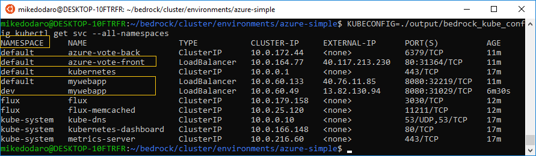
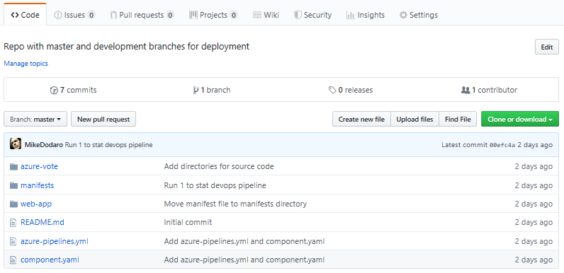
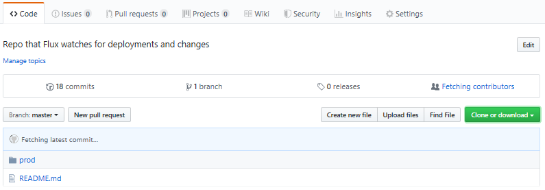

# Namespaces to Partition Cluster Resources in DevOps Pipeline
Namespaces divide a cluster into separate partitions that can be useful for development and release scenarios or large deployments that benefit from separation of resources.  During development, work can progress independently in its own namespace before merging to the default or production namespace.  When used with a DevOps pipeline, namespaces support pull-request based development that leaves a record of commits and can be reverted to previous stages.

## Development Namespace
Using containers from previous examples, the following screenshot shows *azure-vote* and *mywebapp* services running in the *default* namespace, and another *mywebapp* container in the *dev* namespace.  This is common when an application already in production is being updated or modified.



A previous document describes how to set up a [DevOps Pipeline to automate updates to Bedrock Deployment](README.md).  In this new scenario the *dev* namespace can be specified in a manifest that includes tentative changes.  When review and testing are complete, a few lines of metadata in the manifest can be changed from the *dev* namespace to the *default* or production namespace.

## Create a Namespace
To create a namespace for this scenario requires a manifest, for example the following: `dev-namespace.yaml`.
```
apiVersion: v1
kind: Namespace
metadata:
    name: dev
```
Save this file in the Bedrock deployment directory, then run: 

```
KUBECONFIG=./output/bedrock_kube_config kubectl create -f ./dev-namespace.yaml
```
with the result:
```
namespace/dev created
```

##  Deploy Services
Metadata in the manifest *.yaml* specifies the `dev` namespace for deployment of the `mywebapp` container.  The following manifest shows three metadata settings that route the container service to the `dev` namespace.  

```
# mywebapp services for dev namespace
######
apiVersion: v1
kind: Service
metadata:
  name: mywebapp
  namespace: dev    # <--- dev namespace
  labels:
    app: mywebapp
spec:
  type: LoadBalancer
  ports:
  - port: 8080
    name: http
  selector:
    app: mywebapp
---
apiVersion: extensions/v1beta1
kind: Deployment
metadata:
  name: mywebapp-v1
  namespace: dev    # <--- dev namespace
spec:
  replicas: 3
  minReadySeconds: 10 
  strategy:
    type: RollingUpdate 
    rollingUpdate:
      maxUnavailable: 1 
      maxSurge: 1 
  template:
    metadata:
      labels:
        app: mywebapp
        version: v1
        namespace: dev    # <--- dev namespace
    spec:
      containers:
      - name: mywebapp
        image: andrebriggs/goserver:v1.2
        imagePullPolicy: IfNotPresent
        ports:
        - containerPort: 8080
---
```

## Namespace deployment in DevOps Pipeline
When the manifest shown in the previous section is merged to the triggering branch of a DevOps pipeline, Fabrikate will send it to the repo Flux uses to deploy changes to the Bedrock cluster.

This example uses a GitHub repo named `bedrock-services` in tandem with another repo named `bedrock-services-manifests`.

The development repo shown in the following screenshot includes a manifests directory.  Manifests merged to this directory of the master branch trigger the DevOps pipeline.



The `azure-pipeline.yaml` manifest installed on this repo specifies [Fabrikate](../fabrikate/README.md) scripts that publish deployment manifests to the `bedrock-services-manifests` repo:



The Bedrock cluster uses Flux to monitor the `bedrock-services-manifests` repo for changes.  This repo is specified in the `terraform.tfvars` file during [set up](../azure-simple/README.md#set-up-terraform-deployment-variables).


For more information about namespaces, see the [Kubernetes documentation](https://kubernetes.io/docs/concepts/overview/working-with-objects/namespaces/).