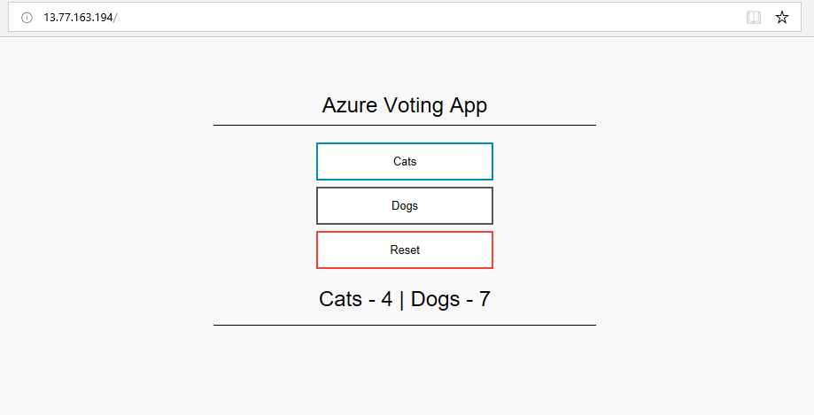

# Build Fabrikate Definition for Container Deployment
In this exercise we use Fabrikate to create a `.yaml` manifest and deploy a Docker container to a Bedrock cluster.

## Container
The container is shown in the [Quickstart: Deploy an Azure Kubernetes Service (AKS) cluster using the Azure CLI](https://docs.microsoft.com/en-us/azure/aks/kubernetes-walkthrough).  This is a simple UI voting application written in Python.  Instead of deploying a new Kubernetes cluster, we will use the manifest provided in the quickstart with an existing Bedrock deployment, such as [A Walkthrough Deploying a Bedrock Environment](../azure-simple/README.md). 

## Manifest
The target manifest for Fabrikate is shown under the heading [Run the application](https://docs.microsoft.com/en-us/azure/aks/kubernetes-walkthrough#run-the-application).   Copy the `.yaml` file provided in this section and create a file accessible in bash or Windows Subsystem for Linux (WSL Ubuntu).  

## Fabrikate
Download the latest version of Fabrikate CLI on your local machine from [releases](https://github.com/microsoft/fabrikate/releases). Unzip the appropriate binary and put fab in your path. The only tools you need to have installed are the fab CLI tool, helm, and git.

Create a directory and put the `azure-vote.yaml` file in it.  In the directory above create another file named `component.yaml` with the following contents:
```yaml
name: azure-vote
type: static
method: local
path: ./directory-you-created-with-the-azure-vote.yaml
```

Then run `$ fab install`.  You should get output like:
```
$ fab install
INFO[24-07-2019 12:04:33] fab version 0.15.0
INFO[24-07-2019 12:04:33] 🔍  Using git: /usr/bin/git
INFO[24-07-2019 12:04:33] 🔍  Using helm: /usr/local/bin/helm
INFO[24-07-2019 12:04:33] 🔍  Using sh: /bin/sh
INFO[24-07-2019 12:04:33] 🔍  Using curl: /usr/bin/curl
INFO[24-07-2019 12:04:33] 👉  Initializing Helm
INFO[24-07-2019 12:04:33] 💾  Loading component.yaml
INFO[24-07-2019 12:04:33] 👉  Starting install for component: azure-vote
INFO[24-07-2019 12:04:33] 👈  Finished install for component: azure-vote
INFO[24-07-2019 12:04:33] ✅  Installed successfully: azure-vote
INFO[24-07-2019 12:04:33] 🙌  Finished install
```

Then run `$ fab generate`, and you should get:
```
$ fab generate
INFO[24-07-2019 12:04:49] fab version 0.15.0
INFO[24-07-2019 12:04:49] 💾  Loading component.yaml
INFO[24-07-2019 12:04:49] 🚚  Generating component 'azure-vote' statically from path ./vote-deploy
INFO[24-07-2019 12:04:49] 💾  Writing generated/common/azure-vote.yaml
INFO[24-07-2019 12:04:49] 🙌  Finished generate
```
When these commands finish, there will be a new directory named `generated` with a subdirectory named `common` that contains the manifest file you can use to deploy the application to a Bedrock Kubernetes cluster.

## Deployment
Flux automation makes it easy to upgrade services or infrastructure deployed by Bedrock.  Flux monitors a repo designated in the deployed .tfvars file.  See [Set Up Flux Manifest Repository](../azure-simple/README.md#set-up-flux-manifest-repository) and [Set Up Terraform Deployment Variables](../azure-simple/README.md#setup-terraform-deployment-variables).

## Deploy an update using Kubernetes manifest
In this example Flux monitors the repo described under the heading [Set Up Flux Manifest Repository](../azure-simple/README.md#set-up-flux-manifest-repository).  Now add the `azure-vote` application to the running deployment by pushing the manifest proviously created by Fabrikate to the repo.  

The .yaml specification describes the service `azure-vote` and type: `LoadBalancer`.  It specifies the source of the Docker image that contains it.  The container will be accessible through the load balancer.

## Results
To see the changes as Flux picks them up and deploys them, open a bash command window and navigate to the Bedrock deployment, for example, the `bedrock/cluster/environments/azure-simple` directory.

Get your Flux namespace by running: `KUBECONFIG=./output/bedrock_kube_config kubectl get pod -n flux`.

Copy the name of the pod (the one that is not memcached).

Then run the command: `KUBECONFIG=./output/bedrock_kube_config kubectl logs -f <your-Flux-namespace> --namespace=flux`.  This will display a running log of the deployment.

Now push the azure-vote.yaml file that Fabrikate created in the `/generated/common` directory to the repo specified in the `.tfvars` file.  Or, simply drop it to the GitHub repo.  Flux is querying the repo for changes and will deploy the new service replicas as defined by this manifest.  

Watch the running log for changes:

```bash
ts=2019-07-24T21:21:22.32817337Z caller=loop.go:103 component=sync-loop event=refreshed url=git@github.com:MikeDodaro/bedrock-deploy-demo.git branch=master HEAD=29acba065c2578381437ff41e671132686037372
ts=2019-07-24T21:21:26.102252102Z caller=sync.go:470 component=cluster method=Sync cmd=apply args= count=4
ts=2019-07-24T21:21:28.686328308Z caller=sync.go:536 component=cluster method=Sync cmd="kubectl apply -f -" took=2.584012506s err=null output="service/azure-vote-back created\nservice/azure-vote-front created\ndeployment.apps/azure-vote-back created\ndeployment.apps/azure-vote-front created"
ts=2019-07-24T21:21:28.698262521Z caller=daemon.go:624 component=daemon event="Sync: 29acba0, default:deployment/azure-vote-back, default:deployment/azure-vote-front, default:service/azure-vote-back, default:service/azure-vote-front" logupstream=false
ts=2019-07-24T21:21:33.477775553Z caller=loop.go:441 component=sync-loop tag=flux-sync old=c6e9461a50c2e1c47363ab5a51567d12e7c47d69 new=29acba065c2578381437ff41e671132686037372
ts=2019-07-24T21:21:34.40170503Z caller=loop.go:103 component=sync-loop event=refreshed url=git@github.com:MikeDodaro/bedrock-deploy-demo.git branch=master HEAD=29acba065c2578381437ff41e671132686037372
ts=2019-07-24T21:22:08.521828606Z caller=images.go:147 component=cluster resource=kube-system:daemonset/azure-cni-networkmonitor err="decoded credential has wrong number of fields (expected 2, got 1)"
ts=2019-07-24T21:22:09.228004388Z caller=warming.go:198 component=warmer info="refreshing image" image=microsoft/azure-vote-front tag_count=5 to_update=5 of_which_refresh=0 of_which_missing=5
ts=2019-07-24T21:22:09.745851263Z caller=warming.go:206 component=warmer updated=microsoft/azure-vote-front successful=5 attempted=5
```
In this output, Flux has found the repo `bedrock-deploy-demo` and created the new service: `"kubectl apply -f -" took=1.263687361s err=null output="service/azure-vote created\ndeployment.extensions/azure-vote-v1 created"`. 

Open another bash window. When the new service is running, use `KUBECONFIG=./output/bedrock_kube_config kubectl get po --all-namespaces` to find the new namespaces in the deployment.

Then run `KUBECONFIG=./output/bedrock_kube_config kubectl get svc --all-namespaces`.  The output will include the `EXTERNAL-IP` address and `PORT` of the `azure-vote` load balancer: 

```bash
$ KUBECONFIG=./output/bedrock_kube_config kubectl get svc --all-namespaces
NAMESPACE     NAME                   TYPE           CLUSTER-IP     EXTERNAL-IP     PORT(S)         AGE
default       azure-vote-back        ClusterIP      10.0.171.76    <none>          6379/TCP        2m23s
default       azure-vote-front       LoadBalancer   10.0.250.183   13.77.163.194   80:30340/TCP    2m23s
default       kubernetes             ClusterIP      10.0.0.1       <none>          443/TCP         33m
flux          flux                   ClusterIP      10.0.158.51    <none>          3030/TCP        18m
flux          flux-memcached         ClusterIP      10.0.227.210   <none>          11211/TCP       18m
kube-system   kube-dns               ClusterIP      10.0.0.10      <none>          53/UDP,53/TCP   32m
kube-system   kubernetes-dashboard   ClusterIP      10.0.177.9     <none>          80/TCP          32m
kube-system   metrics-server         ClusterIP      10.0.101.102   <none>          443/TCP         32m
```
The EXTERNAL-IP, in this case is: 52.175.216.214.  Append the port and use http://52.175.216.214:8080 to run the service in a browser.

