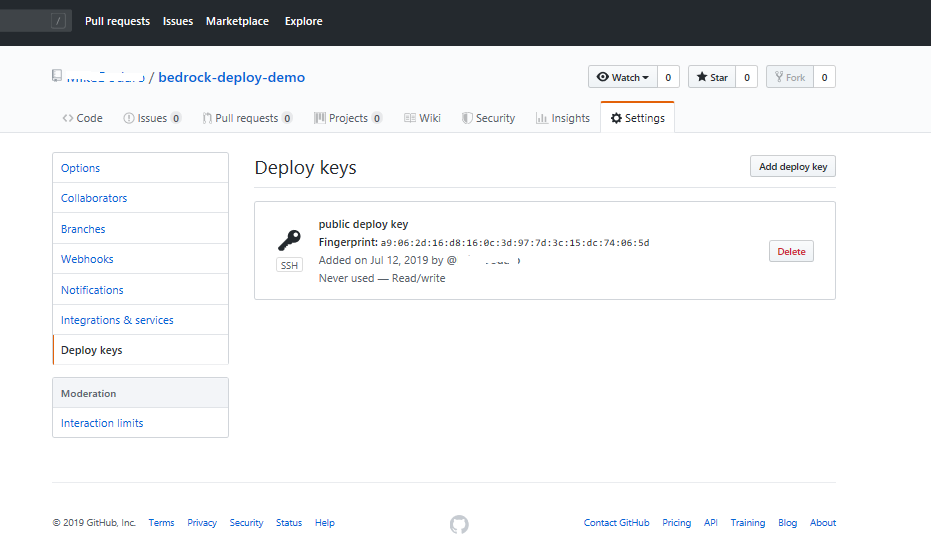

# A First Workload With Bedrock

The best way to start learning about Bedrock is to see how its core GitOps mechanism works and how it makes deploying infrastructure easier, so let's do that with a walkthrough of that functionality.

In this walkthrough, we will:
1. Create our GitOps resource manifest repo that will act as the source of truth for our in-cluster deployments.
2. Scaffold, generate, and deploy our first infrastructure deployment.
3. Make our first GitOps commit and see those changes deployed in the cluster by Flux.

## Create and Configure GitOps Resource Manifest Repo

In a GitOps workflow, we designate a git repo as the definitive source of truth of what should be deployed in our cluster.  An operator in the Kubernetes cluster (Flux in the case of Bedrock) watches this repo and applies commits to the repo to the cluster such that the resources in the cluster exactly match the GitOps resource manifest repo.

Our next steps is to create and configure this repo for this workflow.

### Create the Flux Manifest Repository

[Create an empty git repository](https://github.com/new/) with a name that signifies that the repo is used for a GitOps workflow (eg.  `app-cluster-manifests`) and then clone it locally:

```bash
$ git clone https://github.com/myuser/app-cluster-manifests
```

Flux requires that the git repository have at least one commit, so let's initialize the repo with an empty commit:

``` bash
$ cd app-cluster-manifests
$ git commit --allow-empty -m "Initializing GitOps Resource Manifest Repository"
$ git push origin master
```

### Generate an SSH Key for the GitOps Resource Manifest Repo

When Flux finishes reconciling the cluster state to match the resource manifest repo it pushes a tag to the repo to track the last commit it has reconciled against. This step requires authentication such that the repo can validate that you are authorized to push these tags.

For a Github repo, this authentication is accomplished using an SSH key, so our next task is to create this GitOps SSH key.

We’ll do this using `ssh-keygen` but first let’s create a separate directory to store all of our infrastructure deployment artifacts in:

```bash
$ mkdir -p ~/cluster-deployment
```

With this, let’s create a key pair for our GitOps workflow:

```bash
$ mkdir -p ~/cluster-deployment/keys
$ ssh-keygen -b 4096 -t rsa -f ~/cluster-deployment/keys/gitops-ssh-key
Generating public/private rsa key pair.
Enter passphrase (empty for no passphrase):
Enter same passphrase again:
Your identification has been saved in /Users/myuser/.ssh/gitops-ssh-key.
Your public key has been saved in /Users/myuser/.ssh/gitops-ssh-key.pub.
The key fingerprint is:
SHA256:jago9v63j05u9WoiNExnPM2KAWBk1eTHT2AmhIWPIXM myuser@computer.local
The key's randomart image is:
+---[RSA 4096]----+
|.=o.B= +         |
|oo E..= .        |
|  + =..oo.       |
|   . +.*o=       |
|    o . S..      |
|   . * . .       |
|... o ... .      |
|...  .o+.. .     |
|  .o..===o.      |
+----[SHA256]-----+
```

This will create our keys for our GitOps workflow:
1. The private key for Flux to authenticate against the GitOps repo and,
2. The public key for the GitOps repo to validate the passed credentials.

The public portion of the key pair will be uploaded to GitHub as a deploy key in the next step and we will retain the private portion of the key locally to provide to Flux during cluster deployment.

### Grant Deploy Key Access to the Manifest Repository

We next need to add the public key of this key pair to our repository. You will need ownership permissions to the git repo for this step.

First, copy the contents of the public key to your clipboard using one of the two methods below as appropriate for the platform that you are using:

MacOS
```bash
$ pbcopy < ~/cluster-deployment/keys/gitops-ssh-key.pub
```

Ubuntu (including WSL)

```bash
$ cat ~/cluster-deployment/keys/gitops-ssh-key.pub | xclip
```

Next, on the Github repository, select `Settings` -> `Deploy Keys` -> `Add deploy key`.  Give your key a title and paste in the contents of your public key and check the checkbox to allow the key to have `Write Access`.


Click "Add key", and you should see:



## Scaffold Cluster Deployment

With our GitOps resource manifest repo and key pair created, let’s move on to scaffolding out our cluster deployment.

Creating, managing, and maintaining infrastructure deployment templates is a real challenge, especially at scale, where a large scale deployment can consist of dozens of nearly identical clusters differentiated only by slight differences in config.

Bedrock helps your manage this complexity with infrastructure environment templates and definitions.  Let’s see this in action by scaffolding out our first definition with Bedrock’s `spk` command line tool:

```bash
$ cd ~/cluster-deployment
$ spk infra scaffold --name cluster --source https://github.com/microsoft/bedrock --version master --template cluster/environments/azure-simple
```

This will fetch the specified deployment template, create a directory called `my-cluster`, and places a file called `definition.json` in it:

```json
{
  "name": "cluster",
  "source": "https://github.com/microsoft/bedrock",
  "template": "cluster/environments/azure-simple",
  "version": "master",
  "variables": {
    "agent_vm_count": "3",
    "agent_vm_size": "Standard_D2s_v3",
    "acr_enabled": "true",
    "gc_enabled": "true",
    "cluster_name": "<insert value>",
    "dns_prefix": "<insert value>",
    "flux_recreate": "false",
    "kubeconfig_recreate": "false",
    "gitops_ssh_url": "<insert value>",
    "gitops_ssh_key": "<insert value>",
    "gitops_path": "<insert value>",
    "gitops_url_branch": "master",
    "resource_group_name": "<insert value>",
    "ssh_public_key": "<insert value>",
    "service_principal_id": "<insert value>",
    "service_principal_secret": "<insert value>",
    "gitops_poll_interval": "5m",
    "vnet_name": "<insert value>",
    "service_cidr": "10.0.0.0/16",
    "dns_ip": "10.0.0.10",
    "docker_cidr": "172.17.0.1/16",
    "address_space": "10.10.0.0/16",
    "subnet_prefix": "10.10.1.0/24",
    "network_policy": "azure",
    "oms_agent_enabled": "false"
  }
}
```

This `definition.json` is our first infrastructure definition.  It contains a reference to a deployment template that is maintained by the Bedrock project in this case -- but this template could exist anywhere.

This template will form the base of our deployment. You probably noticed above that the `spk` tool has also extracted the variables for this Terraform template and provided them, with defaults (if available).

## Completing our Deployment Definition

Our next task is to fill all of the empty items in this template with config values.

### Cluster name, DNS prefix, VNET name, and resource group

First, choose a cluster name (for example: `myname-cluster`) and replace both `cluster_name` and `dns_prefix` with this.   This will be the name of the cluster that will be created in your subscription.

Likewise, update the value for `resource_group_name` to be a variant of this, like `myname-cluster-rg`, and update `vnet_name` with a variant as well, like `myname-vnet`. Probably unsurprisingly, your cluster will be created in this resource group and VNET.

### Configure GitOps Repo

Next, let's update the `gitops_ssh_url` to your GitOps resource manifest repo, using the `ssh` url format available when you clone the repo from Github.  It should look something like this: `git@github.com:myuser/app-cluster-manifests.git`.

Our next step is to point `gitops_ssh_key` to the GitOps private key we created previously.  If you followed those steps, you can simply adjust this value to `../keys/gitops-ssh-key`.

In multi-cluster scenarios, we often will keep all of the resource manifests for all of our clusters in the same repo, but in this simple case, we are  only managing one cluster, so we are going to use the root of our GitOps repo as our root for our in-cluster resource manifests.

Given this, make `gitops_path` an empty string `""`.

### Create an Azure Service Principal

Our deployment specification includes references to values for the [Azure Service Principal](https://docs.microsoft.com/en-us/azure/active-directory/develop/app-objects-and-service-principals) for the [Azure Kubernetes Service (AKS)](https://azure.microsoft.com/en-us/services/kubernetes-service/) cluster:

```
        service_principal_id: ""
        service_principal_secret: ""
```

For this walkthrough, we will use a single Service Principal for deploying with Terraform and for the AKS cluster itself and our next step is to provision this.

If you haven’t yet, first [login to the Azure CLI](https://docs.microsoft.com/en-us/cli/azure/authenticate-azure-cli):

```bash
$ az login
```

Next, get the id for your subscription:

```bash
$ az account show
{
  "environmentName": "AzureCloud",
  "id": "7060bca0-1234-5-b54c-ab145dfaccef",
  "isDefault": true,
  "name": "Fabrikam Subscription",
  "state": "Enabled",
  "tenantId": "72f984ed-86f1-41af-91ab-87acd01ed3ac",
  "user": {
    "name": "olina@fabrikam.io",
    "type": "user"
  }
}
```

Finally, create the Service Principal (using the subscription id above):

```bash
$ mkdir -p ~/cluster-deployment/sp
$ az ad sp create-for-rbac --scopes "/subscriptions/7060bca0-1234-5-b54c-ab145dfaccef" > ~/cluster-deployment/sp/sp.json
$ cat ~/cluster-deployment/sp/sp.json
{
  "appId": "7b6ab9ae-dead-abcd-8b52-0a8ecb5beef7",
  "displayName": "azure-cli-2019-06-13-04-47-36",
  "name": "http://azure-cli-2019-06-13-04-47-36",
  "password": "35591cab-13c9-4b42-8a83-59c8867bbdc2",
  "tenant": "72f988bf-86f1-41af-91ab-2d7cd011db47"
}
```

Since these are sensitive secrets, we are going to use environment variables to pass them into our deployment to avoid accidentially checking them in.  Given this, create the following environment variables using the following mapping:

```bash
$ export ARM_SUBSCRIPTION_ID=(subscription id from above)
$ export ARM_TENANT_ID=(tenant from Service Principal)
$ export ARM_CLIENT_SECRET=(password from Service Principal)
$ export ARM_CLIENT_ID=(appId from Servive Principal)
```

So, using the values from above, these environment variables would look like:

```bash
$ export ARM_SUBSCRIPTION_ID=7060bca0-1234-5-b54c-ab145dfaccef
$ export ARM_TENANT_ID=72f984ed-86f1-41af-91ab-87acd01ed3ac
$ export ARM_CLIENT_SECRET=35591cab-13c9-4b42-8a83-59c8867bbdc2
$ export ARM_CLIENT_ID=7b6ab9ae-dead-abcd-8b52-0a8ecb5beef
```

For the Terraform template itself, we will also using environmental variables to specify the values of `service_principal_id` and `service_principal_secret`, so delete these values from the `definition.json` and then define the following environmental variables:

```bash
$ export TF_VAR_service_principal_id=7b6ab9ae-dead-abcd-8b52-0a8ecb5beef
$ export TF_VAR_service_principal_secret=35591cab-13c9-4b42-8a83-59c8867bbdc2
```

More documentation around Service Principals are available in the [Bedrock documentation](https://github.com/microsoft/bedrock/tree/master/cluster/azure#create-an-azure-service-principal).

### Create an Node RSA Key Pair

When you deploy an AKS cluster, you provide an SSH key pair that enables you, in rare circumstances, to shell into the nodes of the cluster.

We’ll use the same process that we used to create a key pair for GitOps:

```bash
$ ssh-keygen -b 4096 -t rsa -f ~/cluster-deployment/keys/node-ssh-key
Generating public/private rsa key pair.
Enter passphrase (empty for no passphrase):
Enter same passphrase again:
Your identification has been saved in /home/myuser/cluster-deployment/keys/node-ssh-key.
Your public key has been saved in /home/myuser/cluster-deployment/keys/node-ssh-key.pub.
The key fingerprint is:
SHA256:+8pQ4MuQcf0oKT6LQkyoN6uswApLZQm1xXc+pp4ewvs myuser@computer.local
The key's randomart image is:
+---[RSA 4096]----+
|   ...           |
|  . o. o .       |
|.. .. + +        |
|... .= o *       |
|+  ++ + S o      |
|oo=..+ = .       |
|++ ooo=.o        |
|B... oo=..       |
|*+. ..oEo..      |
+----[SHA256]-----+
```

Copy the public key for this node key pair into your clipboard using the same method you did for the GitOps public key:

MacOS
```bash
$ pbcopy < ~/cluster-deployment/keys/node-ssh-key.pub
```

Ubuntu (& WSL)
```bash
$ cat ~/cluster-deployment/keys/node-ssh-key.pub | xclip
```

Paste this into your `definition.json` file as the value for `ssh_public_key`.

### Create Azure Resource Group

You will also need an already created resource group in your subscription with the resource group name you chose above before you do a `terraform apply`. Use the following command to create this:

```bash
$ az group create -l westus2 -n myuser-cluster-rg
```
### Generate Terraform Deployment

With these prep steps completed, let’s generate Terraform templates from this cluster definition directory:

```bash
$ cd ~/cluster-deployment
$ spk infra generate -p cluster
```

This reads our `definition.json` file, downloads the template referred to in it, applies the parameters we have provided, and creates a generated Terraform script in a directory called `cluster-generated`.

## Deploy Cluster

From this `generated` directory we can then `init` our Terraform deployment to fetch all of the upstream Terraform module dependencies.

```bash
$ terraform init
Initializing modules...
Downloading github.com/microsoft/bedrock?ref=0.12.0//cluster/azure/aks-gitops for aks-gitops...
- aks-gitops in .terraform/modules/aks-gitops/cluster/azure/aks-gitops
- aks-gitops.aks in .terraform/modules/aks-gitops/cluster/azure/aks
- aks-gitops.aks.azure-provider in .terraform/modules/aks-gitops/cluster/azure/provider
- aks-gitops.aks.azure-provider.common-provider in .terraform/modules/aks-gitops/cluster/common/provider
- aks-gitops.flux in .terraform/modules/aks-gitops/cluster/common/flux
- aks-gitops.flux.common-provider in .terraform/modules/aks-gitops/cluster/common/provider
- aks-gitops.kubediff in .terraform/modules/aks-gitops/cluster/common/kubediff
- aks-gitops.kubediff.common-provider in .terraform/modules/aks-gitops/cluster/common/provider
Downloading github.com/microsoft/bedrock?ref=0.12.0//cluster/azure/provider for provider...
- provider in .terraform/modules/provider/cluster/azure/provider
- provider.common-provider in .terraform/modules/provider/cluster/common/provider
Downloading github.com/microsoft/bedrock?ref=0.12.0//cluster/azure/vnet for vnet...
- vnet in .terraform/modules/vnet/cluster/azure/vnet

Initializing the backend...

Initializing provider plugins...
- Checking for available provider plugins...
- Downloading plugin for provider "null" (hashicorp/null) 2.1.2...
- Downloading plugin for provider "random" (hashicorp/random) 2.2.1...
- Downloading plugin for provider "azuread" (hashicorp/azuread) 0.5.1...
- Downloading plugin for provider "azurerm" (hashicorp/azurerm) 1.32.1...

Terraform has been successfully initialized!

You may now begin working with Terraform. Try running "terraform plan" to see
any changes that are required for your infrastructure. All Terraform commands
should now work.

If you ever set or change modules or backend configuration for Terraform,
rerun this command to reinitialize your working directory. If you forget, other
commands will detect it and remind you to do so if necessary.
```

Our next step is to plan the deployment, which will preflight our deployment script and the configured variables, and output the changes that would happen in our infrastructure if applied:

```bash
$ terraform plan -var-file=spk.tfvars
Refreshing Terraform state in-memory prior to plan...
The refreshed state will be used to calculate this plan, but will not be
persisted to local or remote state storage.

data.azurerm_resource_group.cluster_rg: Refreshing state...
module.aks-gitops.data.azurerm_resource_group.aksgitops: Refreshing state...
module.vnet.data.azurerm_resource_group.vnet: Refreshing state...
module.aks-gitops.module.aks.data.azurerm_resource_group.cluster: Refreshing state...

------------------------------------------------------------------------

An execution plan has been generated and is shown below.
Resource actions are indicated with the following symbols:
  + create

Terraform will perform the following actions:

  # module.vnet.azurerm_subnet.subnet[0] will be created
  + resource "azurerm_subnet" "subnet" {
      + address_prefix       = "10.10.1.0/24"
      + id                   = (known after apply)
      + ip_configurations    = (known after apply)
      + name                 = "myuser-cluster-aks-subnet"
      + resource_group_name  = "myuser-cluster-rg"
      + service_endpoints    = []
      + virtual_network_name = "myuser-cluster-vnet"
    }

.... snip ....

Plan: 8 to add, 0 to change, 0 to destroy.

------------------------------------------------------------------------

Note: You didn't specify an "-out" parameter to save this plan, so Terraform
can't guarantee that exactly these actions will be performed if
"terraform apply" is subsequently run.

Finally, since we are happy with these changes, we apply the Terraform template.

$ terraform apply -var-file=spk.tfvars
An execution plan has been generated and is shown below.
Resource actions are indicated with the following symbols:
  + create

Terraform will perform the following actions:

  + azurerm_resource_group.cluster_rg
      id:                                         <computed>
      location:                                   "westus2"
      name:                                       "myuser-cluster-rg"
      tags.%:                                     <computed>

... snip ...

Plan: 8 to add, 0 to change, 0 to destroy.

Do you want to perform these actions?
  Terraform will perform the actions described above.
  Only 'yes' will be accepted to approve.

  Enter a value: yes

module.vnet.azurerm_resource_group.vnet: Creating...
  location: "" => "westus2"
  name:     "" => "testazuresimplerg"
  tags.%:   "" => "<computed>"
azurerm_resource_group.cluster_rg: Creating...
  location: "" => "westus2"
  name:     "" => "testazuresimplerg"
  tags.%:   "" => "<computed>"

.... snip ...

Apply complete! Resources: 8 added, 0 changed, 0 destroyed.
```

With that, you have successfully have deployed your first cluster with Bedrock!

This possibly seems like a lot of overhead for creating a single cluster.  The real advantage to this approach comes when you need to manage multiple clusters that are only slightly differentiated by config, or when you want to do upgrades to a new version of the template, and a variety of other “day 2” scenarios.  You can read in detail about these scenarios and in our infrastructure definitions documentation.

### Using Terraform State

Terraform stores the results of our `terraform apply` in a `terraform.tfstate` file. You can see an overview of resources created with:

```bash
$ terraform state list
azurerm_resource_group.cluster_rg
module.aks-gitops.module.aks.azurerm_kubernetes_cluster.cluster
module.aks-gitops.module.aks.azurerm_resource_group.cluster
module.aks-gitops.module.aks.null_resource.cluster_credentials
module.aks-gitops.module.flux.null_resource.deploy_flux
module.vnet.azurerm_resource_group.vnet
module.vnet.azurerm_subnet.subnet
module.vnet.azurerm_virtual_network.vnet
````

You can see more details about any one of these created resources with:

```bash
$ terraform state show module.vnet.azurerm_virtual_network.vnet
id                     = /subscriptions/b59451c1-cd43-41b3-b3a4-74155d8f6cf6/resourceGroups/tst-az-simple-rg/providers/Microsoft.Network/virtualNetworks/testazuresimplevnet
address_space.#        = 1
address_space.0        = 10.10.0.0/16
ddos_protection_plan.# = 0
dns_servers.#          = 0
location               = westus2
name                   = testazuresimplevnet
resource_group_name    = tst-az-simple-rg
subnet.#               = 0
tags.%                 = 1
tags.environment       = azure-simple
```

And a full set of details with:

```bash
$ terraform show
```

### Interacting with the Deployed Cluster

The `azure-simple` Terraform template we used in this walkthrough automatically copies the Kubernetes config file from the cluster into the `output` directory.  This config file has all of the details we need to interact with our new cluster.

To utilize it, we first need to merge it into our own config file and make it the default configuration.  We can do that with this:

```bash
$ KUBECONFIG=./output/bedrock_kube_config:~/.kube/config kubectl config view --flatten > merged-config && mv merged-config ~/.kube/config
```

With this, you should be able to see the pods running in the cluster:

```bash
$ kubectl get pods --all-namespaces
NAMESPACE     NAME                                   READY   STATUS    RESTARTS   AGE
flux          flux-5698f45759-ntnz5                  1/1     Running   0          10m
flux          flux-memcached-7c9c56b487-wcsvr        1/1     Running   0          10m
kube-system   azure-cni-networkmonitor-7bjwt         1/1     Running   0          13m
kube-system   azure-cni-networkmonitor-h7m64         1/1     Running   0          13m
kube-system   azure-cni-networkmonitor-q7hn2         1/1     Running   0          13m
kube-system   azure-ip-masq-agent-2xtng              1/1     Running   0          13m
kube-system   azure-ip-masq-agent-5v6vz              1/1     Running   0          13m
kube-system   azure-ip-masq-agent-jpb5h              1/1     Running   0          13m
kube-system   azure-npm-l5flr                        2/2     Running   1          13m
kube-system   azure-npm-qsxnq                        2/2     Running   0          13m
kube-system   azure-npm-zs8hz                        2/2     Running   0          13m
kube-system   coredns-7fc597cc45-7m7cm               1/1     Running   0          11m
kube-system   coredns-7fc597cc45-q2kr8               1/1     Running   0          18m
kube-system   coredns-autoscaler-7ccc76bfbd-pfwjh    1/1     Running   0          18m
kube-system   kube-proxy-c8p2j                       1/1     Running   0          13m
kube-system   kube-proxy-tnrd2                       1/1     Running   0          13m
kube-system   kube-proxy-wsqhn                       1/1     Running   0          13m
kube-system   kubernetes-dashboard-cc4cc9f58-qjbc2   1/1     Running   0          18m
kube-system   metrics-server-58b6fcfd54-c2w6x        1/1     Running   0          18m
kube-system   tunnelfront-5787f6d67-f84zn            1/1     Running   0          18m
```

As you can see, Flux was provisioned as part of cluster creation, and as such we can see the pods are running in the cluster.

Copying the name of the flux pod, let’s fetch the logs for it:

```bash
$ kubectl logs flux-5897d4679b-tckth -n flux
ts=2019-06-18T06:33:18.668235584Z caller=main.go:193 version=1.12.2
ts=2019-06-18T06:33:18.781628775Z caller=main.go:350 component=cluster identity=/etc/fluxd/ssh/identity
ts=2019-06-18T06:33:18.781698175Z caller=main.go:351 component=cluster identity.pub="ssh-rsa AAAAB3NzaC1yc2EAAAADAQABAAACAQDTNdGpnmztWRa8RofHl8dIGyNkEayNR6d7p2JtJ7+zMj0HRUJRc+DWvBML4DvT29AumVEuz1bsVyVS2f611NBmXHHKkbzAZZzv9gt2uB5sjnmm7LAORJyoBEodR/T07hWr8MDzYrGo5fdTDVagpoHcEke6JT04AL21vysBgqfLrkrtcgaXsw8e3rkfbqGLbhb6o1muGdEyE+uci4hRVj+FGL9twh3Mb6+0uak/UsTFgfDi/oTXdXOFIitQ1o40Eip6P4xejEOuIye0cg7rfX461NmOP7HIEsUa+BwMExiXXsbxj6Z0TXG0qZaQXWjvZF+MfHx/J0Alb9kdO3pYx3rJbzmdNFwbWM4I/zN+ng4TFiHBWRxRFmqJmKZX6ggJvX/d3z0zvJnvSmOQz9TLOT4lqZ/M1sARtABPGwFLAvPHAkXYnex0v93HUrEi7g9EnM+4dsGU8/6gx0XZUdH17WZ1dbEP7VQwDPnWCaZ/aaG7BsoJj3VnDlFP0QytgVweWr0J1ToTRQQZDfWdeSBvoqq/t33yYhjNA82fs+bR/1MukN0dCWMi7MqIs2t3TKYW635E7VHp++G1DR6w6LoTu1alpAlB7d9qiq7o1c4N+gakXSUkkHL8OQbQBeLeTG1XtYa//A5gnAxLSzxAgBpVW15QywFgJlPk0HEVkOlVd4GzUw=="
ts=2019-06-18T06:33:18.781740875Z caller=main.go:352 component=cluster host=https://10.0.0.1:443 version=kubernetes-v1.13.5
ts=2019-06-18T06:33:18.781823975Z caller=main.go:364 component=cluster kubectl=/usr/local/bin/kubectl
ts=2019-06-18T06:33:18.783257271Z caller=main.go:375 component=cluster ping=true
ts=2019-06-18T06:33:18.790498551Z caller=main.go:508 url=git@github.com:jmspring/manifests.git user="Weave Flux" email=support@weave.works signing-key= sync-tag=flux-sync notes-ref=flux set-author=false
ts=2019-06-18T06:33:18.790571551Z caller=main.go:565 upstream="no upstream URL given"
ts=2019-06-18T06:33:18.791840947Z caller=main.go:586 addr=:3030
ts=2019-06-18T06:33:18.819345472Z caller=loop.go:90 component=sync-loop err="git repo not ready: git repo has not been cloned yet"
ts=2019-06-18T06:33:18.819404372Z caller=images.go:18 component=sync-loop msg="polling images"
```

## Deploy an update using Kubernetes manifest

The GitOps workflow we have established with Flux and Bedrock makes it easy to control the workflow that is running in the cluster.  As we discussed earlier, Flux watches the GitOps resource manifest repo and applies any changes we make there to the cluster.

Let’s try this by creating a YAML file with a set of Kubernetes resources for a simple service and committing it to the resource manifest repo.  In your resource manifest git repo directory that we cloned earlier, create a file called `webapp.yaml` and place the following into it:

```yaml
apiVersion: v1
kind: Service
metadata:
  name: mywebapp
  labels:
    app: mywebapp
spec:
  type: LoadBalancer
  ports:
  - port: 8080
    name: http
  selector:
    app: mywebapp
---
apiVersion: extensions/v1beta1
kind: Deployment
metadata:
  name: mywebapp-v1
spec:
  replicas: 3
  minReadySeconds: 10
  strategy:
    type: RollingUpdate
    rollingUpdate:
      maxUnavailable: 1
      maxSurge: 1
  template:
    metadata:
      labels:
        app: mywebapp
        version: v1
    spec:
      containers:
      - name: mywebapp
        image: andrebriggs/goserver:v1.2
        imagePullPolicy: IfNotPresent
        ports:
        - containerPort: 8080
---
```

This defines a simple 3 pod deployment of a web service with the container `andrebriggs/goserver:v1.2` with a LoadBalanced service.  Let’s commit this file and push it to our remote GitOps repo:

```bash
$ git add webapp.yaml
$ git commit -m "Add simple web application"
$ git push origin master
```

Let’s then watch the Flux pod logs again, but this time tailing them so we get updates with `-f`:

```bash
$ kubectl logs flux-5897d4679b-tckth -n flux -f
```

Once Flux triggers its next sync, we should see at the end of the output that Flux has found the repo `bedrock-deploy-demo` and created the new service: `"kubectl apply -f -" took=1.263687361s err=null output="service/mywebapp created\ndeployment.extensions/mywebapp-v1 created"`.

Once applied, we should be able to see the web app pods running in our cluster:

```bash
$ kubectl get pods
NAME                           READY   STATUS    RESTARTS   AGE
mywebapp-v1-749d754b4f-k55pv   1/1     Running   0          18m
mywebapp-v1-749d754b4f-nshj5   1/1     Running   0          18m
mywebapp-v1-749d754b4f-sj2hf   1/1     Running   0          18m
```

And we should also see the LoadBalancer service by querying the set of services in the cluster:

```
$ kubectl get services --all-namespaces
NAMESPACE     NAME                   TYPE           CLUSTER-IP     EXTERNAL-IP      PORT(S)          AGE
default       kubernetes             ClusterIP      10.0.0.1       <none>           443/TCP          44m
default       mywebapp               LoadBalancer   10.0.96.208    52.175.216.214   8080:30197/TCP   23m
flux          flux                   ClusterIP      10.0.139.133   <none>           3030/TCP         34m
flux          flux-memcached         ClusterIP      10.0.246.230   <none>           11211/TCP        34m
kube-system   kube-dns               ClusterIP      10.0.0.10      <none>           53/UDP,53/TCP    44m
kube-system   kubernetes-dashboard   ClusterIP      10.0.222.104   <none>           80/TCP           44m
kube-system   metrics-server         ClusterIP      10.0.189.185   <none>           443/TCP          44m
```

External load balancers like this take time to provision, so if the EXTERNAL-IP of service is still pending, keep trying periodically until it is provisioned.

The EXTERNAL-IP, in the case above, is: 52.175.216.214.  Append the port and use http://52.175.216.214:8080 to run the service in a browser.


And that’s it.  We have created a GitOps resource manifest repo, scaffolded and deployed an AKS cluster, and used GitOps to deploy a web app workload to it.

As a final step, you probably want to delete your Kubernetes cluster to save money:

```bash
$ cd ~/cluster-deployment/cluster-generated
$ terraform destroy -var-file=spk.tfvars
```
