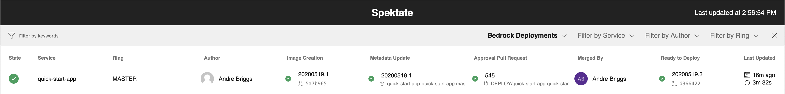

# 5 Minute GitOps Pipeline with `bedrock`

The best way to start learning about GitOps in Bedrock is to walkthrough a simple sample deployment that captures our recommended approach using [Fabrikate](https://github.com/Microsoft/fabrikate). You will be using the Bedrock CLI aka `bedrock`. In this walkthrough, we will:

* Build a sample microservice and link a Helm chart to a High Level Definition [**TODO LINK**] 🔮
* Generate Kubernetes manifests backed by a Git-based source of truth 🚀
* View end to end observability of the microservice deployment 🔭

## Step 1: Install `bedrock` and dependencies

### Pre-req

* An Azure subscription with an existing [Azure Container Registry](https://docs.microsoft.com/en-us/azure/container-registry/)
* Ensure the [latest](https://docs.microsoft.com/en-us/cli/azure/install-azure-cli?view=azure-cli-latest) version of Azure CLI is installed.
* An [Azure DevOps](https://azure.microsoft.com/en-us/services/devops/) project, organization, and read/write/manage [access token](https://docs.microsoft.com/en-us/azure/devops/organizations/accounts/use-personal-access-tokens-to-authenticate?view=azure-devops&tabs=preview-page)

### Installation

`bedrock` is available on Linux, macOS and Windows platforms.

* Download the latest `bedrock` binaries [here](https://github.com/microsoft/bedrock-cli/releases). 

* Install with Homebrew:
   ```bash
   brew update && brew install bedrock-cli
   ```
---
## Step 2: Setup a sample GitOps environment with `bedrock`

Next `bedrock` will do the heavy lifting of creating [repositories](https://github.com/microsoft/bedrock/blob/master/gitops/azure-devops/ADORepos.md), [pipelines](https://github.com/microsoft/bedrock/blob/master/gitops/azure-devops/ManifestGeneration.md), and [cloud resources](https://github.com/microsoft/bedrock/blob/master/gitops/azure-devops/ImageTagRelease.md#create-a-service-connection-to-acr) for you. Please read about Bedrock Concepts [**TODO LINK**] to get more familiar.  

1. Run `bedrock setup`
2. Hit enter to confirm the preselected value that is in parenthesis. Otherwise a new value for the prompt
3. If redirected to an Azure Portal sign in page, login and return to the shell prompt.  

Example command and results below:
```ShellSession
$ bedrock setup
info:    az cli vesion 2.5.1
? Enter organization name
 contoso
? Enter project name
 fabrikam
? Enter your AzDO personal access token
 ****************************************************
? Would you like to create a sample application repository? Yes
? Do you want to create a service principal? Yes
info:    attempting to login to az command line
? Select one of the subscriptions
 CSE Dev Crews Americas West
info:    attempting to create service principal with az command line
info:    Successfully created service principal with az command line
? Enter Azure Container Register Name. The registry name must be unique within Azure
 contosoacr
 Create variable group
 ✅ Install manifest repo
 ✅ Install hld repo
 ✅ Install and verify manifest pipeline
 ? Enter storage account name
 contosoazurestorage
 ✅ Update variable group
 ✅ Install helm repo
 ✅ Install sample app repo
 ✅ Install and verify lifecycle pipeline
 ✅ Install and verify build pipeline 
```

> Note: If you prefer not to use the interactive (immediate feedback for each statement) mode of `bedrock setup` you can provide a config file. See [docs](https://microsoft.github.io/bedrock-cli/commands/#master@setup).

**🎉 Congratulations! 🎉** At this point your have created the [simplest form](https://github.com/microsoft/bedrock/blob/master/gitops/PipelineThinking.md) of a Bedrock GitOps pipeline. Next let's get a closer at what we have created.

---
## Step 3: Observe the `bedrock` GitOps flow

We can see a live report of the `bedrock` GitOps journey we just completed in _Step 2_ using Bedrock's [Spektate](https://github.com/microsoft/spektate/) dashboard. Follow the instructions below to follow along 

1. Ensure you have Docker running locally. You can download Docker [here](https://docs.docker.com/desktop/).
2. Run `bedrock deployment dashboard`, you will be redirected to the localhost webpage in your default web browser.
3. _If the page doesn't load on first try please refresh the webpage._

Example below:
```console
$ bedrock deployment dashboard
info:    Pulling dashboard docker image
info:    Launching dashboard on http://localhost:4040
```

You will see a row of data in the Spektate dashboard as seen below. Feel free to click on links on Spektate to see the builds and pull requests that `bedrock` GitOps process automated:



⭐️ If you have an existing Kubernetes cluster, the Spektate dashboard will indicate when your application has been synced with the cluster. Learn about how to get a Kubernetes cluster integrated in _Next Steps_.

---
## Next Steps

In this walkthrough we created a GitOps workflow of repositories and build pipelines. In addition, we were able to capture telemetry from the build pipelines to display the journey of the sample application to a Kubernetes manifest repository.

* Learn about more GitOps scenarios addressed by Bedrock and extend this walkthrough for your own tooling and scenarios.
  * Bedrock GitOps Next Steps [**TODO LINK**]
* Learn how to enable your existing Kubernetes clusters to take advantage of Bedrock GitOps
  * Configuring a syncing agent on your Kubernetes clusters [**TODO LINK**]
* Learn how to easily deploy a new Kubernetes cluster(s) using Terraform and `bedrock`
  * Single and multi-cluster GitOps enabled AKS [**TODO LINK**]