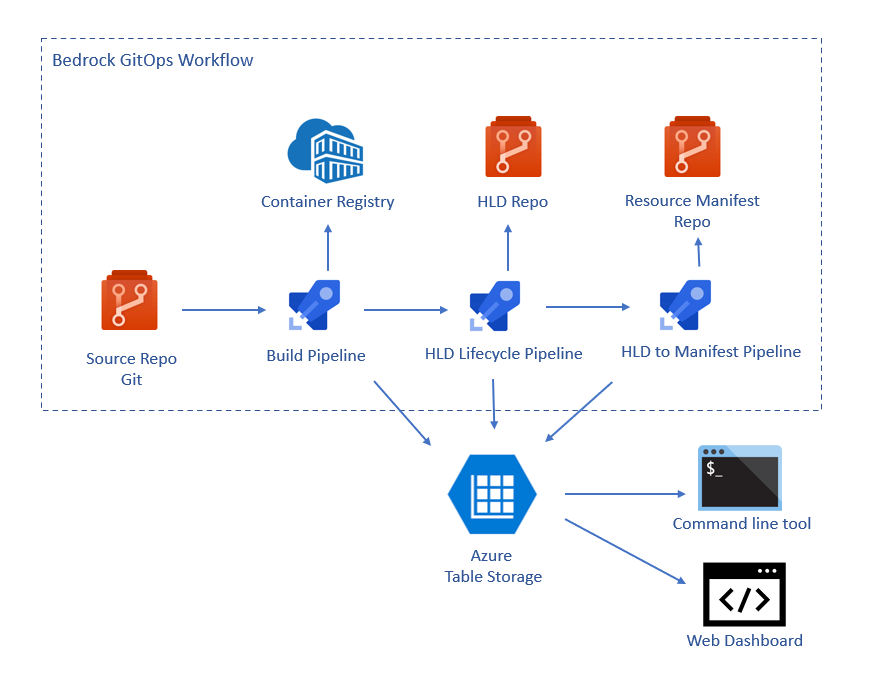
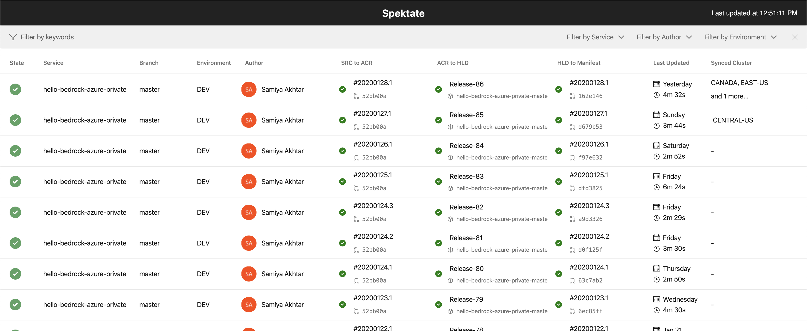
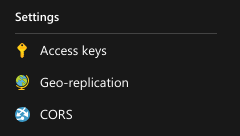
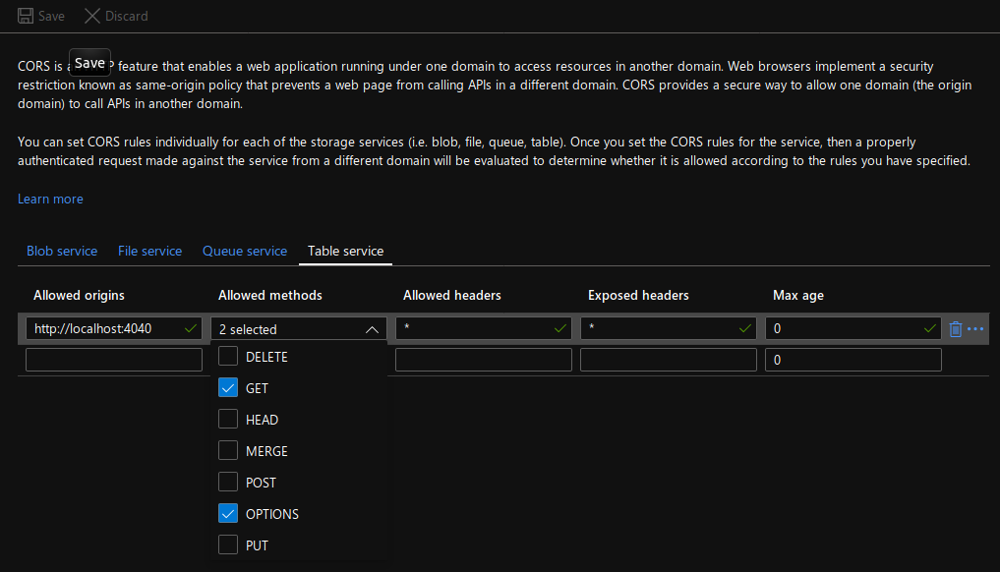
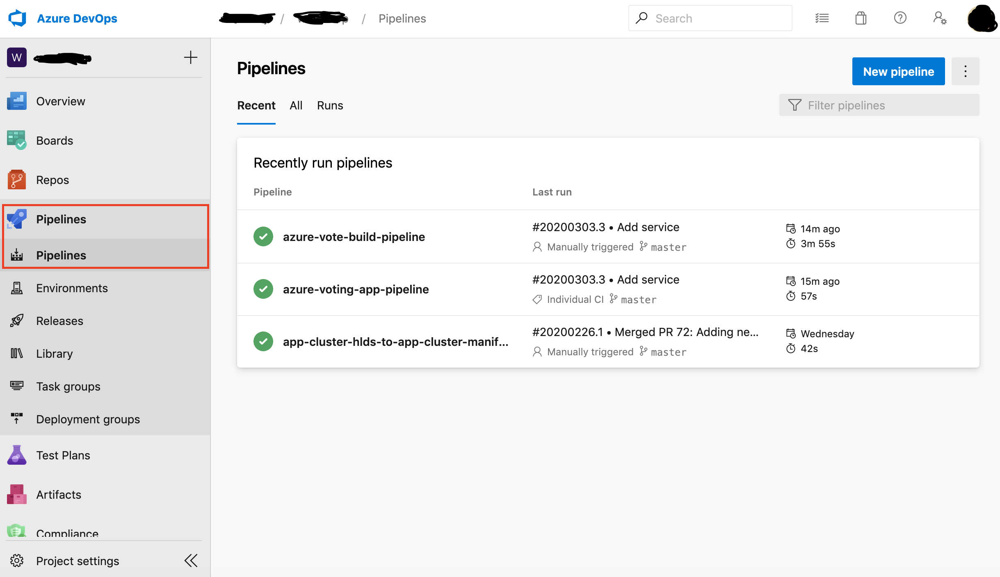
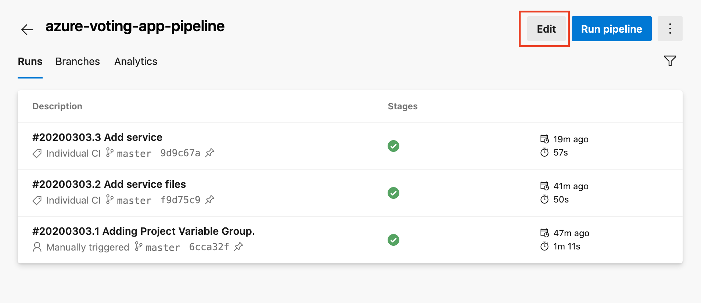
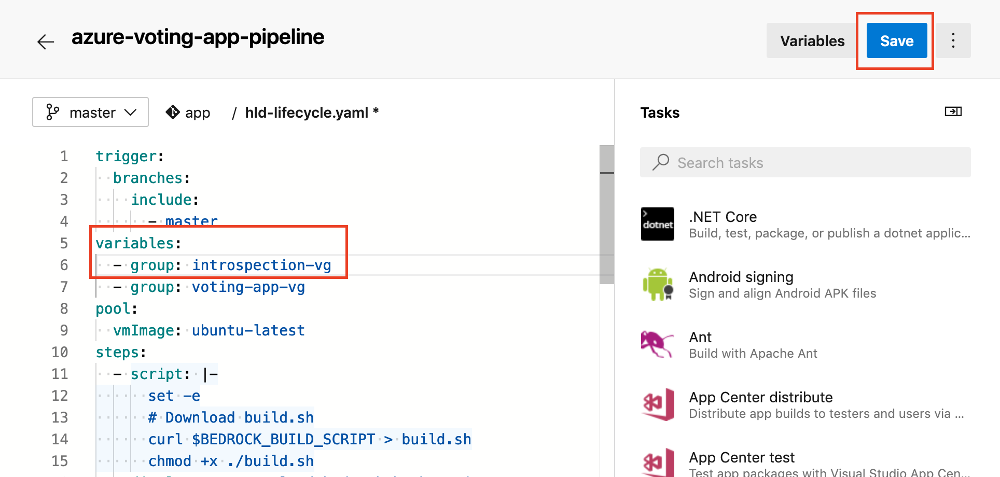

# Introspection in Service Deployments

Many Kubernetes deployments are composed of not just one, but many microservices, and this complexity is compounded by, for latency, scalability, and/or reliability concerns, that these microservices are often also deployed across multiple clusters as well.  This makes it hard to reason about the current state of any individual cluster -- and especially a collection of ones that all together constitute the workload.

To help with this, Bedrock has a service introspection tool to provide better visibility the end to end deployment workflows. It integrates with the GitOps pipeline and service management that were setup in previous walkthrough guides.

The service introspection tool exists in two forms:
1. Command line tool
2. Web Dashboard

The service introspection tool provides views into the current status of any change in the system, from continuous integration build to tracking the deployment of the container containing that commit in each of the downstream clusters consuming that container.

The service introspection main components are:
1. A Bedrock Gitops pipeline that reports back with telemetry data for each of the steps of the system. Currently supported in Azure DevOps
2. An Azure Storage Table that stores all of the telemetry reported back.
3. Introspection tools both for the command line and web dashboard.

The following diagram shows how the introspection tool integrates with the Azure DevOps pipelines in a Bedrock GitOps Workflow.


The Web Dashboard is shown in the image below. In Bedrock, the status is displayed from newest to oldest, and we can see in the first line that a commit has triggered a container build that is currently deployed in the west cluster but that the east cluster hasn't yet been synchronized and is currently still running the previous version of the container.



This walkthrough will cover how to set up introspection in your own deployments and how to use it to observe changes to your cluster.

## Prerequisites
This guideline assumes you have completed the following:

1. Set up GitOps. Guideline: [A First Workload With Bedrock](./firstWorkload/README.md)
2. Set up the HLD to Manifests pipeline. Guideline: [Setting up an HLD to Manifest pipeline](./hld-to-manifest.md)
3. Onboard a Service Repository. Guideline: [Service Management](services.md)


## Setup an Azure Storage Table
Service introspection tool needs a database to store the information about your
pipelines, builds and deployments. Currently, service introspection supports
storage in the form of an Azure Storage table. Follow the steps below to create
it or use an existing one.

### Create an Azure storage account
You can use bedrock to create a storage account if it does not already exist in your subscription in the given resource group.
The storage table will also be created in a newly created or in an existing storage account if it does not exist already.

The `bedrock deployment onboard` command will create the storage account:

```
$ bedrock deployment onboard --storage-account-name $STORAGE_ACCOUNT --storage-table-name $TABLE_NAME --storage-location $LOCATION --storage-resource-group-name $RESOURCE_GROUP --service-principal-id $SP_APP_ID --service-principal-password $SP_PASS --tenant-id $SP_TENANT --subscription-id $SUBSCRIPTION
```
Where:

- `$STORAGE_ACCOUNT`: Azure storage account name
- `$TABLE_NAME`: Azure storage table name
- `$LOCATION`: Azure location to create new storage account when it does not exist
- `$RESOURCE_GROUP`: Name of the resource group to create new storage account when it does not exist (must already exist)
- `$SP_APP_ID`: Azure service principal id with `contributor` role in Azure Resource Group
- `$SP_PASS`: Azure service principal password
- `$SP_TENANT`: Azure AD tenant id of service principal
- `$SUBSCRIPTION`: Azure subscription id

More information about its usage can be found [here](https://microsoft.github.io/bedrock-cli/commands/index.html#master@deployment_onboard).

### Storage account CORS settings

Configure the CORS settings for the storage account to allow requests from the
service introspection dasbhoard.

1. Go to the [Azure portal](https://portal.azure.com)
2. Search for the name of your storage account
3. Click the CORS options on the menu on the left side:



Add the following settings under **Table Service**:


**Note:** If you are running the service introspection bedrock dashboard in a port
other than `4040`, add that entry in the settings instead.

## Configure the Pipelines
The Bedrock GitOps pipelines need to be configured to start sending data to
`bedrock` service introspection. If you followed the guidelines from the (Prerequisites)[#prerequisites] each pipeline `yaml` will already have the script needed for introspection.

To send data from Azure pipelines to the Azure Storage table created
previously, a variable group needs to be configured in Azure DevOps (where the
pipelines are).

### Create a Variable Group

We next want to create a variable group that contains the necessary configuration details that our pipelines need in order to push telemetry about the success of our pipelines for observability.

Create the following `introspection-values.yaml` file with the configuration details:

```
name: "introspection-vg"
description: "Service introspection values"
type: "Vsts"
variables:
    INTROSPECTION_ACCOUNT_KEY:
        value: "Set this to the access key for your storage account"
        isSecret: true
    INTROSPECTION_ACCOUNT_NAME:
        value: "Set this to the name of your storage account"
    INTROSPECTION_PARTITION_KEY:
        value: "This field can be a distinguishing key that recognizea your source repository in the storage for eg. in this example, we're using the name of the source repository `hello-bedrock`"
    INTROSPECTION_TABLE_NAME:
        value: "Set this to the name of the table you created previously in [Create a table](#create-a-table)"
```

And then use bedrock's variable-group management to create the variable group:

```
$ bedrock variable-group create --file introspection-values.yaml --org-name $ORG_NAME --devops-project $DEVOPS_PROJECT --personal-access-token $ACCESS_TOKEN
```

Where `ORG_NAME` is the name of the Azure Devops org, `DEVOPS_PROJECT` is the name of your Azure Devops project and `ACCESS_TOKEN` is the Personal access token associated with the Azure DevOps org. In [Setting up an HLD to Manifest pipeline](./hld-to-manifest.md) we created a personal access token.

### Update the Pipelines
Next, we will update all the pipelines to include the variable group we created previously.

```yaml
variables:
  - group: <your-variable-group-name>
```

First go to the pipelines on the Azure DevOps portal where you created your project:


Next, click on the pipeline definition that you want to edit:


Add the name of the variable group you created in the file `introspection-values.yaml`. In this case, the name of the variable group we created was `introspection-vg`:


Repeat these steps for each pipeline definition.

## Run the Introspection Tools

If you haven't already, create a copy of `bedrock-config.yaml` from the starter
[template](https://raw.githubusercontent.com/microsoft/bedrock-cli/master/bedrock-config.yaml) with the appropriate values for the
`introspection` section.

```yaml
introspection:
  dashboard:
    image: "samiyaakhtar/spektate:prod" # Use this default docker image unless you would like to use a custom one
    name: "spektate"
  azure: # This is the storage account for the service introspection tool.
    account_name: "storage-account-name" # Must be defined to run bedrock deployment commands
    table_name: "storage-account-table-name" # Must be defined to run bedrock deployment commands
    partition_key: "storage-account-table-partition-key" # Must be defined to run bedrock deployment commands
    key: "storage-access-key" # Must be defined to run bedrock deployment commands. Use ${env:INTROSPECTION_STORAGE_ACCESS_KEY} and set it in .env file
    source_repo_access_token: "source_repo_access_token" # Optional. Required only when source repository is private (in order to render the author column in dashboard)
```

Initialize `bedrock` to use these values:
```
$ bedrock init -f bedrock-config.yaml
```

Launch the dashboard:
```
$ bedrock deployment dashboard
```

Launch the command line tool:
```
$ bedrock deployment get
```
