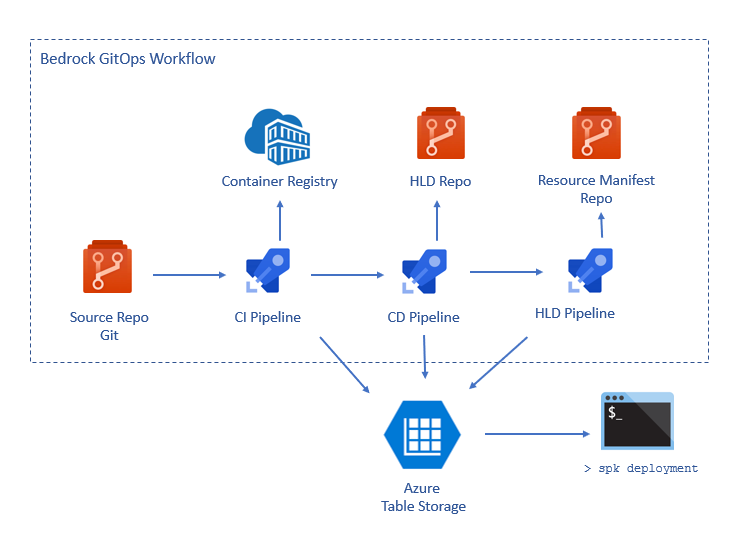

# Service Deployment Introspection

Many Kubernetes deployments are composed of not just one, but many microservices, and this complexity is compounded by, for latency, scalability, and/or reliability concerns, that these microservices are often also deployed across multiple clusters as well.  This makes it hard to reason about the current state of any individual cluster -- and especially a collection of ones that all together constitute the workload.

To help with this, Bedrock has an introspection tool to provide better visibility the end to end deployment workflows. It integrates with the GitOps pipeline and service automation that Bedrock provides and provides both command line and web dashboard views into the current status of any change in the system, from continuous integration build to tracking the deployment of the container containing that commit in each of the downstream clusters consuming that container.

Figure 1 shows the web dashboard for this tool.  In Bedrock, the status is displayed from newest to oldest, and we can see in the first line that a commit has triggered a container build that is currently deployed in the west cluster but that the east cluster hasn't yet been synchronized and is currently still running the previous version of the container.

In this documentation item, we will show you how to set up introspection in your own deployments and how to use it to observe changes to your cluster.

## Getting Started

Installing, configuring, and using the SPK introspection dashboard is extensively documented in the [command line reference documentation.](https://github.com/CatalystCode/spk/blob/master/docs/service-introspection-onboarding.md)
