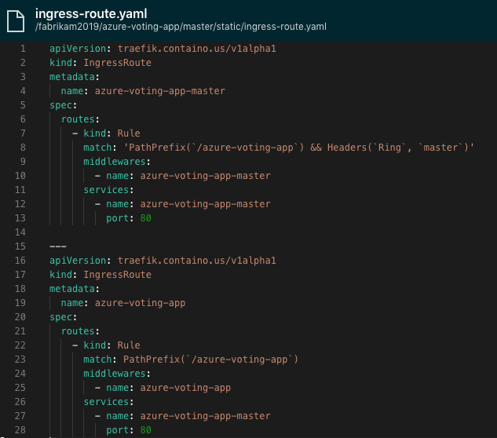
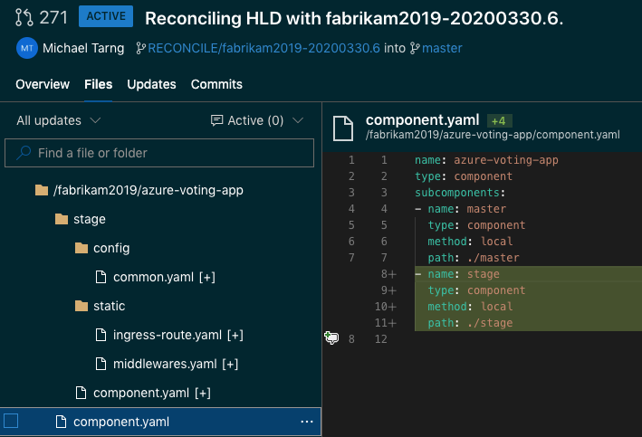
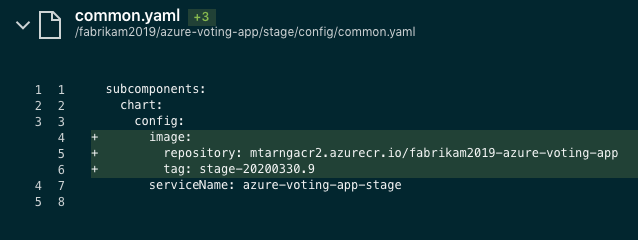
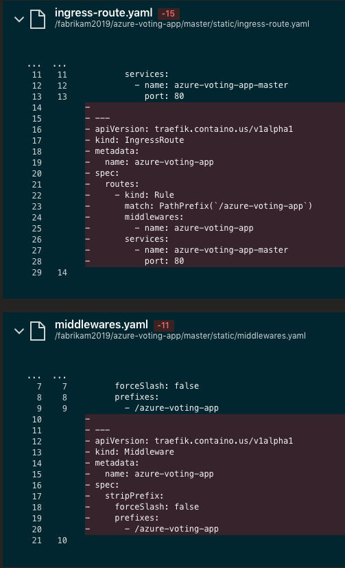
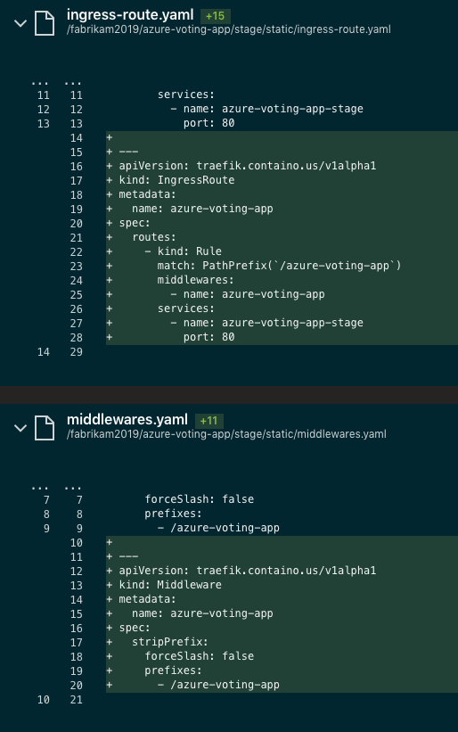

# Walkthrough: Rings deployment and management with automation

If you're new to the concept of Rings, it is suggested you read through the [Bedrock CLI Rings Guide](https://github.com/microsoft/bedrock-cli/blob/master/guides/rings-101.md#what-are-deployment-rings). In short, in the context of Kubernetes, Rings are a way to encapsulate and deploy multiple environments in a single cluster.

This walkthrough will guide you through enabling Ringed deployments of your project with automation through the `bedrock` tool. We will be utilizing the azure-vote example that was set up during the [Service Management Walkthrough](./services.md).

## Prerequisites
1. Completion of the [First Workload guide](./firstWorkload/README.md) to setup an AKS cluster configured with flux.
2. Completion of the [GitOps Pipeline Walkthrough](./hld-to-manifest.md) to set up required GitOps workflow repositories and pipelines.
3. Completion of the [Service Management Walkthrough](./services.md)
4. `bedrock` version `v0.6.0` or later. Download the latest: [Bedrock CLI Releases](https://github.com/microsoft/bedrock-cli/releases)

## Enabling Ingress Routes
[Traefik2](https://github.com/containous/traefik) is the default LoadBalancer utilized to route ingress traffic to a specific ring.

When setting up the HLD (high-level-definition) for the first time with `bedrock hld init`, Traefik2 is included as the initial component. If it was not included or removed as a component, please clone the HLD repository and add Traefik as a component:

```sh
git clone git@ssh.dev.azure.com:v3/mtarng/my-bedrock-project/fabrikam-hld
...
cd fabrikam-hld
fab add traefik2 --source https://github.com/microsoft/fabrikate-definitions.git --path definitions/traefik2
git add -A
git commit -m 'Adding Traefik2 component'
```

Additionally, if `disableRouteScaffold` was added to the project `bedrock.yaml` for the azure-vote service during the Service Management walkthrough, go ahead and remove it.

Your project `bedrock.yaml` should look like this when updated:

```yaml
rings:
  master:
    isDefault: true
services:
  - path: ./azure-vote
    displayName: azure-voting-app
    helm:
      chart:
        accessTokenVariable: ACCESS_TOKEN_SECRET
        branch: master
        git: 'https://github.com/mtarng/helm-charts'
        path: chart-source/azure-vote
    k8sBackend: ''
    k8sBackendPort: 80
    middlewares: []
    pathPrefix: ''
    pathPrefixMajorVersion: ''
```

Now, commit the changes to the `master` branch and let the lifecycle pipeline run to completion. The resulting Pull Request should include a static component with generated IngressRoutes and Middlewares for the azure-vote app:




Now merge the PR to the HLD repository and wait for the resulting manifest generation pipeline to complete.

Once the manifests are updated and deployed with flux, you should be able to see the new Traefik LoadBalancer, IngressRoutes, and Middlewares on the cluster:

```sh
$ kubectl get svc
NAME                                TYPE           CLUSTER-IP     EXTERNAL-IP     PORT(S)                      AGE
azure-voting-app-master             ClusterIP      10.0.239.229   <none>          80/TCP                       48m
kubernetes                          ClusterIP      10.0.0.1       <none>          443/TCP                      3d1h
traefik2                            LoadBalancer   10.0.1.238     52.243.22.233   80:32236/TCP,443:31639/TCP   3d1h
vote-back-azure-voting-app-master   ClusterIP      10.0.222.135   <none>          6379/TCP                     48m

$ kubectl get IngressRoutes
NAME                      AGE
azure-voting-app          48m
azure-voting-app-master   48m

$ kubectl get Middlewares
NAME                      AGE
azure-voting-app          48m
azure-voting-app-master   48m
```

Now we can request against the public IP that has been configured: `52.243.22.233`. Additionally Traefik will route all traffic with the path-prefix `/azure-voting-app` without a Ring header to the `azure-voting-app-master` service because `master` is set as the default Ring in `bedrock.yaml`:
```sh
$ curl http://52.243.22.233/azure-voting-app
<!DOCTYPE html>
<html xmlns="http://www.w3.org/1999/xhtml">
<head>
    <link rel="stylesheet" type="text/css" href="/static/default.css">
    <title>Azure Vote App</title>

    <script language="JavaScript">
        function send(form){
        }
    </script>

</head>
<body>
... 
</body>
</html>
```

Requests with the Header `"Ring: master"` will be routed similarly:

```sh
$ curl 52.243.22.233/azure-voting-app -H "Ring: master"
<!DOCTYPE html>
<html xmlns="http://www.w3.org/1999/xhtml">
<head>
    <link rel="stylesheet" type="text/css" href="/static/default.css">
    <title>Azure Vote App</title>

    <script language="JavaScript">
        function send(form){
        }
    </script>

</head>
<body>
...
</body>
</html>
```

**Note** - with the current iteration of the [azure-vote](https://github.com/Azure-Samples/azure-voting-app-redis) application, links and references are hardcoded and will not work properly with the IngressRoute path-prefix, so the application will not display or respond properly.

## Creating a new Ring

Now that we have our default `master` ring live on our cluster, we'll look at adding another ring, `stage`, onto our cluster.

First, let's go back to our application repository and checkout the `master` branch. Our `master` branch is the source of truth of what rings will exist for a project as the lifecycle pipeline is set to trigger off only the `master` branch and reads the values of `rings` from `bedrock.yaml` in that branch.

In this sample, our application is in the `fabrikam2019` directory.
```sh
cd fabrikam2019
git checkout master
git pull
```

Now, let's add our new Ring, `stage`:
```sh
bedrock ring create stage
git add -A
git commit -m 'Adding new ring: stage'
git push
```

Now, the lifecycle pipeline will trigger and create a new PR to the HLD repository to add the new `stage` components for all applications referenced in the project `bedrock.yaml`:



Go ahead and merge the new PR.

However, our stage component does not yet have a reference to a proper container image. Let's make a small change and kick off the build pipeline for the `stage` ring.

Once again, lets navigate to the application repository and create a new branch named `stage` to put our changes in.
```sh
cd fabrikam2019
git checkout -b stage
git push --set-upstream origin stage
```

Now we could either manually trigger build pipeline on Azure DevOps on the `stage` branch, or we can make a small change to showcase our Ring.

Let's make a small change here:
```sh
printf 'Hello from the Stage Ring!\n' | cat - azure-vote/azure-vote/templates/index.html > temp && mv temp azure-vote/azure-vote/templates/index.html
git add -A
git commit -m 'Adding reference to Stage Ring in index.html'
git push
```

Now the resulting build pipline triggered off the `stage` branch should create a PR against the HLD repository with a new image tag: 



Once that PR is merged, the resulting generated manifest should be ready to deploy on the cluster.

The resulting Pods and Services on the cluster should now reflect the new Ring:
```sh
$ kubectl get pods
NAME                                                  READY   STATUS    RESTARTS   AGE
traefik2-6f8ddc69cc-w67c2                             1/1     Running   0          3d2h
vote-back-azure-voting-app-master-659f9bfc-qmbnr      1/1     Running   0          104m
vote-back-azure-voting-app-stage-5c899d74b9-sh4f5     1/1     Running   0          26m
vote-front-azure-voting-app-master-548c58c67d-hmf47   1/1     Running   0          97m
vote-front-azure-voting-app-stage-c4b6bd44d-m8pn7     1/1     Running   0          35s
```

Now we can try requesting the same page with the Header `"Ring: stage"`:
```sh
$ curl 52.243.22.233/azure-voting-app -H "Ring: stage"
Hello from the Stage Ring!
<!DOCTYPE html>
<html xmlns="http://www.w3.org/1999/xhtml">
...
</html>
```

And now we've finished creating and validating our `stage` Ring!

## Setting the default Ring
To set the default ring for Headerless routing, we can use the `bedrock ring set-default` command.

Let's go back to our application repository and checkout the source-of-truth branch, `master`:

```sh
cd fabrikate2019
git checkout master
git pull
```

And now we can set the default to an existing ring, `stage`, via `bedrock`:

```sh
bedrock ring set-default stage
git add -A
git commit -m 'Setting default ring to stage'
git push
```

Once the lifecycle pipeline completes, merge the new PR against the HLD repository. This PR should remove the Headerless IngressRoute and Middleware from the `master` ring and add them to the `stage` ring instead.




Merge these changes and wait for the changes to be reflected on the cluster.

We can verify the changes on the cluster:
```sh
$ kubectl get IngressRoutes
NAME                      AGE
azure-voting-app          128m
azure-voting-app-master   128m
azure-voting-app-stage    50m

$ kubectl describe IngressRoute azure-voting-app
Name:         azure-voting-app
Namespace:    default
...
Spec:
  Routes:
    Kind:   Rule
    Match:  PathPrefix(`/azure-voting-app`)
    Middlewares:
      Name:  azure-voting-app
    Services:
      Name:  azure-voting-app-stage
      Port:  80
Events:      <none>
```

We see the default IngressRoute will now route to the `stage` service: `azure-voting-app-stage`. Let's test this:

```sh
$ curl 52.243.22.233/azure-voting-app
Hello from the Stage Ring!
<!DOCTYPE html>
<html xmlns="http://www.w3.org/1999/xhtml">
...
</html>
```

And now we've validated that our default Ring is `stage`.

## Removing a Ring

Now let's go over how to remove a Ring from a cluster. Do note that there will be [manual steps](https://github.com/microsoft/bedrock-cli/blob/master/guides/manual-guide-to-rings.md#removing-the-ring-from-the-cluster) involved as bedrock currently does not remove services nor does it remove rings from the HLD repository.

As we cannot delete the default ring, we need to first set the default Ring to `master` again:
```sh
cd fabrikam2019
git checkout master
git pull
bedrock ring set-default master
git add -A
git commit -m 'Setting default ring to master'
```
Merge the resulting lifecycle pipeline PR against the HLD. These changes should just be setting the default IngressRoute to point to the `master` ring again.

Now lets remove `stage` as a ring from the project:
```sh
bedrock ring delete stage
git add -A
git commit -m 'Removing stage ring from project'
git push
```

We should also delete the remote branch associated with the `stage` ring to prevent more builds being triggered:
```sh
git branch -D stage
git push -d origin stage
```

Now, since bedrock does not currently remove rings or service from the HLD repository, we need to remove components related to the `stage` ring we've removed from the project.

Let's checkout our HLD repository and pull the latest:
```sh
git clone git@ssh.dev.azure.com:v3/mtarng/my-bedrock-project/fabrikam-hld
...
cd fabrikam-hld
git checkout master
git pull
```

Now, lets remove the components in our HLD that pertain to the `stage` ring.

Let's navigate into our project directory, `fabrikam2019`, then into our service directory, `azure-voting-app`, and remove the `stage` components from the `component.yaml` file:
```sh
$ cat fabrikam2019/azure-voting-app/component.yaml 
name: azure-voting-app
type: component
subcomponents:
- name: master
  type: component
  method: local
  path: ./master
- name: stage        # DELETE
  type: component    # THESE
  method: local      # FOUR
  path: ./stage      # LINES
```

Next, we should remove the stage directory for the service, then commit and push the changes:
```sh
rm -rf fabrikam2019/azure-voting-app/stage/
git add -A
git commit -m 'Removing stage ring from fabrikam2019 project'
git push
```

Once the resulting manifest generation pipeline run is complete, the related `stage` resources should be removed from your cluster once flux has synced:
```sh
$ kubectl get pods
NAME                                                  READY   STATUS    RESTARTS   AGE
traefik2-6f8ddc69cc-w67c2                             1/1     Running   0          3d3h
vote-back-azure-voting-app-master-659f9bfc-qmbnr      1/1     Running   0          166m
vote-front-azure-voting-app-master-548c58c67d-hmf47   1/1     Running   0          158m

$ kubectl get svc
NAME                                TYPE           CLUSTER-IP     EXTERNAL-IP     PORT(S)                      AGE
azure-voting-app-master             ClusterIP      10.0.239.229   <none>          80/TCP                       166m
kubernetes                          ClusterIP      10.0.0.1       <none>          443/TCP                      3d3h
traefik2                            LoadBalancer   10.0.1.238     52.243.22.233   80:32236/TCP,443:31639/TCP   3d3h
vote-back-azure-voting-app-master   ClusterIP      10.0.222.135   <none>          6379/TCP                     166m

$ kubectl get IngressRoutes
NAME                      AGE
azure-voting-app          168m
azure-voting-app-master   168m

$ kubectl get Middlewares
NAME                      AGE
azure-voting-app          168m
azure-voting-app-master   168m
```

You have now finished removing the `stage` ring from your cluster.
