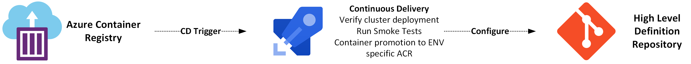
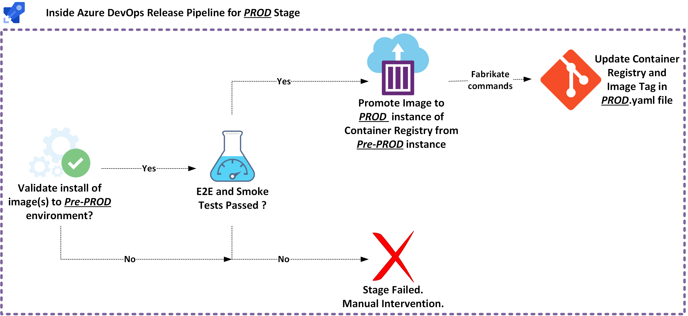

# How We Think About Designing GitOps Pipelines

## GitOps in Bedrock
Our main GitOps pipeline is a manifest yaml generation pipeline. It is the essence of GitOps in Bedrock. An operator configures a Fabrikate high-level definition on one end then automated magic happens, and we get a repo with Kubernetes resource manifests on the other end.

<i>Example of manifest yaml generation pipeline</i>

Both the input and output are backed by git repositories that provide an audit trail. The input git repo can follow a branch, commit, pull request model. This sort of pipeline is also easy to rollback.

## Extending the Manifest YAML Generation Pipeline
Any other pipeline that we place before this pipeline can be called a release or _augmentation_ pipeline. These augmentations usual have the goal of helping automate changes to the high-level definition repository.

Bedrock GitOps pipelines can use polyglot pipeline orchestrators. For instance, a Jenkins augmentation pipeline can be the prefix to an Azure DevOps manifest generation pipeline. Consequently, pipeline orchestrators can be mixed and matched to support the needs of development and operation teams.

One example where automation is useful is to automatically update references to a container image tag name.  A microservice referenced in a Fabrikate high-level definition repository will reference a Helm chart that should allow modification of templated values.

<pre>
     ...
     containers:
        - name: deis-database
          image: {{.Values.imageRegistry}}/postgres:<b>{{.Values.dockerTag}}</b>
          imagePullPolicy: {{.Values.pullPolicy}}
	  ... 
</pre>

<i>Example of image tag template highlighted in Helm chart snippet</i>

The high-level steps of automated container image tag updates include:
+ A build process that increments a build number and assigns a build image number as the image tag in a container registry.
+ Updating a Fabrikate template config file in high-level definition repo with the relevant image tag gets updated and a manifest generation pipeline may automatically get run 
+ The cluster(s) should automatically get updated to the latest Kubernetes deployment

Another example of an augmentation pipeline builds upon the previous example. This time we want to help automate image container promotion across environments. Using the Fabrikate high-level definition to track state, we can configure what container registries and tag names map to each environment. Most importantly control when the container promotion happens.

<i>High level example of container promotion augmentation pipeline</i>

Starting from a state where you already have your microservices in environment “pre-production” you can:
+ Verify that version of microservices we want is deployed on the cluster (via automation or manual intervention). 
+ Execute end to end/smoke tests to exercise your microservices in the environment
+ Promote your image container to the production version of your container registry if end to end/smoke test are successful
+ Use Fabrikate commands to update the high-level definition with the new promoted values

These steps can be repeated for N amount of promotions depending on the number of Kubernetes environments a development team maintains for an application. The figure below is a close up of what goes on in the Azure DevOps continuous delivery portion.

<i>Inside container promotion CD from pre-production to production</i>

## Next Steps
Try creating some examples of pipelines for the in following platforms:
* [Azure Devops](./azure-devops)
