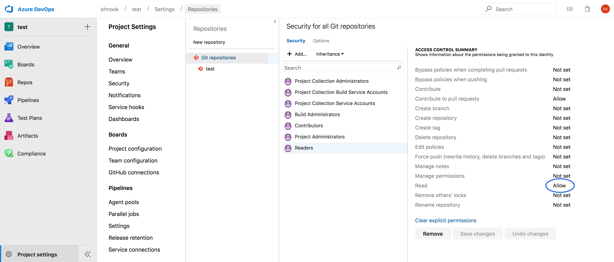

# Operating Private Repositories

## Private Repositories

When building services in an organization you will want to utilize private Git repositories to protect sensitive codebases. When combined with a Gitops workflow, you can have confidence in your gitops pipeline to be both secure, and auditable.

## Context: Components and (Private) Subcomponents

Components can utilize other components as [subcomponents](https://github.com/microsoft/fabrikate/blob/master/docs/component.md), enabling a recursive description of components, that utilize components as descendents. When a gitops pipeline invokes `fab install`, it recursively steps through to each of the descendents and invokes `fab install` until it gets to a descendent at which there are no longer any subcomponents to fetch.

Consider the following component:

```
name: my-component
method: local
source: component-files
subcomponents:
  - name: private-component
    method: git
    type: component
    source: https://github.com/contoso/my-private-repository
```

Whereas the component defined by `my-component` may be a public component, the subcomponent it depends on, `private-component` is, as its name describes, private. A gitops pipeline invoking `fab install` on this component will thus fail, as we haven't yet identified a method for Fabrikate to clone the component (via Git) to the environment in which it is running. There are a few ways to mitigate this issue.

## Personal Access Tokens

Git repository providers such as Azure DevOps or Github will often provide the ability to generate a Personal Access Token for authenticating and accessing a repository on behalf of the user the token was issued to. These tokens, depending on the issuer, will provide the same permissions as the user they authenticate on behalf of.

- For Github, If a user has access to repositories `A`, `B`, and `C`, then the personal access token issued to the user maintains the same access control.
    - You can create a Personal Access Token for a Github user account [here](https://github.com/settings/tokens), and they last until they are revoked.

- For Azure DevOps there are a number of considerations when utilizing Personal Access Tokens for repository access:
    - A Personal Access Token can be generated for two situations, with varying selectable time spans for each token. The token types are described as follows:

      - A single Organization that a user is a member of
      - All accesible Organizations a user is a member of

    - Azure DevOps provides further Access Controls to Git Repositories via Roles. At minimum, a user that must be able to fetch components hosted in private repositories must also have the Git Repository Reader access control set in the Azure DevOps Security Group they belong to. This control can be configured in the Project Settings like so:

    - You can create a Personal Access Token for an Azure DevOps User within your Organization settings. Example url for token settings, replace ${organization} with your organization name: https://dev.azure.com/${organization}/_usersSettings/tokens.

After you've generated a Personal Access Token for your user account, you must configure Fabrikate (0.13.0 or higher) with knowledge on how to utilize it. Fabrikate 0.13.0 introduces a new configuration file, `access.yaml`, in which Git repositories map to the _name_ of the environment variable that holds the Personal Access Token. This layer of indirection ensures that a user does not simply encode Personal Access Tokens directly into a file.

Let's refer back at the `component.yaml` file from earlier:

```
name: my-component
method: local
source: component-files
subcomponents:
  - name: private-component
    method: git
    source: https://github.com/contoso/my-private-repository
```

At the same level, we introduce an `access.yaml` file with the following contents:

```
https://github.com/contoso/my-private-repository: ENV_VAR_CONTAINING_PAT
```

To test that this workflow works, you may:
  1. Set the environment variable value `ENV_VAR_CONTAINING_PAT` to a Personal Access Token for the referenced repository (https://github.com/contoso/my-private-repository).
  2. Invoke `fab install` from the same directory as the component.

## SSH Keys

**For you to utilize this approach, you must utilize, at minimum, [Fabrikate v0.15.1 or above](https://github.com/microsoft/fabrikate/releases/).**

While Personal Access Tokens offer a reliable way to read and clone Git repositories on behalf of a user, they can become unwieldy to use in practice. For an Azure DevOps scenario, imagine if a component's subcomponents were spread across multiple Organizations - a user supplying a Personal Access Token would have to provide one for every organization the component depends on. For example, given the following component.yaml:

```
name: episerver-cluster-hld
type: component
subcomponents:
- name: private-component
  type: component
  source: https://dev.azure.com/contoso/cool-project/_git/private-component
  method: git
- name: awesome-component
  type: component
  source: https://dev.azure.com/fabrikam/awesome-project/_git/awesome-component
  method: git
```

A corresponding access.yaml would like:

```
https://dev.azure.com/contoso/cool-project/_git/private-component: ENV_VAR_FOR_CONTOSO_PAT
https://dev.azure.com/fabrikam/awesome-project/_git/awesome-component: ENV_VAR_FOR_FABRIKAM_PAT
```

And would require Personal Access Tokens for both the `contoso` organization and the `fabrikam` organization for a `fab install` to work as expected. Note that due to the recursive nature of components, a subcomponent can refer to other private git repositories as subcomponents as well. The subcomponent's root component.yaml can thus also provide an adjacent access.yaml, specifying the required Personal Access Tokens as environment variable names, and so on.

Managing Personal Access Tokens can be utilized for simple components, but as you can imagine, the complexity increases dramatically as one adds more private components as subcomponents. As such, you may be interested in managing access to components via SSH Key Pairs, which many, if not all, Git providers provide as an authentication mechanism out of the box.

To utilize SSH Key Pairs you must do the following:

1. Utilizing a SSH toolkit ([we suggest OpenSSH](https://www.openssh.com/)), [generate an SSH Key Pair](https://www.ssh.com/ssh/keygen/).
2. Upload the Public Key to Azure DevOps (the URL depends on your organization, but typically follows the pattern https://dev.azure.com/${organization}/_usersSettings/keys) or [GitHub](https://github.com/settings/keys).
3. [Add the Private Key to the SSH Agent](https://www.ssh.com/ssh/add)

Take note the following considerations:
- For Azure Devops, this process must be repeated for every organization that your component depends on.
- For Github, the user account to which the public key is added must have access to all the private repositories that your component depends on.

With this setup, you can migrate away from Personal Access Tokens for installing components, and use a more secure Public/Private key approach to manage and maintain repository access, while still working with Fabrikate components from private repositories. Take note: you will still require a  Personal Access Token to configure automatic Pull Requests against your High Level Definition repository.


## Additional Resources

1. [Personal Access Tokens and Fabrikate](https://github.com/microsoft/fabrikate/blob/master/docs/auth.md)
