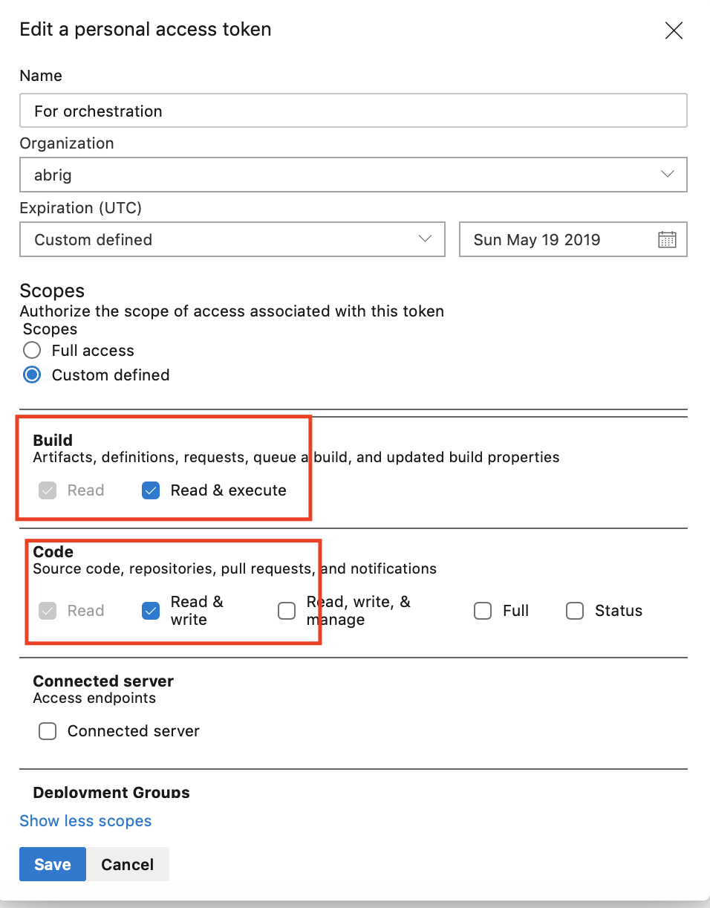

# Creating Azure DevOps Repos for GitOps

## Prerequistes

1. Install the [Azure CLI DevOps Extension](https://github.com/Microsoft/azure-devops-cli-extension)

## Setup

## 1. Create a new project in Azure DevOps

```
$ az devops project create -n $PROJECT_NAME
```

## 2. Create a Personal Access Token
1. If Azure Devops, click your profile name in the upper right corner.
1. Next, click the `Security` submenu. 
1. Next, choose `Personal Access Tokens` on the left window menu. 
1. Finally click `+ New Tokens`

1. Make sure your Personal Access Token (PAT) has appropriate permissions to read and write Azure DevOps builds and code.


## 3. Create High Level Definition and Manifest Repositories

1. Create high level definition (HLD) and manifest repositories in your new ADO project using the command line.  In the below, `$HLD_REPO_NAME` and `$MANIFEST_REPO_NAME` correspond to the name of the each of the repos respectively.
```
$ az repos create --name $HLD_REPO_NAME
$ az repos create --name $MANIFEST_REPO_NAME
```

2. (optional) If you are using our [sample HLD repo](https://github.com/samiyaakhtar/aks-deploy-source), import it with the following command:
```
$ az repos import create --git-source-url $SAMPLE_HLD_REPO_PATH --repository HLD_REPO_NAME
```

The imported HLD example contains an Azure Pipelines yaml file that will activate checks on pull requests and merge to master branch. It will also import a `build.sh` script that the [azure-pipelines.yml](README.md#azure-pipelines-build-yaml) file relies on. These processes are critical to maintaining the _release flow_.

## Reference
* https://docs.microsoft.com/en-us/azure/devops/pipelines/repos/azure-repos-git?view=azure-devops