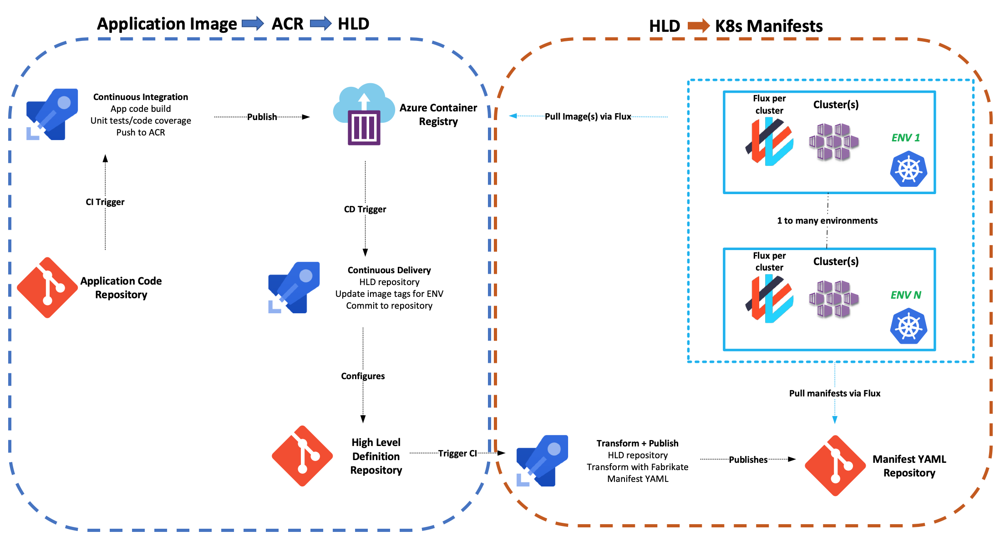
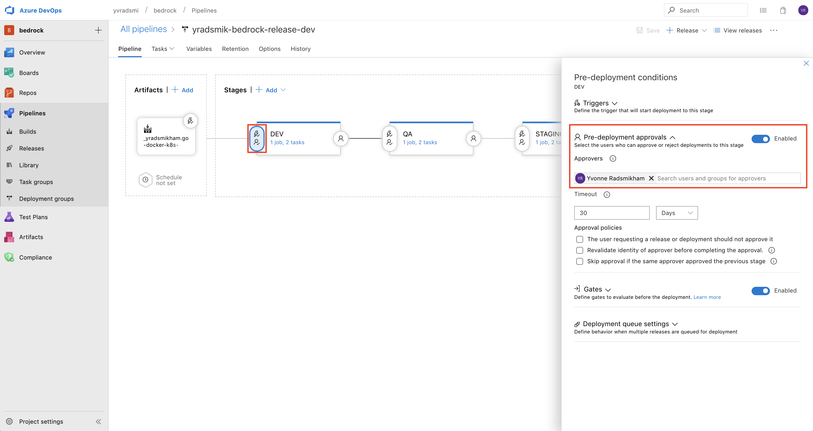
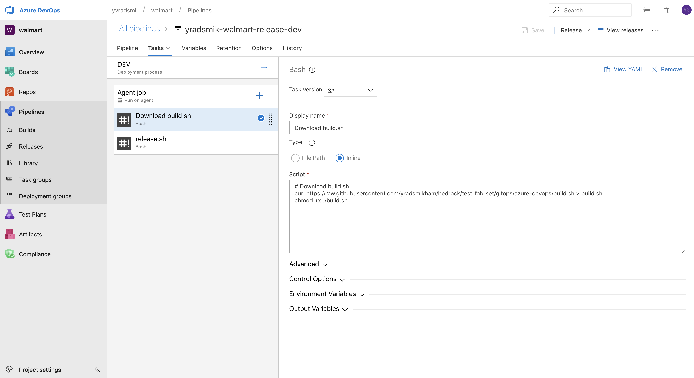
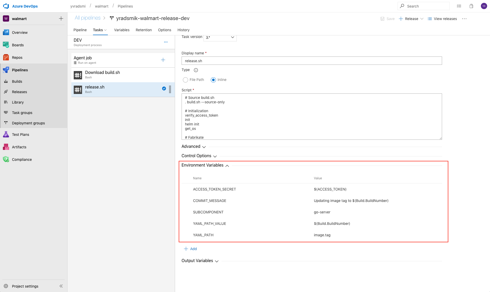

# GitOps CI/CD with Azure Devops

This section describes how to configure Azure Devops as the CI/CD system for your GitOps Workflow.

## Prerequisites

1. _Permissions_: The ability to create Pipelines in your Azure DevOps Organization.
2. _High Level Deployment Description_: Either your own [Fabrikate](https://github.com/Microsoft/fabrikate) high level definition for your deployment or a sample one of ours.  We provide a [sample HLD repo](https://github.com/samiyaakhtar/aks-deploy-source) that builds upon the [cloud-native](https://github.com/timfpark/fabrikate-cloud-native) Fabrikate definition. The one used in this example can be found [here](https://github.com/yradsmikham/fabrikate-go-server).

## Setup

The GitOps workflow can be split into two components:

1. Application (Docker) Image -> Azure Container Registry (ACR) -> High Level Definition (HLD)
2. High Level Definition (HLD) -> K8s Manifests



## Application (Docker) Image -> Azure Container Registry (ACR) -> High Level Definition (HLD)

### 1. Create Repositories and Personal Access Tokens

Create both high level definition (HLD) and resource manifest repos and the personal access tokens that you'll use for the two ends of this CI/CD pipeline.  We have instructions for how to do that in two flavors:
* [Azure DevOps](ADORepos.md)
* [GitHub](GitHubRepos.md)

### 2. Create Azure Pipeline Build YAML

The Azure Pipeline Build YAML will build and deploy Docker images to Azure Container Registry (ACR). Below is a sample YAML file:

```
trigger:
- master

pool:
  vmImage: 'Ubuntu-16.04'

variables:
  GOBIN:  '$(GOPATH)/bin' # Go binaries path
  GOROOT: '/usr/local/go1.11' # Go installation path
  GOPATH: '$(system.defaultWorkingDirectory)/gopath' # Go workspace path
  modulePath: '$(GOPATH)/src/github.com/$(build.repository.name)' # Path to the module's code

steps:
- script: |
    mkdir -p '$(GOBIN)'
    mkdir -p '$(GOPATH)/pkg'
    mkdir -p '$(modulePath)'
    shopt -s extglob
    shopt -s dotglob
    mv !(gopath) '$(modulePath)'
    echo '##vso[task.prependpath]$(GOBIN)'
    echo '##vso[task.prependpath]$(GOROOT)/bin'
  displayName: 'Set up the Go workspace'

- script: |
    go version
    go get -v -t -d ./...
    if [ -f Gopkg.toml ]; then
        curl https://raw.githubusercontent.com/golang/dep/master/install.sh | sh
        dep ensure
    fi
    docker run --rm -v "$PWD":/go/src/github.com/andrebriggs/goserver -w /go/src/github.com/andrebriggs/goserver iron/go:dev go build -ldflags "-X main.appVersion=$(build.BuildNumber)" -v -o bin/myapp
    az login --service-principal --username "$(SP_APP_ID)" --password "$(SP_PASS)" --tenant "$(SP_TENANT)"
    az acr build -r $(ACR_NAME) --image go-docker-k8s-demo:$(build.BuildNumber) .
  workingDirectory: '$(modulePath)'
  displayName: 'Get dependencies, build image, then publish to ACR'
```

This Azure Pipeline Build YAML file will be based on the application code that you are trying to build and deploy. The YAML shown is an example from: https://github.com/andrebriggs/go-docker-k8s-demo

### 3. Create Azure Pipeline Release

The Azure Pipeline Release will be triggered off of the Azure Pipeline Build that was created in Step 2, and will accomplish the following objectives:

- Clone the HLD repo
- Download and Install Fabrikate
- Execute `fab set` to manipulate HLDs
- Git commit and push to HLD repo

The Release should look similar to the following, where updates to the build artifact will automatically trigger the execution of tasks within the stages. Here, the different stages in the pipeline resemble environments in your DevOps workflow.


Each stage should require manual approval from a specific user in order to proceed to the next stage.



The `ACCESS_TOKEN` and `REPO` variables are specifically used in the `build.sh`, which is sourced in the `release.sh`. As described before, the `ACCESS_TOKEN` is the Personal Access Token that grants access to your git account. In this case, the `REPO` variable is set to be the HLD repo.


Each stage targets specific environment defined via the `ENVIRONMENT` variable. Each stage contains two tasks: `Download scripts`, and `release.sh`. The `Download scripts` task downloads the `build.sh` and `release.sh` from the Microsoft/Bedrock repo.



The `Run release.sh` task will execute `release.sh` with the following environment variables:

```
ACCESS_TOKEN_SECRET: $(ACCESS_TOKEN)
COMMIT_MESSAGE: custom message used when committing and pushing to git
SUBCOMPONENT: the subcomponent within your Fabrikate HLD that should be manipulated
YAML_PATH: the yaml path to the subkey to set (e.g. data.replicas)
YAML_PATH_VALUE: the value to the subkey
ENVIRONMENT: the targeted environment

```



After the Release runs successfully, the new application image that was generated in the Pipeline Build (Step #2) should now be referenced appropriately in the HLD.

## [High Level Definition (HLD) -> K8s Manifests](https://github.com/Microsoft/bedrock/blob/master/gitops/azure-devops/README.md)
