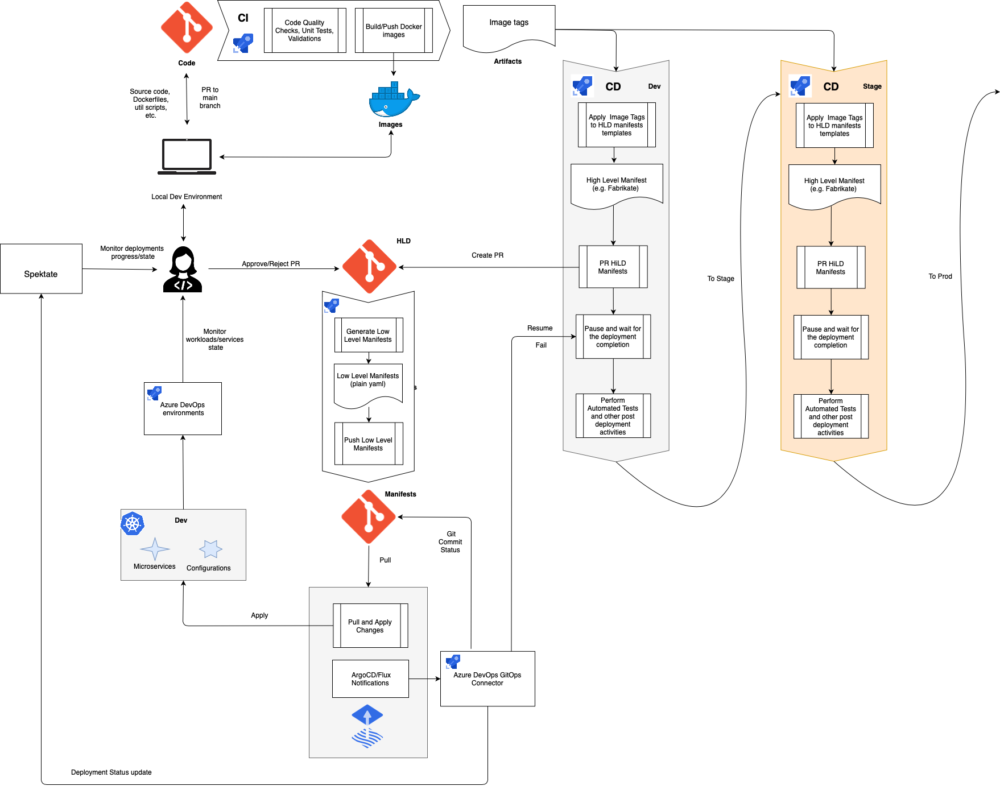
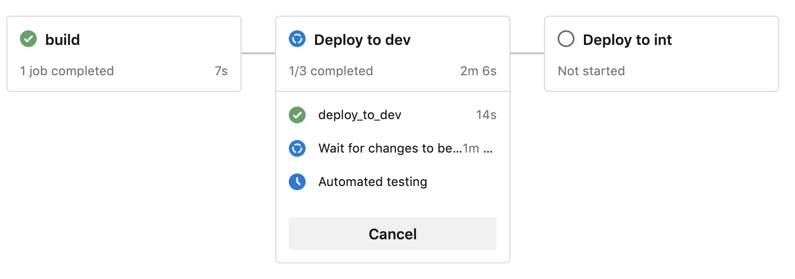
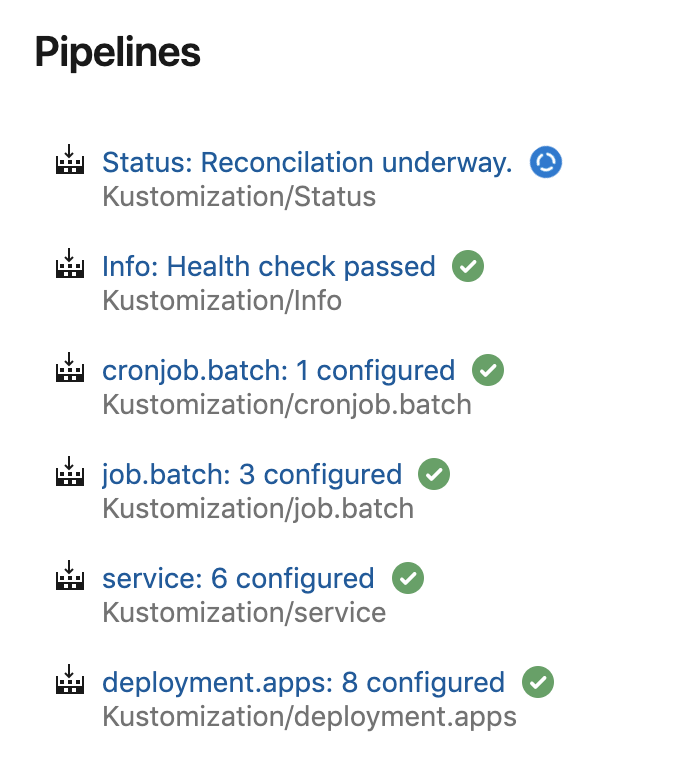
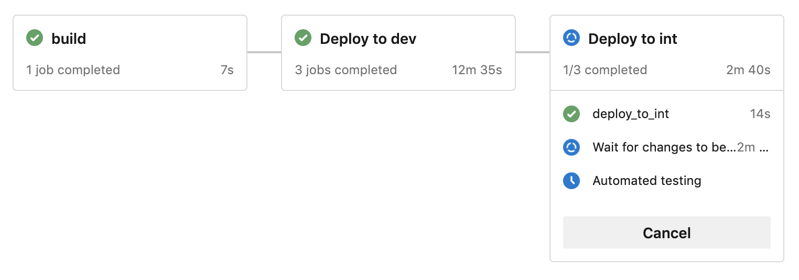

# Azure DevOps CI/CD Pipeline with GitOps connector

The diagram above describes a CI/CD process that implements an environment promotion concept with Azure DevOps and Flux V2.

It targets to resolve the following challenges:

- The manifests repository shows what happens with the applications in the K8s clusters. However, it only shows the desired state and very often the current state. But things can go wrong, labels can be misplaced and image not being able to be pulled, even though it was successful to apply the manifests.
- To build a multistage CD pipeline there must be a backward connection from Flux to Azure DevOps that reports the deployment state/result so the CD pipeline can proceed with testing, notifying, deploying to next environment, etc.

Once either of the code components (src, Dockerfiles, etc.) is pushed to a collaboration (main) branch, a CI/CD  (Release) pipeline takes care of that and produces artifacts. It runs code quality checks, unit test, builds and pushes Docker images. The artifact of the CI (Build) stage is a list of built image tags.

This artifact is consumed by the CD (Delivery) part of the pipeline, which is triggered automatically right after the Build stage. The CD part delivers in a multistage way K8s manifests that must be deployed for each environment and it promotes the artifacts to the next environment only after successful deployment on the previous one. Every CD stage in the pipeline creates a PR to HLD repository in a file/folder/branch corresponding to a specific environment. Having done that, it waits in agentless mode for a callback until the PR is merged and the deployment to an environment is completed or until the PR is abandoned.

Once the PR to HLD is merged a *generation-manifest* pipeline is triggered which generates raw yaml manifests and pushes them to the Manifest repository. Flux pulls the changes from the Manifest repo and applies them to the environment. During the synchronization Flux notifies on every phase change and every health check change an integration component "Azure DevOps GitOps Connector". This component "knows" how to communicate to Azure DevOps and it updates the Git commit status so the synchronization progress is visible in the repository. Besides that the connector sends deployment status updates to Spektate, so it is available on Spektate dashboard.

When the synchronization including health check has successfully finished or failed the connector resumes or fails the Release pipeline respectively.

If Azure DevOps environment is configured with a K8s namespace it gives information on the state of the K8s services and workloads including yaml specifications and pod logs. See [Environment - Kubernetes resource](https://docs.microsoft.com/azure/devops/pipelines/process/environments-kubernetes?view=azure-devops) for the details. It can be used as an additional observability instrument that gives a descent level of insight right in the Azure DevOps UI.

Once the release pipeline is signaled that the deployment was successful it performs automated tests and all the necessary post deployment activities. Having done that, it moves to the next stage with the exact same process.

