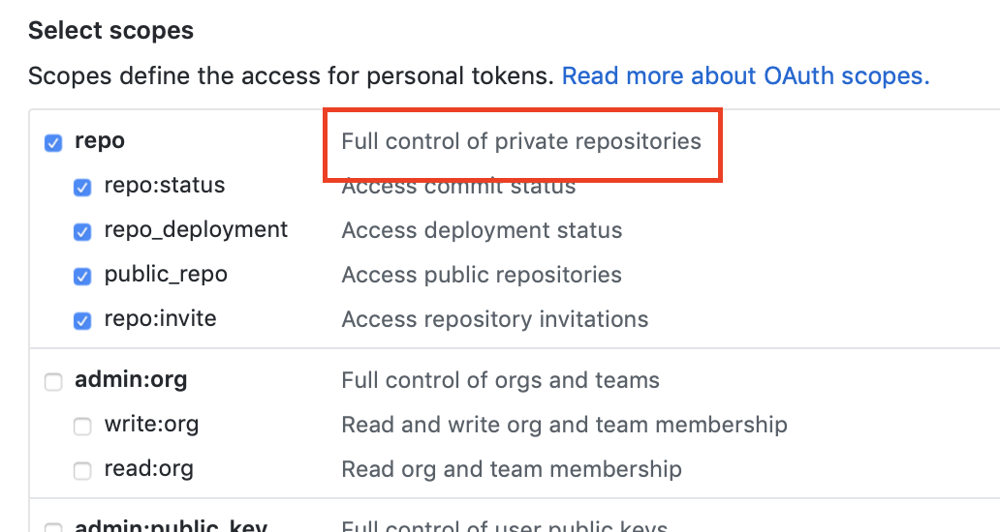

# Creating GitHub Repos for GitOps

## Setup

## 1. Create HLD Repository

If you have not already, you will need to create your own high level definition repository.  (We provide a [sample GitHub repo](https://github.com/samiyaakhtar/aks-deploy-source) that you can fork and modify for your own application.)

Make sure you have an [azure-pipelines.yml](README.md#azure-pipelines-build-yaml) file at the root of your repository, as this is what we will use later to setup the build rules in Azure Devops.

## 2. Create Manifest Repository

You will also need a destination repository on GitHub where the Kubernetes resource manifests will be pushed to.

Next, generate a [deploy key](https://developer.github.com/v3/guides/managing-deploy-keys/) for your new repository on GitHub. Keep the contents of yor public SSH key and local path to your private SSH key handy for the next step.

## 3. Create a Flux enabled AKS Cluster

Use the content of your public SSH key and path to your private SSH key when following the directions for [cluster setup](https://github.com/Microsoft/bedrock/tree/master/cluster).

## 3. Create a Personal Access Token

In order to access the destination respository we need appropriate authentication. 

Create a GitHub Personal Access Token if you don't have one already following [these instructions](https://help.github.com/articles/creating-a-personal-access-token-for-the-command-line/).

**IMPORTANT**: Make sure your personal access token has read/write access to private repositories.

## Reference
* https://docs.microsoft.com/en-us/azure/devops/pipelines/repos/github?view=azure-devops