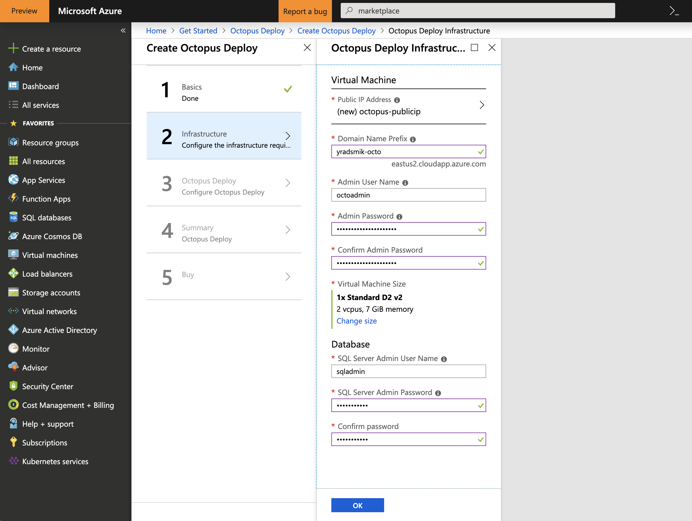
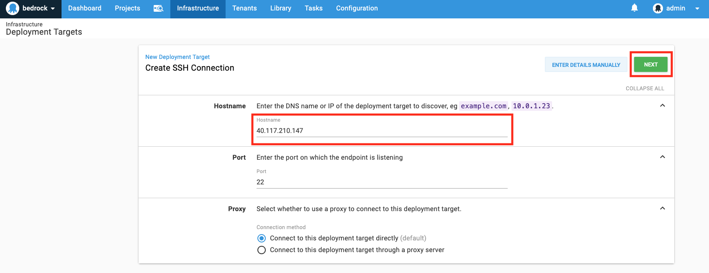
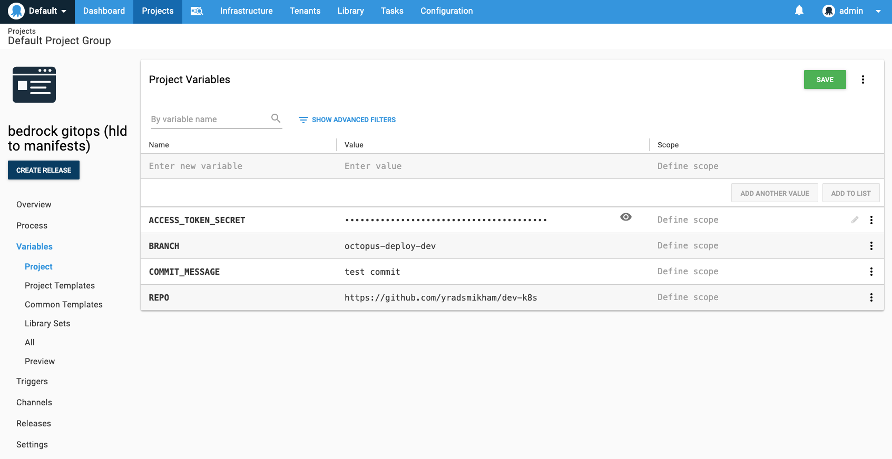
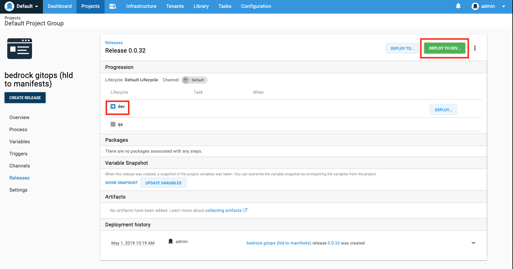

# Octopus Deploy

Octopus Deploy, an automated deployment and release management tool, has been tested against the Bedrock GitOps workflow. There are many differences between using Octopus Deploy and Azure DevOps. Therefore, a few adjustments need to be made beforehand in order to use Octopus Deploy as a substitute.

## Getting Started

Octopus Deploy is supported in the [Azure Marketplace] (https://azuremarketplace.microsoft.com/en-us/marketplace/apps/octopus.octopusdeploy) with a free 45-day trial. This guide will demonstrate how it would be possible to recreate the following workflow:


### 1. Launch an Octopus Deploy Server in Azure Portal

1. Create an Octopus Deploy instance in Azure Portal





### 2. Login to your Octopus account

1. To access the Octopus Deploy server, you will need to find the DNS name of of the `octopus-publicip` resource.


You can access the Octopus Server via browser using the DNS name.

### 3. Create and prepare your Target Deployment Resources in Azure

1. Create a Linux Virtual Machine in Azure. You can do this via the Azure CLI or in Azure Portal. To use Azure CLI, run the following command:

```
az vm create \
  --resource-group "myResourceGroup" \
  --name "myVM" \
  --image "UbuntuLTS" \
  --admin-username "Demouser" \
  --admin-password "Demouser@123" \
  --location local
```
Change the arguments to something that is appropriate for your environment.

2. Use SSH to connect to the virtual machine

`ssh admin-user@publc-ip-address`

You may be prompted to enter the admin password.

3. Run shell as a target user by executing the command `sudo -s`.

This will allow you to run as the `root` user which will give you the appropriate permissions to download packages.

4. Install necessary components for GitOps workflow:

You will need to install git, zip, and libunwind-dev. In addition, download, install, and initialize Helm.

```
apt-get update
apt-get install -y git zip libunwind-dev
curl -LO https://git.io/get_helm.sh
chmod 700 get_helm.sh
./get_helm.sh
helm init
```

5. Clone HLD repository

Clone your HLD git repo to the $HOME directory of your VM by running `git clone <Link to HLD Repo>`. Depending on how your HLD repo is structured, you may need to copy the content of your HLD repo to the $HOME directory. You can do this by

`cp -r <name of HLD repo>/* .`

### 4. Create your Release

1. Create an environment(s) for your release (e.g. `dev`, `qa`, `prod`).


2. Add Deployment Targets to your Infrastructure.





Select the environment that was created in Step 1, and create a new Target role (e.g. `octo-admin`). If a target role does not already exist, add a new role.


3. Check the health of the Deployment Target(s)


4. Define your deployment process.

Add a new step that will call a bash script. In this section, you will use the `build.sh` script from [Microsoft/Bedrock](https://github.com/Microsoft/bedrock/blob/master/gitops/azure-devops/build.sh). Minor additions need to be made to `build.sh` because Octopus Deploy has a unique way of defining and using [environment variables](https://octopus.com/docs/deployment-examples/custom-scripts/using-variables-in-scripts) for different scripting languages.

Append the following lines to the `build.sh`:

```
ACCESS_TOKEN_SECRET=$(get_octopusvariable "ACCESS_TOKEN_SECRET")
REPO=$(get_octopusvariable "REPO")
BRANCH_NAME=$(get_octopusvariable "BRANCH_NAME")
COMMIT_MESSAGE=$(get_octopusvariable "COMMIT MESSAGE")
```

Under `Variables`, be sure to define the variables as shown:



### 5. Deploy

Create a Release for deployment!





### Check Octopus Deploy Logs

After your Release is finished running, you can view the results and logs of the Release.


## Disadvantages

- Does not support Github triggers
- Plugin/Extension development not supported
