# GitOps CI/CD with Azure Devops

This section describes how to configure Azure Devops as the CI/CD system for your GitOps Workflow.

## Prerequisites

1. _Permissions_: The ability to create Projects in your Azure DevOps Organization.
2. _High Level Deployment Description_: Either your own [Fabrikate](https://github.com/Microsoft/fabrikate) high level definition for your deployment or a sample one of ours.  We provide a [sample HLD repo](https://github.com/samiyaakhtar/aks-deploy-source) that builds upon the [cloud-native](https://github.com/timfpark/fabrikate-cloud-native) Fabrikate definition.

## Setup

The GitOps workflow can be split into two components:

1. Application (Docker) Image -> Azure Container Registry (ACR) -> High Level Definition (HLD)
2. High Level Definition (HLD) -> K8s Manifests


The automation within each process heavily involves the use of Azure DevOps Pipeline Build and Releases and Fabrikate.

### Application (Docker) Image -> Azure Container Registry (ACR) -> High Level Definition (HLD)

#### 1. Create Repositories and Personal Access Tokens

Create both high level definition (HLD) and resource manifest repos and the personal access tokens that you'll use for the two ends of this CI/CD pipeline.  We have instructions for how to do that in two flavors:
* [Azure DevOps](ADORepos.md)
* [GitHub](GitHubRepos.md)

#### 2. Create Azure Pipeline Build YAML

The Azure Pipeline Build YAML will build and deploy Docker images to Azure Container Registry (ACR). Below is a sample yaml file:

```
trigger:
- master

pool:
  vmImage: 'Ubuntu-16.04'

variables:
  GOBIN:  '$(GOPATH)/bin' # Go binaries path
  GOROOT: '/usr/local/go1.11' # Go installation path
  GOPATH: '$(system.defaultWorkingDirectory)/gopath' # Go workspace path
  modulePath: '$(GOPATH)/src/github.com/$(build.repository.name)' # Path to the module's code

steps:
- script: |
    mkdir -p '$(GOBIN)'
    mkdir -p '$(GOPATH)/pkg'
    mkdir -p '$(modulePath)'
    shopt -s extglob
    shopt -s dotglob
    mv !(gopath) '$(modulePath)'
    echo '##vso[task.prependpath]$(GOBIN)'
    echo '##vso[task.prependpath]$(GOROOT)/bin'
  displayName: 'Set up the Go workspace'

- script: |
    go version
    go get -v -t -d ./...
    if [ -f Gopkg.toml ]; then
        curl https://raw.githubusercontent.com/golang/dep/master/install.sh | sh
        dep ensure
    fi
    docker run --rm -v "$PWD":/go/src/github.com/andrebriggs/goserver -w /go/src/github.com/andrebriggs/goserver iron/go:dev go build -ldflags "-X main.appVersion=$(build.BuildNumber)" -v -o bin/myapp
    az login --service-principal --username "$(SP_APP_ID)" --password "$(SP_PASS)" --tenant "$(SP_TENANT)"
    az acr build -r $(ACR_NAME) --image go-docker-k8s-demo:$(build.BuildNumber) .
  workingDirectory: '$(modulePath)'
  displayName: 'Get dependencies, build image, then publish to ACR'
```

This Azure Pipeline Build YAML file will be based on the application code that you are trying to build and deploy. The YAML shown is an example from: https://github.com/andrebriggs/go-docker-k8s-demo

#### 3. Create Azure Pipeline Release

The Azure Pipeline Release will be triggered off of the Azure Pipeline Build that was created in Step 2. The Azure Pipeline Release will accomplish the following objectives:

- Clone the HLD repo
- Download and Install Fabrikate
- Execute `fab set` to manipulate HLDs
- Git commit and push to HLD repo

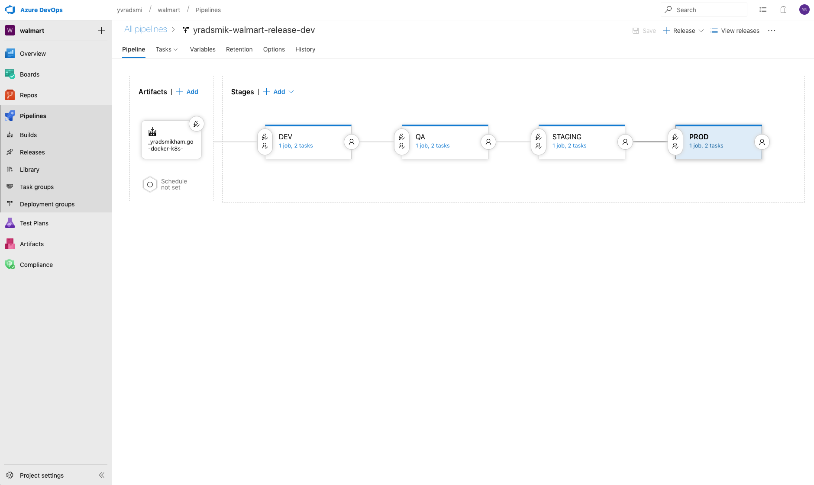

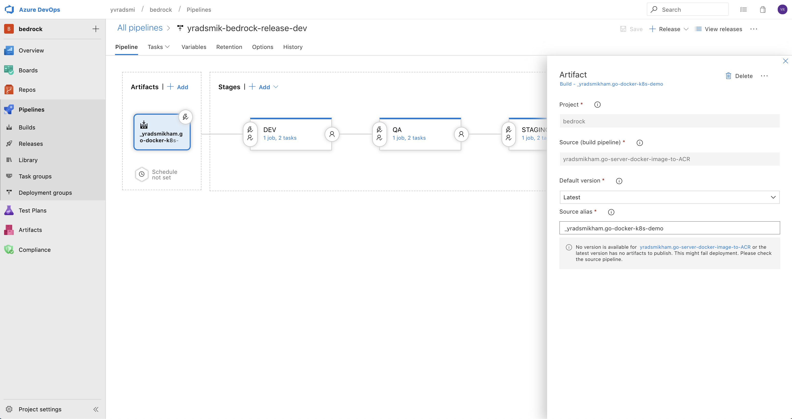

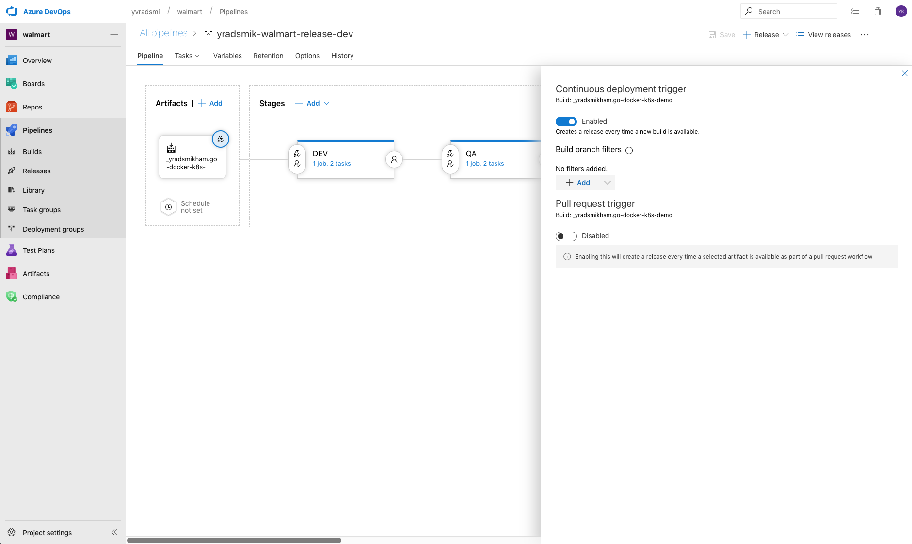

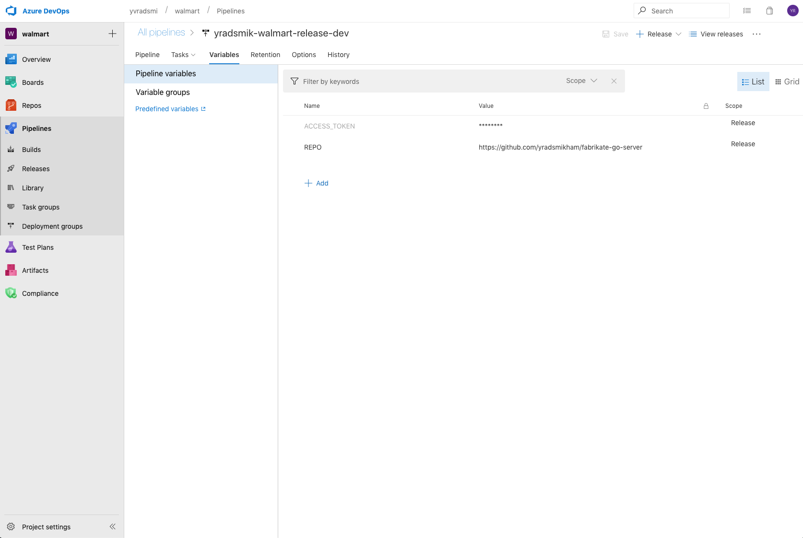

### High Level Definition (HLD) -> K8s Manifests

#### 1. Create Repositories and Personal Access Tokens

Create both high level definition (HLD) and resource manifest repos and the personal access tokens that you'll use for the two ends of this CI/CD pipeline.  We have instructions for how to do that in two flavors:
* [Azure DevOps](ADORepos.md)
* [GitHub](GitHubRepos.md)

#### Add Azure Pipelines Build YAML
If you are using your own high level description, add the following `azure-pipelines.yml` file to its root to defines the build rules for your Azure Devops pipeline.

```
trigger:
- master

pool:
  vmImage: 'Ubuntu-16.04'

steps:
- checkout: self
  persistCredentials: true
  clean: true

- bash: |
    curl $BEDROCK_BUILD_SCRIPT > build.sh
    chmod +x ./build.sh
  displayName: Download Bedrock orchestration script
  env:
    BEDROCK_BUILD_SCRIPT: https://raw.githubusercontent.com/Microsoft/bedrock/master/gitops/azure-devops/build.sh

- task: ShellScript@2
  displayName: Validate fabrikate definitions
  inputs:
    scriptPath: build.sh
  condition: eq(variables['Build.Reason'], 'PullRequest')
  env:
    VERIFY_ONLY: 1

- task: ShellScript@2
  displayName: Transform fabrikate definitions and publish to YAML manifests to repo
  inputs:
    scriptPath: build.sh
  condition: ne(variables['Build.Reason'], 'PullRequest')
  env:
    ACCESS_TOKEN_SECRET: $(ACCESS_TOKEN)
    COMMIT_MESSAGE: $(Build.SourceVersionMessage)
    MANIFEST_REPO: $(MANIFEST_REPO)
    BRANCH_NAME: $(Build.SourceBranchName)
```

__Note__: If you would like to trigger the build on a branch other than master, add it to the above file under `trigger`

#### 2. Create Pipeline

We use an [Azure Pipelines Build](https://docs.microsoft.com/en-us/azure/devops/pipelines/get-started/key-pipelines-concepts?toc=/azure/devops/pipelines/toc.json&bc=/azure/devops/boards/pipelines/breadcrumb/toc.json&view=azure-devops) to build your high level description into resource manifests:

1. On a pull request (pre push to master) it executes a simple validation on proposed changes to infrastructure definition in the HLD repo.
1. On a merge to master branch (post push to master) it executes a script to transform the high level definition to YAML using [Fabrikate](https://github.com/Microsoft/fabrikate) and pushes the generated results into the resource manifest repo.

#### Create Build for your Definition Repo

In Azure DevOps:
1. Click on "Pipelines" on the left side to expand a submenu
2. Click on "Builds" from the submenu
3. In the 2nd column from the left click the "+ New" button
4. Select "New pipeline"

  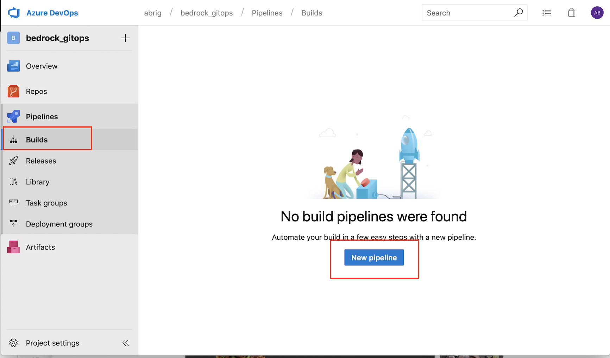

5. Choose the platform you are using for source control:

  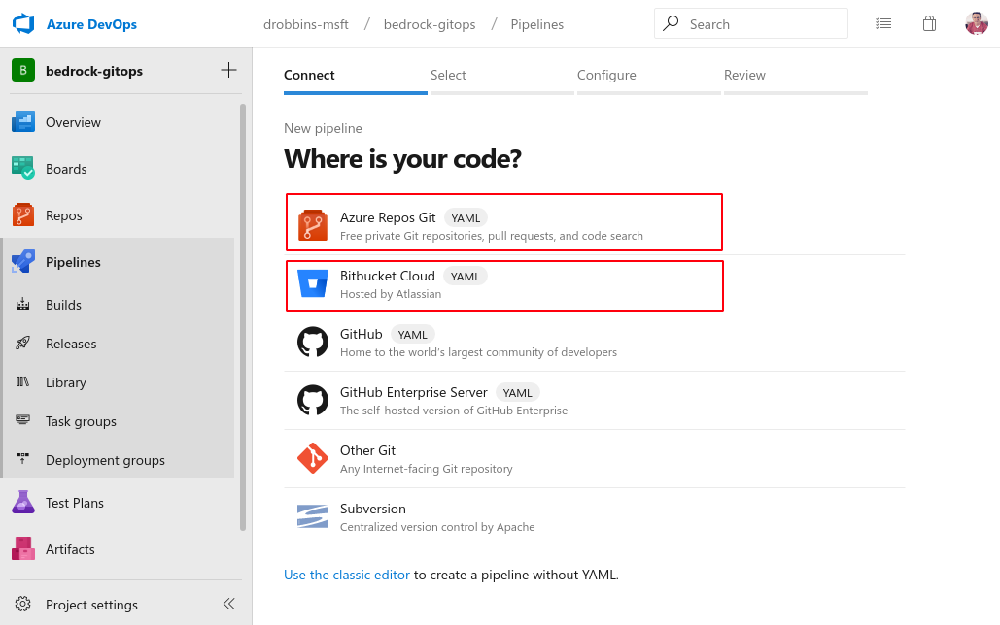

6. Choose your high level definition repo:
    1. Azure DevOps Repo Example: 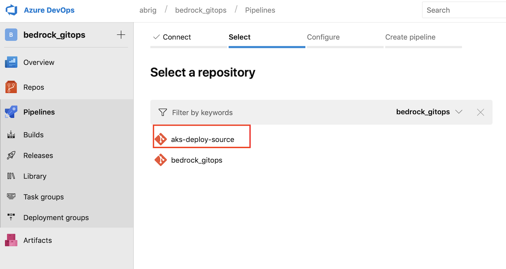
    1. GitHub Repo Example: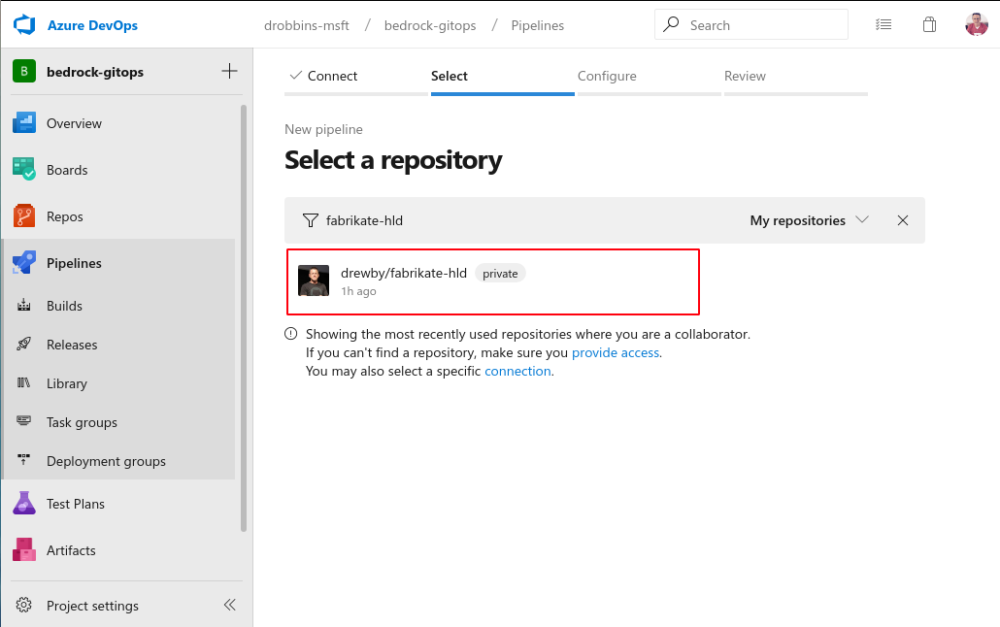

7. Select the "Configuration as Code" template

  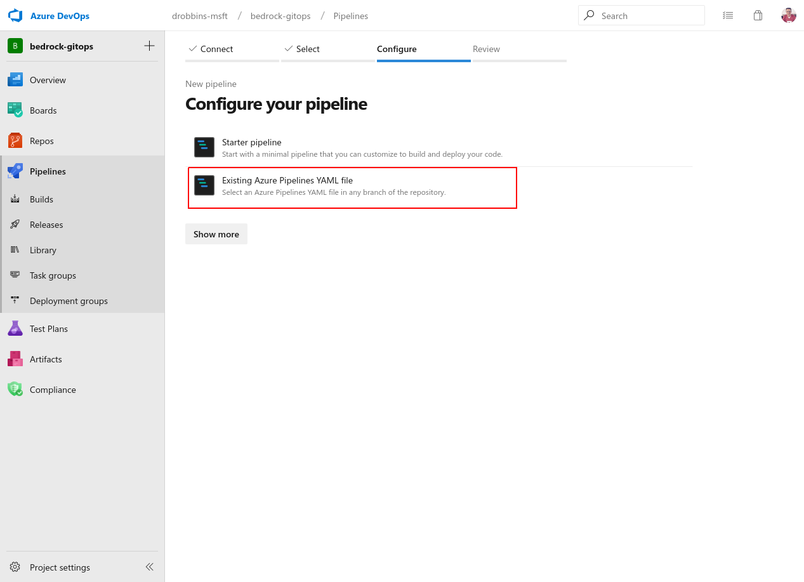

8. Name the build and choose the `azure-pipeline.yml` file in the root of your high level definition repo.

#### Configure Build

1. Click the "Variables" tab.

5. Add two variables that are used by the `build.sh` script referenced in `azure_pipeline.yml`:
    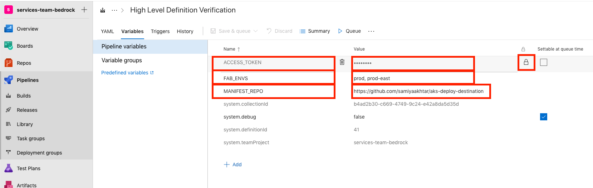
    1. __Name__: `ACCESS_TOKEN` (_mandatory_) __Value__: Personal Access Token ([Azure DevOps](https://docs.microsoft.com/en-us/azure/devops/organizations/accounts/use-personal-access-tokens-to-authenticate?view=azure-devops) or [GitHub](https://www.help.github.com/articles/creating-a-personal-access-token-for-the-command-line)) for your repo type. Click the "lock" icon to the right of the value field to indicate this is a _secret_ per the screenshot above.
    2.  __Name__: `MANIFEST_REPO` (_mandatory_) __Value__: The full URL to your manifest repo (i.e. https://github.com/andrebriggs/acme-company-yaml.git)
    3. __Name__: `FAB_ENVS` (_optional_) __Value__: Comma-separated list of environments for which you have specified a config in your high level definition repo. If this variable is not created in the pipeline, the script will generate manifest files for a generic `prod` environment. For example, you may set this variable to `prod-east, prod-west` depending on your configuration.

6. Click "Save & Queue".

7. You should now see the build run and complete successfully.
  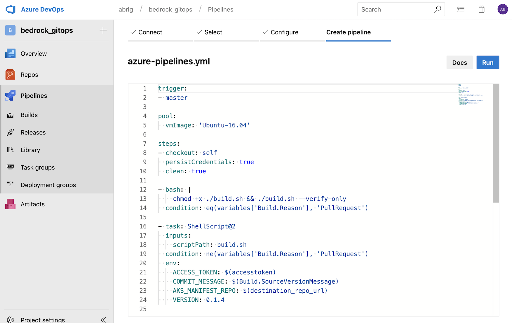

#### 3. Configure Flux

Once you have your Azure Pipeline Build working, you will need to retrieve the SSH public key you used to [set up your cluster](../../cluster/README.md).

1. Copy the SSH key to your clipboard.

2. In Azure DevOps, under your User Profile > Security > SSH public keys, click on `Add` and add the Flux deploy key.
  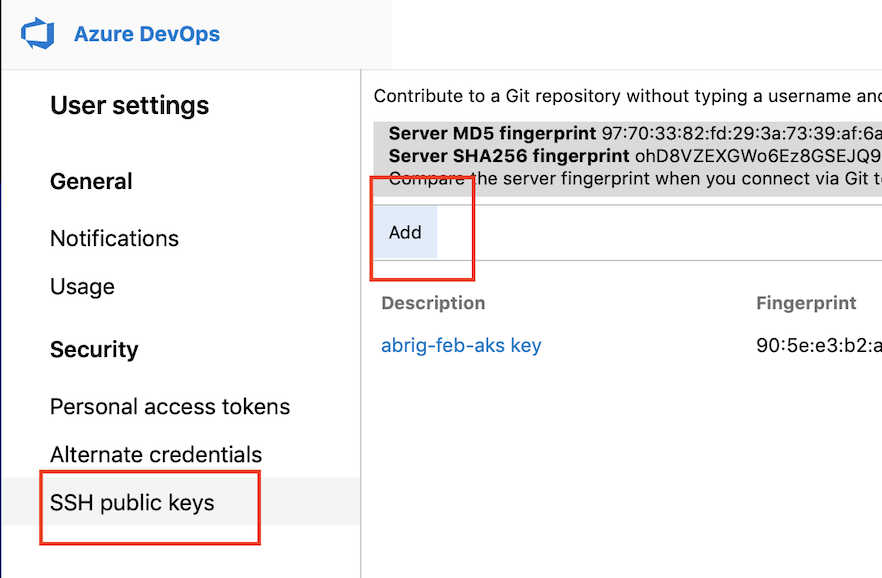

3. On your cluster find the name of your pod by executing `kubectl get pods -n flux`
    ```
    $ kubectl get pods -n flux
    NAME                              READY   STATUS    RESTARTS   AGE
    flux-7d459f5f9-c2wtd              1/1     Running   0          24h
    flux-memcached-59947476d9-49xs6   1/1     Running   0          24h
    ```

4. Monitor the logs of your running Flux instance using the command `kubectl logs POD_NAME -n flux` to ensure that the initial manifest YAML files are being applied to your cluster.
```
$ kubectl logs flux-7d459f5f9-c2wtd -n flux
ts=2019-02-14T19:37:55.332948174Z caller=main.go:156 version=1.10.1
ts=2019-02-14T19:37:55.408911845Z caller=main.go:247 component=cluster identity=/etc/fluxd/ssh/identity
ts=2019-02-14T19:37:55.414659575Z caller=main.go:417 url=git@github.com:andrebriggs/aks-feb-manifest.git user="Weave Flux" email=support@weave.works sync-tag=flux-sync notes-ref=flux set-author=false
...
...
```
Now, when a change is commited to the resource manifest repo, Flux should acknowledge the commit and make changes to the state of your cluster as necessary. You can monitor Flux by viewing the logs by running `kubectl logs POD_NAME -n flux -f` in stream mode.

#### 4. Make a Pull Request

1. Create a new branch in your HLD repo and make a commit to the high level definition.

1. For example, let's say we wanted to make a change that dropped the `cloud-native` stack and instead added directly a Elasticsearch / Fluentd / Kibana logging stack and Prometheus / Grafana metrics monitoring stack to your definition.  We would make a commit that made this change:
  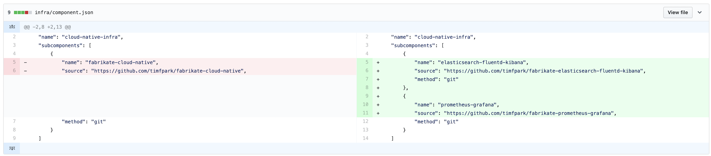

1. Then, create a pull request to merge your changes into master branch.

1. When you do this, the Azure Devops pipeline will automatically run validation checks against your pull request.

1. Once these checks have passed and the PR has been approved by your team process, you can merge it into master.

#### 5. Monitor Repository Changes
1. Once merged, you can monitor the progress of the HLD transformation in the Build menu in your Azure DevOps _Project_.

1. When the commit is merged into master, your Azure Devops pipeline will build the resource manifests for this definition and check them into the resource manifest repo.

1. Once the build is successful, navigate to your manifest repository. You should see a very recent commit to the main branch.
  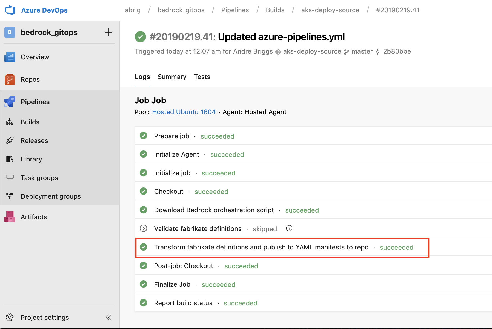

#### 6. Monitor Cluster Changes

1. Next, [Flux](https://github.com/weaveworks/flux/blob/master/site/get-started.md#confirm-the-change-landed) will automatically apply the build resource manifest changes to your cluster.  You can watch this with the following `kubectl` command:

```
$ kubectl logs POD_NAME -n flux -f
```

2. You can also use [Kubediff](https://github.com/weaveworks/kubediff) to make sure the applied resource manifests in your cluster match your resource manifest repo by cloning your resource manifest repo and then running:

```
$ kubediff ./cloned-resource-manifest-repo
```

3. Finally, you should watch your normal operational metrics to make sure the change was successful.

#### Reference

* [Azure Pipelines](https://docs.microsoft.com/en-us/azure/devops/pipelines/get-started/what-is-azure-pipelines?toc=/azure/devops/pipelines/toc.json&bc=/azure/devops/boards/pipelines/breadcrumb/toc.json&view=azure-devops)
