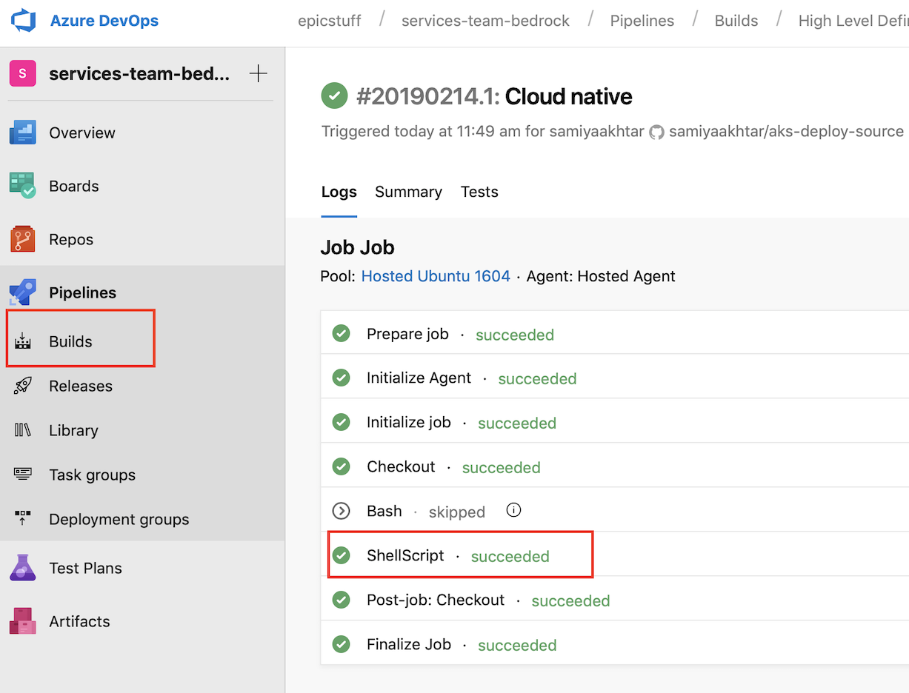

# Getting Started with Azure DevOps and GitOps  
The expectation here is that from scratch you can set up the necessary repos to get a Bedrock GitOps release flow™ working. 

## Prerequisites
* AKS Cluster
  * Create and deploy a [flux enabled AKS cluster](../../cluster/README.md)
* Permissions:
  * Be able to create _Projects_ in your Azure DevOps _Organization_ 
  * Create GitHub Personal Access Token (if using GitHub Repos)

## Sample HLD Repository
We provide a [sample HLD repo](https://github.com/samiyaakhtar/aks-deploy-source) that can be imported or cloned based on the flavor of git repository you use. The sample HLD contains a [Cloud Native](https://github.com/timfpark/fabrikate-cloud-native) fabrikate definition.

### Azure Pipelines Build YAML
The repo also contains an Azure Pipelines YAML file that controls some build rules on based upon whether a PR is occuring or if a merge to master branch has occured.

```
trigger:
- master

pool:
  vmImage: 'Ubuntu-16.04'

steps:
- checkout: self
  persistCredentials: true
  clean: true

- bash: |
    chmod +x ./build.sh && ./build.sh --verify-only
  condition: eq(variables['Build.Reason'], 'PullRequest')

- task: ShellScript@2
  inputs:
    scriptPath: build.sh
  condition: ne(variables['Build.Reason'], 'PullRequest')
  env:
    ACCESS_TOKEN: $(accesstoken)
    COMMIT_MESSAGE: $(Build.SourceVersionMessage)
    AKS_MANIFEST_REPO: $(aks_manifest_repo)

```

At the end of this walkthrough you will have kubernetes manifest files corresponding to the Cloud Native stack on your manifest repo. These YAML files will then be deployed to your AKS cluster via Flux. 

## Walkthrough
### 1. Create Repositories

We provide instructions for creating HLD and Manifest repos in two flavors:
* [Azure DevOps](ADORepos.md)
* [GitHub](GitHubRepos.md)

### 2. Create an Orchestration Pipeline

Configuration of an [Azure Pipelines Build](https://docs.microsoft.com/en-us/azure/devops/pipelines/get-started/key-pipelines-concepts?toc=/azure/devops/pipelines/toc.json&bc=/azure/devops/boards/pipelines/breadcrumb/toc.json&view=azure-devops) is necessary for orchestration. We provide a YAML configration file in the sample HLD repository that performs the following behaviors:

+ On a pull request (pre push to master) will execute a simple validation on proposed changes to infrastructure definition in the HLD repo.

+ On a merge to master branch (post push to master) we execute a script to transform the high level definition to YAML using [Microsoft Fabrikate](https://github.com/Microsoft/fabrikate) and push it to the manifest repository.

#### Create a Build from your HLD Repo

In the Azure DevOps,
1. Click on "Pipelines" on the left side to expand a submenu
2. Click on "Builds" from the submenu
3. In the 2nd column from the left click the "+ New" button
4. Select "New build pipeline"
  
5. Choose the appropriate repo flavor as the selection to the "Where is your code?" prompt
  
6. Choose the repo that you named as $HLD_REPO_NAME
  


#### Configure a Build

At this point you will see `azure-pipeline.yml`, which is contained in the HLD repo.
1. Click the blue run button on the right side.
2. You should see the output of an azure pipeline. Instead of waiting for the build to finish, click the ellipsis (...) in the upper right corner and choose "Edit pipeline".
3. You will see the YAML contents again. Click on the ellipsis to the right of the blue "Run" button and choose "Pipeline settings".
4. Click the "Variables" tab.
5. Add two variables:
    1. __Name__ AKS_MANIFEST_REPO __Value__ MANIFEST_REPO_NAME_GIT_URL
    2. __Name__ ACCESS_TOKEN __Value__ MANIFEST_REPO_NAME_GIT_URL
    3. __Name__ GIT_HOST __Value "azure"
    These variables are consumed by the `build.sh` called in `azure_pipeline.yml`.
6. Click "Save & Queue".
7. You will see the build run and hopefully complete successfully. At this point we can make a PR change to the HLD repo.
  

### 3. Configure Flux

Once you have your Azure DevOps repos in place and the Azure Pipelne Build working, you will need to retrieve the SSH public key you used to [set up your cluster](../../cluster/README.md).

1. Copy the SSH key.
2. In Azure DevOps, under your User Profile > Security > SSH public keys, click on `Add` and add the Flux deploy key.
  

3. On your cluster find the name of your pod by executing `kubectl get pods -n flux`
    ```
    $ kubectl get pods -n flux
    NAME                              READY   STATUS    RESTARTS   AGE
    flux-7d459f5f9-c2wtd              1/1     Running   0          24h
    flux-memcached-59947476d9-49xs6   1/1     Running   0          24h
    ```

4. Monitor the logs of your flux using the command `kubectl logs POD_NAME -n flux` to ensure that the initial manifest YAML files are being applied to yourt cluster.
```
$ kubectl logs flux-7d459f5f9-c2wtd -n flux
ts=2019-02-14T19:37:55.332948174Z caller=main.go:156 version=1.10.1
ts=2019-02-14T19:37:55.408911845Z caller=main.go:247 component=cluster identity=/etc/fluxd/ssh/identity
ts=2019-02-14T19:37:55.414659575Z caller=main.go:417 url=git@github.com:andrebriggs/aks-feb-manifest.git user="Weave Flux" email=support@weave.works sync-tag=flux-sync notes-ref=flux set-author=false
...
...
```
Now, when a change is commited to the Manifest repo, Flux should acknowledge the commit and make changes to the state of your cluster as necessary. You can monitor Flux by viewing the logs by running `kubectl logs POD_NAME -n flux -f` in stream mode.

### 4. Make a Pull Request
1. Create a new branch in your HLD repo and make a commit to the high level definition.
1. An example of a change could be adding a Prometheus and Grafana stack to your definition
  
1. Perform a pull request to merge your changes into master branch
1. Once checks has passed have the PR approved 

### 5. Monitor Repository Changes
* Once a pull request is approved you can monitor the progress of the HLD transformation in the Build menu in your Azure DevOps _Project_.
* Once the build is successful navigate to your manifest repository. You see a very recent commit to the main branch.
  

### 6. Monitor Cluster Changes

* Use [Flux](https://github.com/weaveworks/flux/blob/master/site/get-started.md#confirm-the-change-landed) to provide automated deploy synchronization between your manifest repo and cluster. 
  * Watch the cluster in stream mode by running `kubectl logs POD_NAME -n flux -f`
* Use [Kubediff](https://github.com/weaveworks/kubediff) to make sure your cluster configuration and matches your manifest repo configuration

### 7. Repeat As Necessary
At this point a cycle of a GitOps flow has completed. To make additional changes to your cluster visit [Step 4](#4-make-a-pull-request). 

## Reference
* [Azure Pipelines](https://docs.microsoft.com/en-us/azure/devops/pipelines/get-started/what-is-azure-pipelines?toc=/azure/devops/pipelines/toc.json&bc=/azure/devops/boards/pipelines/breadcrumb/toc.json&view=azure-devops)
