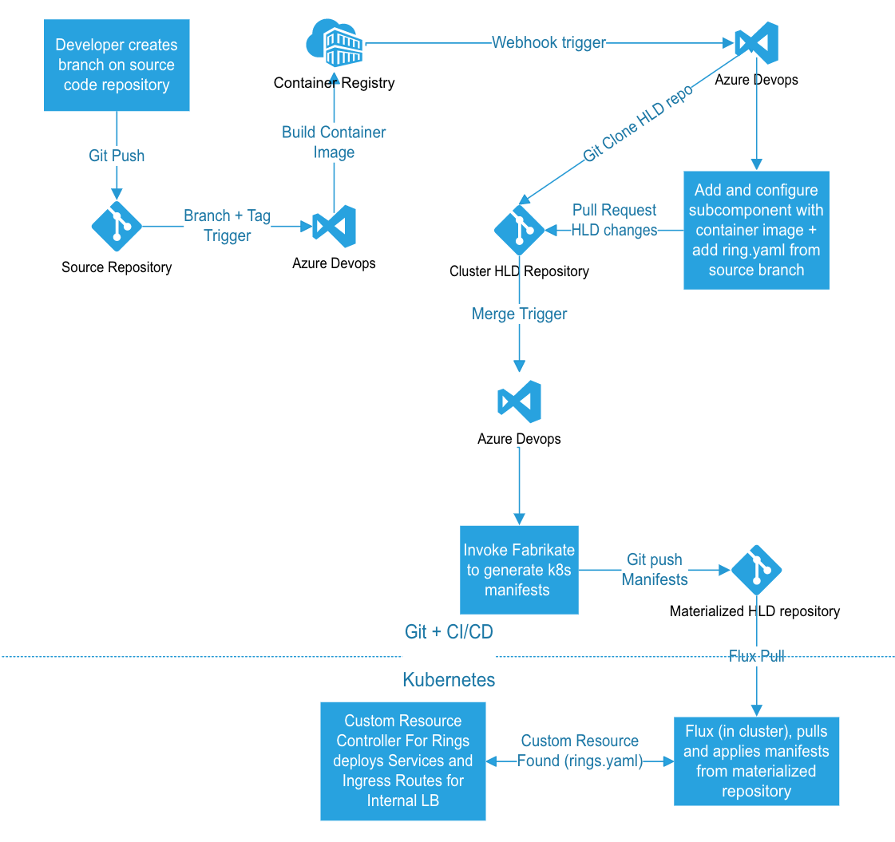

# Rings

Ring deployment is a configuration on top of a service deployment that allows you to deploy *revisions* of the service alongside any existing instances of *that* service, and any other services. It allows you to control the "blast radius" of a change to a service by gradually rolling out new revisions of a microservice to production without the risk of affecting all end users.

This README serves to explain a Ring based deployment using Fabrikate and Bedrock.

**NOTE**: This pipeline is ideal for developers who want to practice Bedrock GitOps **without using a Service Mesh**. This approach will require that the you have an application that replicates the behavior of a Service Mesh (e.g. [Ring Operator](https://github.com/microsoft/bedrock/tree/rings/gitops/rings#ring-operator)).

The Ring workflow is shown in the following diagram, where you will see that it represents an extension to the [Bedrock CI/CD](https://github.com/microsoft/bedrock/tree/master/gitops).



In summary, there are two additions made to the Bedrock CI/CD to account for this Rings implementation:

1. Cluster HLD Repo
2. Ring.yaml

## Components of the Ringed Model

### Git Repositories

Recall that in the official Bedrock CI/CD (without Rings), there exists three types of repositories: (1) Service Source Code (2) HLD (Service and Cluster) and (3) the Materialized. In a Ringed Model, the same repositories exists as well. The following repositories are required in the Rings workflow:

For every independent service we assume 2 git repositories exist:

**Service Source Repository**: A git repository that maintains the source code of the service, a dockerfile, and a helm chart. Developers will commit regularly to this repository, with revisions and rings being tracked in Git branches.

**Service HLD Repository**: A second git repository that maintains a High Level Definition for the source repository. Commits to this repository are automated, and configuration is performed via AzDo pipelines. Subcomponents in this repository map to the branches in the Service Source Repository

For all services represented by the above 2 git repositories, we assume two more repositories exist:

**Cluster HLD Repository**: A git repository that maintains a High Level Definition for all Services and Revisions that are intended to be run on the Cluster.

**“Materialized” Manifest Repository**: this git repository acts as our canonical source of truth for Flux – the in-cluster component that pulls and applies Kubernetes manifests rendered from the Cluster HLD repository.

### Ring.yaml
As a ring is considered to be strictly a revision of a microservice, we need a way to configure the ingress controller to route to the microservice revision a user belongs to. We achieve this by providing a `ring.yaml` file in our helm chart, which is an abstraction on Kubernetes and Traefik primitives.

An example of ring.yaml:

```yaml
serviceName: "languages"
majorVersion: "v1"
ringName: "48883-add-search"
group: "CMS-CORE"
contact: cms-core-dl@contoso.com
branch: feature/48883-add-search
initialUsers:
  - bill@contoso.com
  - ted@contoso.com
deploy: true

application:
  replicaCount: 10
  ports:
    - 8080
```

The `ring.yaml` pairs with a `deployment.yaml` within the helm chart of your `src` repository as follows:

**Source Repository**:
 * ring
   * config
       * common.yaml
   * component.yaml
   * Chart.yaml
   * values.yaml
 * src
   * Dockerfile
   * ..
 * azure-pipelines.yaml

The `selector` field of your `ring.yaml` should match the `spec.selector.matchLabels` of the `deployment.yaml` file. This is because a "Ring Operator" will create the service that matches the labels on the `deployment.yaml`, and once the Ring is created, it knows to map to a specific version of a service and ingress routes based on these `selector` labels, and will control access control to the service.

### Ring Operator
The ring.yaml is consumed by a custom resource controller, which we call the Ring Controller. The Ring Controller sets up two resources on the cluster that map traffic to the proper service revision: a Traefik Ingress Route that maps path and headers to a Kubernetes service, and a Kubernetes service that maps to the microservice deployment.

**DISCLAIMER:** Bedrock does *not* provide an open-sourced "Ring Operator", or any tool that can manage ingress routes to a specific service. We are in the process of developing and open-sourcing a "Ring Operator" soon.

## Creating a New Ring for a Service

This section will assist in understanding the order of operations of a Ringed Model. However, if you want a step-by-step guide on implementing Rings, please visit the [Rings Implementation Guide](./RingsImplementation.md)

### 1. Create a New Branch

To create a revision of the microservice that can deploy alongside existing instances of the microservice, and any other microservices, a developer will need to create a new git branch on the microservice source repository. The git branch could reflect a bug fix or a new feature for the service, but regardless, should be a revision of some kind with a unique ring definition (e.g. branch name, ring.yaml).

### 2. Image Tag Release Pipeline

The [Image Tag Release Pipeline](https://github.com/microsoft/bedrock/blob/rings/gitops/azure-devops/ImageTagRelease.md), which is a core component of the Bedrock CI/CD workflow, will acknowledge the creation of a new Ring when a git branch is created. Like any other commit, it will trigger the build for the Image Tag Release Pipeline. Recall that the pipeline will execute a build to build and push a Docker image using a new image tag. Then, it will initiate the Release pipeline, where a Pull Request will be created to have Fabrikate  update the image tag in the Fabrikate definitions for the Service HLD repo, __in addition to__ to adding a new subcomponent (via `fab add` command) to the `component.yaml` (shown below) for the new git branch, if it does not already exists. In the `component.yaml`, we use a path based selector to identify where in the source code repository the Helm chart exists.

```yaml
name: hello-rings
type: component
subcomponents:
- name: hello-rings-featurea
  type: helm
  source: https://github.com/bnookala/hello-rings
  method: git
  path: chart
  branch: featurea
- name: hello-rings-featureb
  type: helm
  source: https://github.com/bnookala/hello-rings
  method: git
  path: chart
  branch: featureb
```

### 3. Merge Pull Request against Service HLD Repo

A developer on a project must manually engage a Pull Request merge in order to gate access for a Ring to production.

### 4. Manifest Generation Pipeline

When the pull request merged by another developer into the `master` branch of the Service HLD repository, the [Manifest Generation Pipeline](https://github.com/microsoft/bedrock/blob/master/gitops/azure-devops/ManifestGeneration.md) initiates. The difference in this Manifest Generation pipeline is that it will execute the build using the Cluster HLD repo as opposed to the Service HLD repo. The Cluster HLD repo sources all known services that are intended to be run on a cluster via their representative HLD repositories.

An example of the `component.yaml` in the Cluster HLD repo:

```yaml
name: hello-rings-cluster
subcomponents:
- name: hello-rings
  type: component
  source: https://github.com/bnookala/hello-rings-hld
  method: git
  branch: master
- name: ring-operator
  type: component
  source: https://github.com/samiyaakhtar/ring-operator
  method: git
  branch: master
```


## References

- Service Source Repo: https://github.com/bnookala/hello-rings
- Service HLD Repo: https://github.com/bnookala/hello-rings-hld
- Cluster HLD Repo: https://github.com/bnookala/hello-rings-cluster
- Materialized Manifest Repo: https://github.com/bnookala/hello-rings-cluster-materialized
