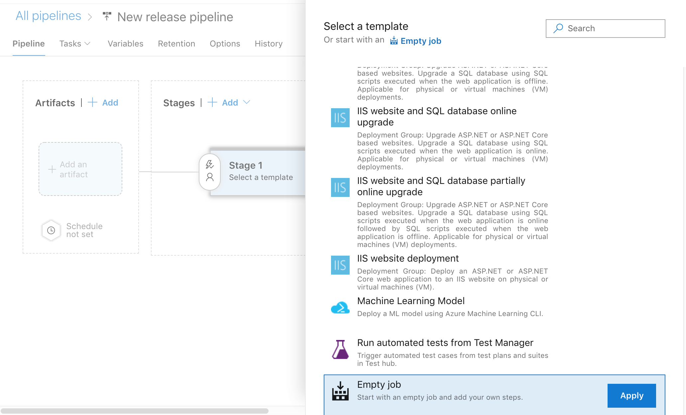
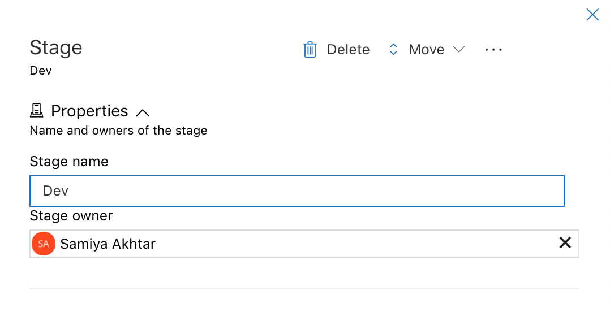
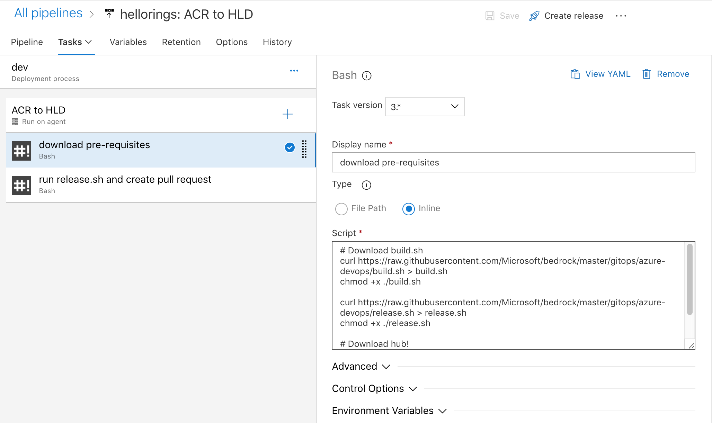
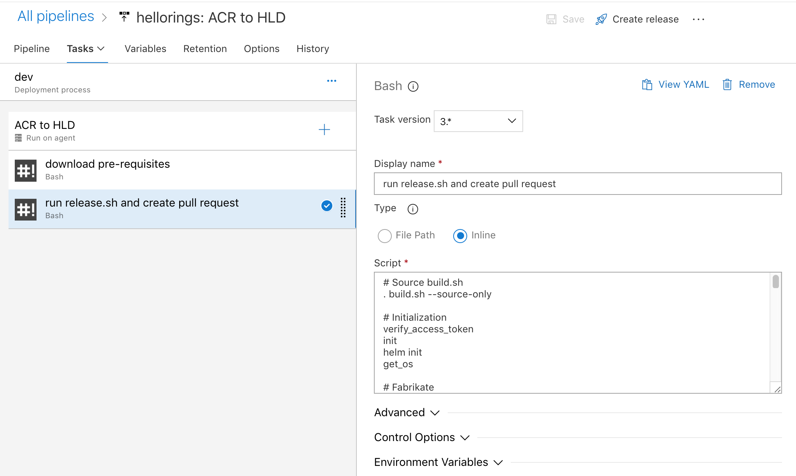

# Rings Implementation

This guide intends to implement Rings on Kubernetes without a Service Mesh using Azure DevOps. We recommend you review the [Rings](./README.md) documentation to understand the design of this ringed model before attempting to implement it.

## Pre-requisites

1. An Azure Container Registry (ACR)
2. A [Service Connection](../azure-devops/ImageTagRelease.md#Create-a-service-connection-to-ACR) established in Azure DevOps to access the ACR.

## SRC to ACR

This is the first pipeline in the process which builds the source repository, runs any required tests, and pushes the built image to the container registry. You may refer to our [sample hello world rings](https://github.com/bnookala/hello-rings) repository located here.

Create a new `azure-pipelines.yml` file in the source repository and add the following code to it:
```yaml
trigger:
branches:
    include:
    - master
    - '*'
paths:
    include:
    - '*'

pool:
vmImage: 'ubuntu-latest'

steps:
- checkout: self
  persistCredentials: true
  clean: true
  
- task: Docker@2
  inputs:
    containerRegistry: '<name_of_the_service_connection_to_ACR_registry>'
    repository: '<name_of_the_repository>'
    command: 'buildAndPush'
    Dockerfile: '**/src/Dockerfile' # Path to the Dockerfile
    tags: 'hello-rings-$(Build.SourceBranchName)-$(Build.BuildId)' # Use this format to have the tag name audit information forward for the next pipelines
  condition: ne(variables['Build.Reason'], 'PullRequest')


```

*Note*: The format used for tags is used a certain way to allow the next few pipelines to extract information from it for branch name and build ID. If you change this format, you may have to update the subsequent pipelines in a different way.

If you have any additional test steps in your project, add them to this file before the Docker step. Run the pipeline and you should be able to see a new tag cre

## ACR to HLD

This Azure pipeline is meant to be a Release pipeline which is triggered by the ACR image published in the previous step as an artifact. It accomplishes the following objectives:

- Download and Install the pre-requisites [Fabrikate](https://github.com/Microsoft/fabrikate) and [Hub](https://hub.github.com/)
- Clone the HLD repo
- Execute `fab set` to manipulate HLDs to update the new image tag build in the previous pipeline
- Execute `fab add` to add any ring that is newly created (as a branch)
- Git commit and push to service HLD repo in a new branch
- Open a pull request from this new branch into the service HLD using Hub

1. To start off, you can create the first environment (e.g. Dev) using an Empty Job template.

    

2. Add a new stage to the pipeline (e.g. Dev)

    

3. Add a new artifact by selecting Azure Container Registry that we're pushing to, in the previous step. If you haven't already setup the connections necessary to add this in your project settings, follow instructions [here](../azure-devops/ImageTagRelease.md#Create-a-service-connection-to-ACR).

    

4. Add two build steps to this pipeline, one downloads the necessary pre-requisites and the second runs the release pipeline.

    - **GitHub**

        If you're using GitHub repositories, follow the steps below.

        For the first build step, copy the following lines of code:


        ```sh
        # Download build.sh
        curl https://raw.githubusercontent.com/Microsoft/bedrock/master/gitops/azure-devops/build.sh > build.sh
        chmod +x ./build.sh

        curl https://raw.githubusercontent.com/Microsoft/bedrock/master/gitops/azure-devops/release.sh > release.sh
        chmod +x ./release.sh

        # Download hub!
        sudo add-apt-repository ppa:cpick/hub
        sudo apt-get update
        sudo apt-get install hub
        ```

        

        For the second step, copy the following lines of code:

        ```sh
        # Source build.sh
        . build.sh --source-only

        # Initialization
        verify_access_token
        init
        helm init
        get_os

        # Fabrikate
        get_fab_version
        download_fab

        # Clone HLD repo
        git_connect

        subcomponent=$(echo "$YAML_PATH_VALUE" | sed 's/\-[^-]*$//')

        echo "FAB SET"
        if [[ ! -z $FAB_ENV_NAME ]]
        then
            fab set --environment $FAB_ENV_NAME --subcomponent $subcomponent $YAML_PATH=$YAML_PATH_VALUE $YAML_PATH_2=$YAML_PATH_VALUE_2
        else
            fab set --subcomponent $subcomponent $YAML_PATH=$YAML_PATH_VALUE $YAML_PATH_2=$YAML_PATH_VALUE_2
        fi

        echo "GIT STATUS"
        git status

        # extract branch name from the full subcomponent
        branch_name=$(echo ${subcomponent##*-})
        # Execute fab add to add this branch to the service HLD
        fab add $subcomponent --source $SOURCE_PATH --branch $branch_name --method git --path $CHART_PATH --type helm


        echo "GIT ADD"
        git add -A

        pr_branch_name=pr_$subcomponent_$YAML_PATH_VALUE
        git checkout -b $pr_branch_name

        # Set git identity
        git config user.email "admin@azuredevops.com"
        git config user.name "Automated Account"

        echo "GIT COMMIT"
        git commit -m "Updating image tag for service $branch_name"

        echo "GIT PUSH"
        git_push origin $pr_branch_name

        # Create pull request
        export GITHUB_TOKEN=$ACCESS_TOKEN_SECRET
        hub version
        hub pull-request -m "Updating service $branch_name"
        ```

        

    - **Azure DevOps**

        If you're using Azure DevOps repos, follow the steps below. For the first build step, copy the following lines of code:

        ```sh
        # Download build.sh
        curl https://raw.githubusercontent.com/Microsoft/bedrock/master/gitops/azure-devops/build.sh > build.sh
        chmod +x ./build.sh

        curl https://raw.githubusercontent.com/Microsoft/bedrock/master/gitops/azure-devops/release.sh > release.sh
        chmod +x ./release.sh

        # Download az CLI
        sudo apt-get update
        sudo apt-get install azure-cli
        az extension add --name azure-devops
        ```

        For the second build step:

        ```sh
        # Source build.sh
        . build.sh --source-only

        # Initialization
        verify_access_token
        init
        helm init
        get_os

        # Fabrikate
        get_fab_version
        download_fab

        # Clone HLD repo
        git_connect

        subcomponent=$(echo "$YAML_PATH_VALUE" | sed 's/\-[^-]*$//')

        echo "FAB SET"
        if [[ ! -z $FAB_ENV_NAME ]]
        then
            fab set --environment $FAB_ENV_NAME --subcomponent $subcomponent $YAML_PATH=$YAML_PATH_VALUE $YAML_PATH_2=$YAML_PATH_VALUE_2
        else
            fab set --subcomponent $subcomponent $YAML_PATH=$YAML_PATH_VALUE $YAML_PATH_2=$YAML_PATH_VALUE_2
        fi

        echo "GIT STATUS"
        git status

        # extract branch name from the full subcomponent
        branch_name=$(echo ${subcomponent##*-})
        # Execute fab add to add this branch to the service HLD
        fab add $subcomponent --source $SOURCE_REPO --branch $branch_name --method git --path $CHART_PATH --type helm


        echo "GIT ADD"
        git add -A

        pr_branch_name=pr_$subcomponent_$YAML_PATH_VALUE
        git checkout -b $pr_branch_name

        # Set git identity
        git config user.email "admin@azuredevops.com"
        git config user.name "Automated Account"

        echo "GIT COMMIT"
        git commit -m "Updating image tag for service $branch_name"

        echo "GIT PUSH"
        git_push origin $pr_branch_name

        export AZURE_DEVOPS_EXT_PAT=$ACCESS_TOKEN_SECRET

        az devops configure --defaults organization=$ORG_NAME project=$PROJECT_NAME

        echo "Making pull request from $pr_branch_name against master"

        az repos pr create --org $ORG_NAME  -p $PROJECT_NAME -r $REPO_NAME -s "$pr_branch_name" -t "master" --title "Updating service $branch_name" -d "Automated pull request for branch $branch_name"
        ```

5. Add the following environment variables to the second build step:

   - `ACCESS_TOKEN_SECRET`: Set this to the personal access token from GitHub/Azure DevOps
   - `YAML_PATH_VALUE`: Set this to `$(Build.BuildId)` so that it can be used to update the image tag built in the previous pipeline
   - `YAML_PATH`: Set this to the field which needs to be updated in the HLD, in this case `image.tag`
   - `SUBCOMPONENT`: Set this to the name of the subcomponent that you're trying to update in the HLD
   - `YAML_PATH_2`: Set this to the second field updating in this step, in this case, the image repository `image.repository`
   - `YAML_PATH_VALUE_2`: Set this to the value for the image repository, such as `hellorings.azurecr.io/hellorings`
   - `CHART_PATH`: Set this to the folder in the source repository where the charts are located, in this example they're in `chart`
   - `SOURCE_REPO`: Set this to the URL for the source code repository, in this case `https://github.com/bnookala/hello-rings`
   - (*Azure DevOps only*) `ORG_NAME`: Set this to the organization URL in the format `https://dev.azure.com/org_name/`
   - (*Azure DevOps only*) `PROJECT_NAME`: Set this to the name of the project in your organization where the repository is hosted.
   - (*Azure DevOps only*) `REPO_NAME`: Set this to the name of the repository

    

6. Run these steps from the very beginning, from the SRC to ACR pipeline, and shortly you should see a new release kicked off for the newly built ACR image. Check the pull requests page to see if a new PR is opened against the service HLD!

When you push a new branch, a pull request should be open for that ring against the service HLD. Make sure that the SRC to ACR pipeline is triggered for all branches (not just master) to allow new rings to be pull requested.

### Service HLD to Materialized Manifest

The Service HLD to Materialized Manifest pipeline resembles the [Manifest Generation Pipeline](https://github.com/microsoft/bedrock/blob/master/gitops/azure-devops/ManifestGeneration.md) with the **requirements** to specify the following environment variables:

```
HLD_PATH = the git url to the Cluster HLD repo
(e.g. https://github.com/bnookala/hello-rings-cluster)

MANIFEST_REPO = the git url to the materialized manifest repo
(e.g. https://github.com/bnookala/hello-rings-cluster-materialized)
```

The Service HLD to Materialized Manifest repo pipeline is initiated by a pull request that the Image Tag Release pipeline will create. A user will need to merge the pull request in order to cause this pipeline to build.

### Cluster HLD to Materialized Manifest

As described in the [Rings Model](./README.md) documentation, the idea of using a Cluster HLD is to have a repository that maintains the High Level Definition for **all** services and revisions that are intended to be run on the cluster.

It is important to note that the Cluster HLD to manifest pipeline build does *not* run every time the CI/CD process is invoked. The Cluster HLD is a unique HLD that is **only** deployed when a new Ring is to be added to the cluster. The following example is a Cluster HLD that consists of two services, the `hello-rings` and the `ring-operator`, each service with its own ring.

```yaml
name: hello-rings-cluster
subcomponents:
- name: hello-rings
  type: component
  source: https://github.com/bnookala/hello-rings-hld
  method: git
  branch: master
- name: ring-operator
  type: component
  source: https://github.com/samiyaakhtar/ring-operator
  method: git
  branch: master
```
The Cluster will need to be modified by the user when a new service(s) or branch of a service (ring) is to be added. The new service will be added as a subcomponent in the `component.yaml` file. Often, multiple rings derived from the same service will be created and is differentiated by git branches.

To incorporate the Cluster HLD into the Bedrock Rings CI/CD, you will need to configure another manifest generation pipeline, but this time using the Cluster HLD, instead of a Service HLD, writing to the *same* materialized manifest repo used in the Service HLD to Materialized Manifest pipeline.

Unlike the Service HLD to Materialized Manifest pipeline, you will only need to specify the `MANIFEST_REPO` here.
