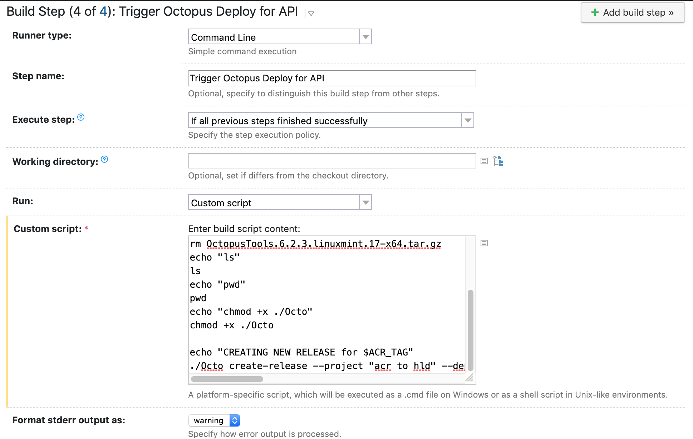
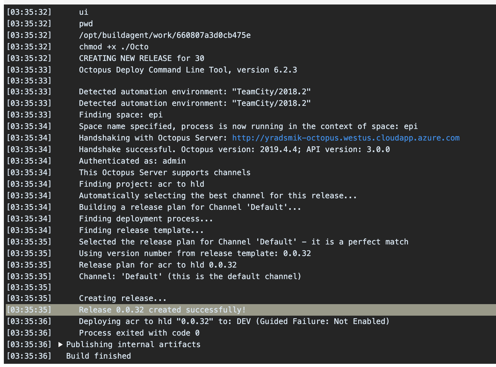

A common CD tool to use with TeamCity is Octopus Deploy, which this guide explains how the two can be tied up where TeamCity provides Continuous Integration and Octopus provides Continuous Delivery. 

## Pre-requisite

Make sure you already have a running CI pipeline in TeamCity and a CD pipeline in Octopus, or follow the guides available for [TeamCity](./README.md) and [Octopus](../octopus/README.md) to setup the individual pipelines. 

## Trigger Octopus from TeamCity

This guide sets a build step for triggering Octopus CD for an Image Tag Release pipeline that we set up for the GitOps workflow. It builds an ACR image and publishes it, then triggers Octopus Deploy with the tag of the newly built image. 

Add a build step to the end of the integration steps, which would trigger Octopus CD. It should look like below:



Add the following code to the custom script which downloads the Octo CLI, and triggers a release: 

```
# Download a pre-requisite to run octo.exe
echo "DOWNLOADING libunwind.so"
apt-get install -y libunwind-dev

# Download a stable version of octo.exe
echo "DOWNLOADING OCTO.EXE"
wget https://download.octopusdeploy.com/octopus-tools/6.2.3/OctopusTools.6.2.3.linuxmint.17-x64.tar.gz
tar xvzf OctopusTools.6.2.3.linuxmint.17-x64.tar.gz
rm OctopusTools.6.2.3.linuxmint.17-x64.tar.gz
echo "chmod +x ./Octo"
chmod +x ./Octo

echo "CREATING NEW RELEASE for $ACR_CONTAINER_TAG"
./Octo create-release --project $PROJECT_NAME --deployto $ENV_NAME --server $OCTO_SERVER --apiKey $OCTO_API_KEY --space $SPACE --variable "YAML_PATH_VALUE:$ACR_CONTAINER_TAG"
```

This step assumes the following variables are set up in TeamCity:

- `OCTO_API_KEY`: Obtain an API key for your Octopus server by going into your profile settings. It should be in the format `API-XXXXXXXXXXXXXXXXXX`
- `OCTO_SERVER`: URL for the Octopus server
- `ACR_CONTAINER_TAG`: In order to set an ACR tag that contains build number, branch name and commit hash, follow steps [here](./ImageTagRelease.md#creating-an-acr-container-tag-with-branch-name-commit-hash-and-build-number). Otherwise, If you would like to skip creating a complex ACR tag for simplicity, set this to any constant image tag which is stable in your ACR. 
- `ENV_NAME`: This should be set to the environment you would like to create a release for. For example `DEV`.
- `PROJECT_NAME`: The name of the project you're creating a release for
- `SPACE`: The project space in which the release resides under. If it's under default, you may skip this parameter. 

Make sure this build step executes after the ACR images are built in the pipeline. Do a test run to see the logs from ths build step, and they should look like something below:

