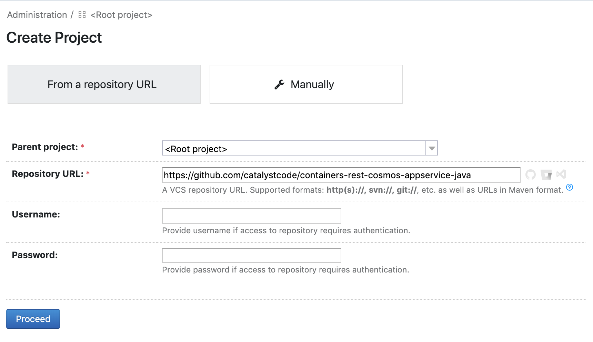
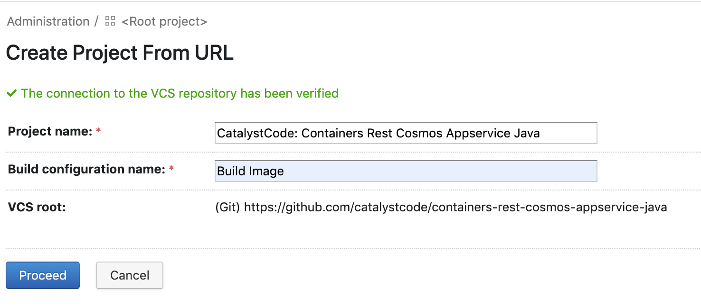
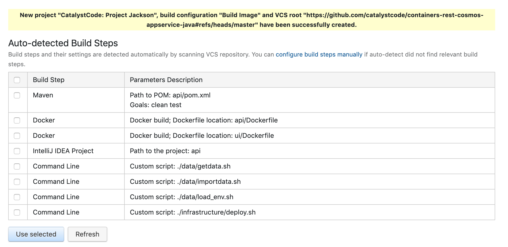
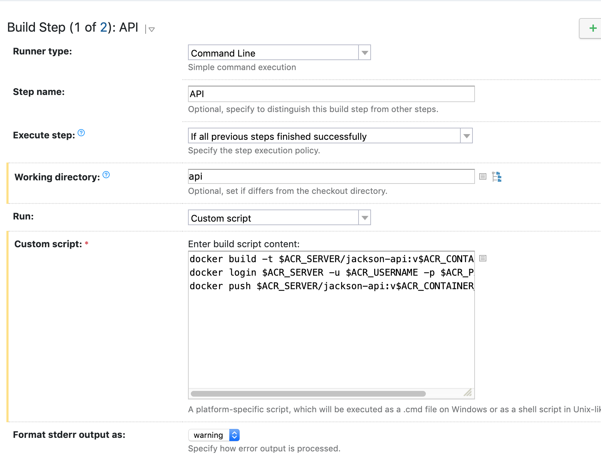
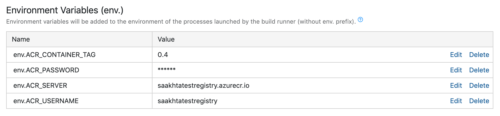
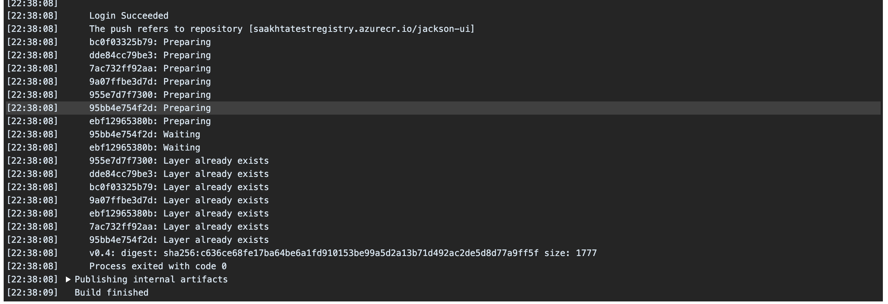

## Image Tag Release Pipeline

The guide below demonstrates how to deploy an instance of TeamCity on your Azure cloud to run continuous integration builds to build an ACR image for a sample application. 


1. Login to [Azure Marketplace](https://ms.portal.azure.com/#blade/Microsoft_Azure_Marketplace/GalleryFeaturedMenuItemBlade/selectedMenuItemId/home) and search for TeamCity. 
Click on `TeamCity` > `Create`

    

2. Configure settings for the TeamCity server by entering an appropriate name, selecting (or creating a new) resource group and location, and press `OK`.

    

3. Configure settings for the Virtual Machine by entering an appropriate username and a strong password. Make sure to select a subnet and domain name label (it should be automatically filled in). Press `OK` to proceed.

    

4. Enter a strong password for MySEL and make sure a storage account is selected or automatically filled in. Press `OK` to proceed. 

    

5. It should show a summary of all the settings about to be applied. Press `OK` to continue. 

    

6. In this step it will prompt you for any payments, if needed. Agree to the terms of conditions and press `Create`. 

7. Click on the notification that says `Deployment in progress` and you can view the status of your deployment which is underway. Wait till this deployment is complete, then navigate to the `Outputs` tab on the left column. 

    

8. When deployment is complete, the `Outputs` tab will give you a URL where TeamCity is deployed and the ssh command. Copy the `teamcityURL` and open it in the browser on another tab. 

    

9. When you visit this URL, for example `http://server-teamcity-999608bafa.eastus2.cloudapp.azure.com/showAgreement.html`, it will display the licence agreement for JetBrains TeamCity. Press `Accept` and `Continue`. 
10. Next, it will prompt you to create a new administrator account. Enter a username and secure password, then press `Create Account`. 

    

11. Next, it will prompt you to fill in your profile. Complete your profile and navigate to `Projects` in the top left. It should display an option to Create a project. 

    

12. Enter the project details for your application code repository and enter credentials if it's not a public repository. In this example, we're using the app code repository for [Project Jackson](https://github.com/catalystcode/containers-rest-cosmos-appservice-java) which is a simple application with front and back end capabilities. 

    

13. Enter an appropriate name for the project build configuration and click `Proceed`. 
    

14. At this step, it will start auto-detecting build steps found in the repository. If your Dockerfile works standalone without any parameters, select it in the checkboxes. We're going to leave all these unchecked since we will use a custom script and variables for security, to push these to the ACR image. Click on `configure build steps manually`.

    

15. In this step, we will manually add the command line script to build the ACR image. Paste the following lines of code:

    ```
    docker build -t $ACR_SERVER/jackson-api:v$ACR_CONTAINER_TAG .
    docker login $ACR_SERVER -u $ACR_USERNAME -p $ACR_PASSWORD
    docker push $ACR_SERVER/jackson-api:v$ACR_CONTAINER_TAG
    ```

    

16. Press `Save` and click on `Parameters` on the left column. 
    

17. Add the following parameters to the environment variables section:
    - `env.ACR_CONTAINER_TAG`: This is just an incremental tag for the container image; for our purposes we're using the build number so it's always unique and incremental. 
    - `env.ACR_PASSWORD`: The password for the container registry. Set this to the password spec for security purposes.
    - `env.ACR_SERVER`: URL for the ACR server, for example we are using `saakhtatestregistry.azurecr.io`
    - `env.ACR_USERNAME`: The username for the container registry

    

18. Click on `Run` to do a test run for this configuration. You should be able to see a new tag show up in the ACR registry for the newly pushed image! 
19. If you would like to configure the same for the UI working directory, follow the same steps above but for a new build step, and paste the code below:

    ```
    docker build -t $ACR_SERVER/jackson-ui:v$ACR_CONTAINER_TAG .
    docker login $ACR_SERVER -u $ACR_USERNAME -p $ACR_PASSWORD
    docker push $ACR_SERVER/jackson-ui:v$ACR_CONTAINER_TAG
    ```

    Make sure the working directory is set to the UI folder correctly. 

20. Click on `Run` to do a test run for this configuration. You should now see both tags being built (if there are changes) and the new tag should show up in the ACR portal for UI! 
    
