# TeamCity

TeamCity is a build management and continuous integration server developed by [JetBrains](https://www.jetbrains.com/teamcity/). 

## Getting Started

TeamCity is available in the [Azure Marketplace](https://azuremarketplace.microsoft.com/en-en/marketplace/apps/jetbrains.teamcity?tab=Overview). Follow the instructions below to deploy an instance of TeamCity on your Azure cloud to run continuous integration builds.

1. Login to [Azure Marketplace](https://ms.portal.azure.com/#blade/Microsoft_Azure_Marketplace/GalleryFeaturedMenuItemBlade/selectedMenuItemId/home) and search for TeamCity. 
Click on `TeamCity` > `Create`

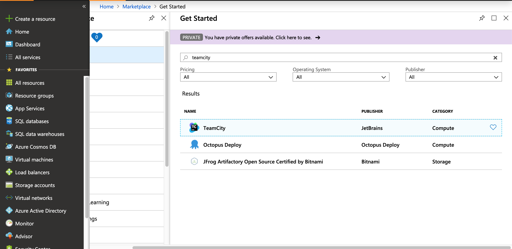

2. Configure settings for the TeamCity server by entering an appropriate name, selecting (or creating a new) resource group and location, and press `OK`.

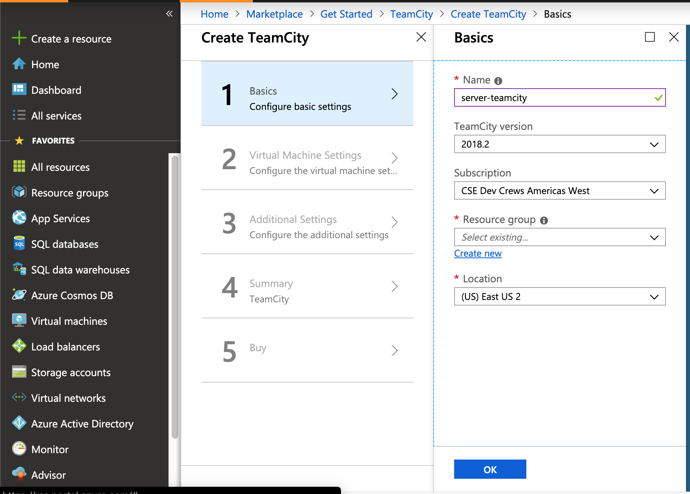

3. Configure settings for the Virtual Machine by entering an appropriate username and a strong password. Make sure to select a subnet and domain name label (it should be automatically filled in). Press `OK` to proceed.

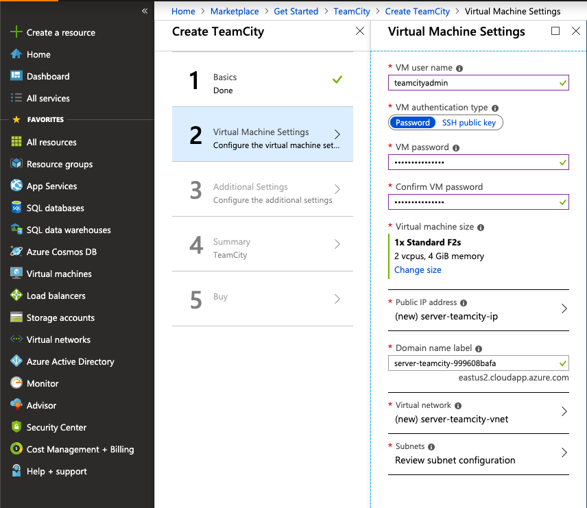

4. Enter a strong password for MySEL and make sure a storage account is selected or automatically filled in. Press `OK` to proceed. 

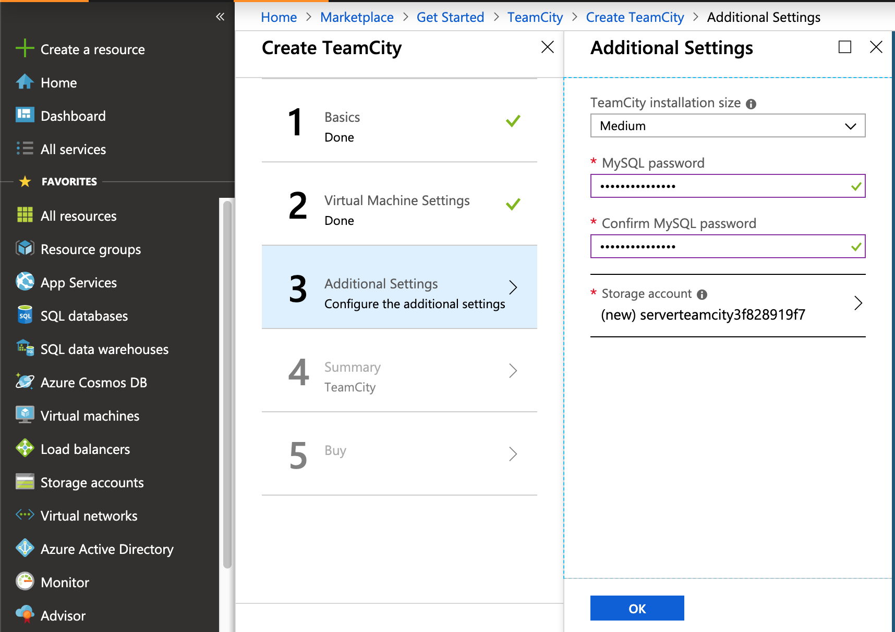

5. It should show a summary of all the settings about to be applied. Press `OK` to continue. 

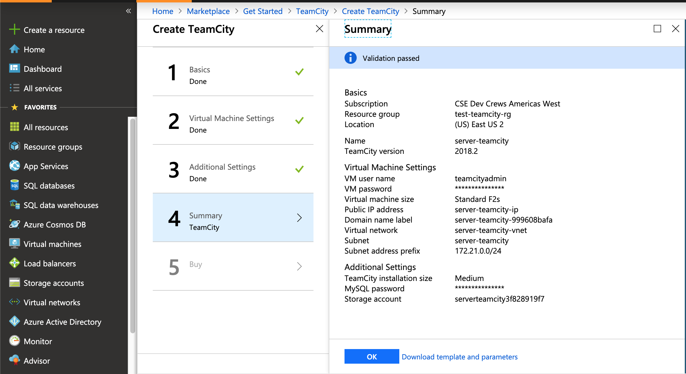

6. In this step it will prompt you for any payments, if needed. Agree to the terms of conditions and press `Create`. 

7. Click on the notification that says `Deployment in progress` and you can view the status of your deployment which is underway. Wait till this deployment is complete, then navigate to the `Outputs` tab on the left column. 


8. When deployment is complete, the `Outputs` tab will give you a URL where TeamCity is deployed and the ssh command. Copy the `teamcityURL` and open it in the browser on another tab. 

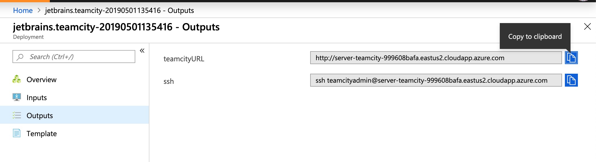

9. When you visit this URL, for example `http://server-teamcity-999608bafa.eastus2.cloudapp.azure.com/showAgreement.html`, it will display the licence agreement for JetBrains TeamCity. Press `Accept` and `Continue`. 
10. Next, it will prompt you to create a new administrator account. Enter a username and secure password, then press `Create Account`. 

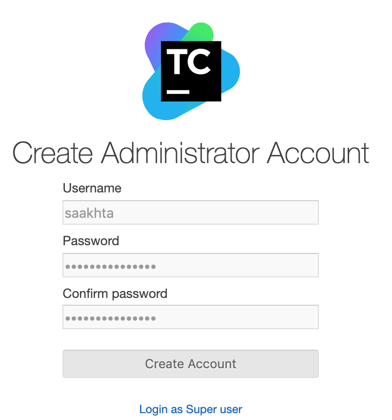

11. Next, it will prompt you to fill in your profile. Complete your profile and navigate to `Projects` in the top left. It should display an option to Create a project. 

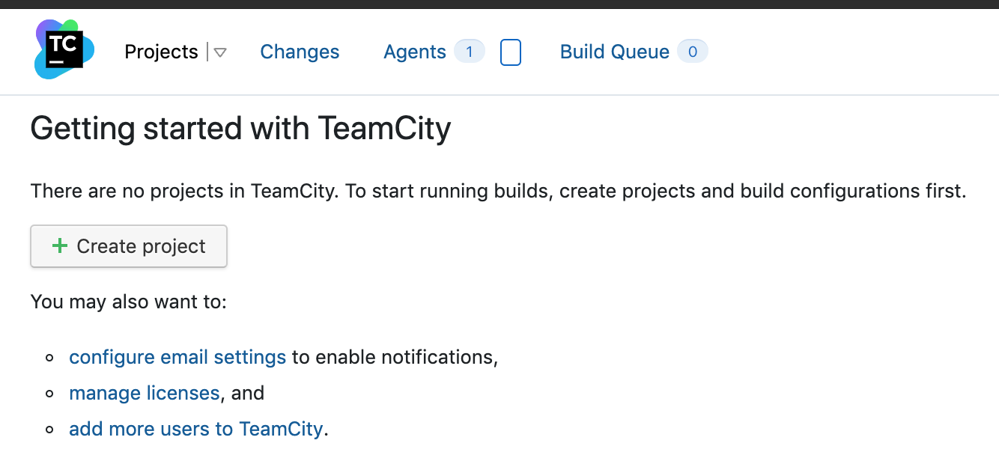

12. Create the project from the repository URL, and enter credentials if it's not a public repository. Click on `Proceed`. 

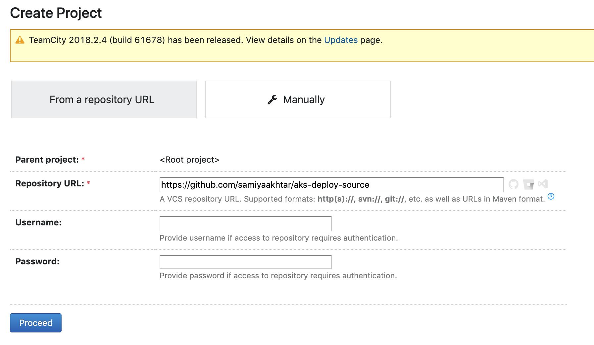

13. Enter a name for the build and click on `Proceed`. 

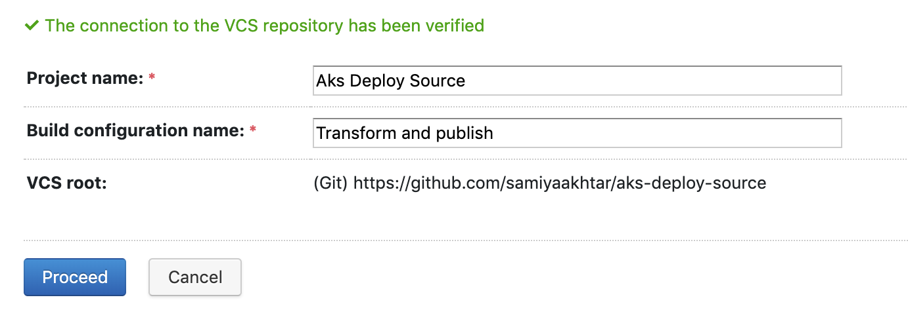

14. After this step, it will auto-detect build steps and prompt you to configure it, and if none are present you may configure it manually. Click on `configure build steps manually`, since we're planning on using the build script provided by  [`Microsoft / Bedrock`](https://github.com/microsoft/bedrock). 
15. Select `Command Line` from the dropdown for `Runner Type`. Enter a step name and select `Custom script` for `Run`. Enter the following commands for `Custom script`: 

```
curl https://raw.githubusercontent.com/microsoft/bedrock/master/gitops/teamcity/build.sh > build.sh
chmod +x ./build.sh
./build.sh
```

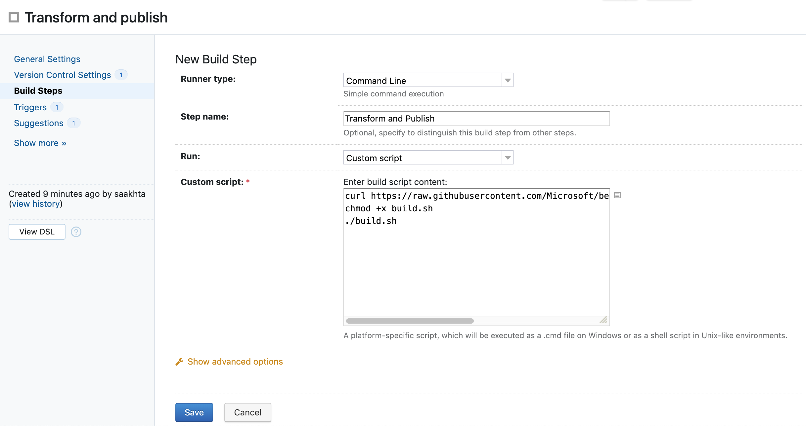

1.  Press `Save` and click on `Parameters` on the left column

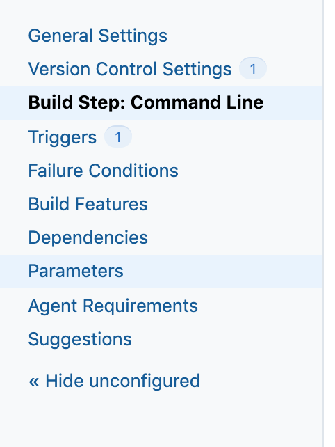

17. Click on `Add new parameter`, and add the following variables under `Environment Variables`:


- `ACCESS_TOKEN_SECRET`: Get an access token from GitHub/Azure DevOps where your repo is hosted, so that the script can have access to push to the remote manifest yaml repository. You may make this a hidden variable to protect it.
- `COMMIT_MESSAGE`: Since TeamCity does not have a variable that can provide the exact commit message, enter something valuable, such as "Auto-generated yaml files"
- `REPO`: Set this to the manifest repo, such as `https://github.com/samiyaakhtar/jackson-manifest`

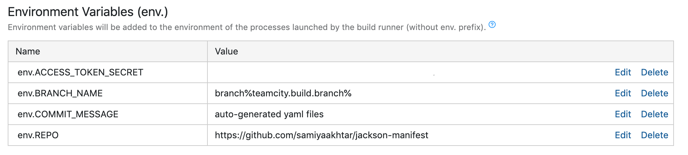

18.  Click on `Run` to do a test run for this configuration! 

## Disadvantages

- Upgrading from one version to another is a task with TeamCity 
- Not free if you need more than 3 agents and over 100 builds
- Unintuitive user interface, less customizability, fewer hooks, less variables available as part of build processes (such as commit messages can't be fetched from a repo that triggered it)


